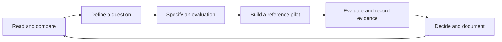

# Thinking Harness

Welcome to Thinking Harness, an applied research project on the construction and
improvement of agentic harnesses. This repository brings together literature reviews,
experimental protocols, reference implementations, and thesis materials.

A harness is the application layer around a model: instructions, tools, execution flow,
memory, controls, and evaluation. We are studying how to construct or improve that layer
under measurable quality, cost, and human-review constraints.

## Current status

The project is in its research preparation stage. The thesis case, method, framework,
and final contribution remain open. No improvement method or scientific reproduction
has been implemented yet. Existing code validates the repository itself.

`main` holds reviewed baselines. `develop` integrates ongoing work through task PRs.
The initial bootstrap predates this workflow; it is not a formal research release.
See the [branch standard](docs/standards/std-0003-branching-and-releases.md).

## Start here

- Read the [research charter](docs/doc-0001-research-charter.md) and [initial plan](docs/doc-0002-initial-plan.md).
- Explore the [paper catalog](research/literature/catalog.csv) and [partial STOP review](research/literature/reviews/pap-0001-stop.md).
- Follow work in the [Project](https://github.com/users/jairzinhosantos/projects/2).
- Before contributing, read [AGENTS.md](AGENTS.md), the [operating model](docs/operating-model.md),
  and the [writing and diagram standard](docs/standards/std-0004-writing-and-diagrams.md).

## Research workflow

Each cycle produces evidence that helps retain, refine, or reject a research direction.
The thesis will select one bounded case; the public laboratory can explore additional cases.



## Repository guide

| Directory | Contents and purpose |
|---|---|
| `docs/` | Charter, plan, operating model, standards, decisions, designs, and iteration notes |
| `research/` | Paper catalog, review notes, search records, synthesis, and research proposals |
| `src/` | Future implementation of the selected method; currently a placeholder |
| `tests/` | Automated checks; currently tests for repository and diagram validation |
| `configs/` | Shareable experiment configuration, without credentials |
| `benchmarks/` | Future reference tasks, scenarios, and evaluators |
| `environments/` | Local service definitions when the selected case requires them |
| `experiments/` | Protocols, execution manifests, and evidence-based reports |
| `data/` | Dataset catalog, provenance, licenses, splits, and checksums |
| `manuscripts/` | Academic requirements and thesis manuscript sources |
| `templates/` | Reusable paper-review, experiment, agent-handoff, and academic templates |
| `diagrams/` | Editable Draw.io sources and generated SVG previews |
| `assets/` | Original or licensed resources with recorded provenance |
| `scripts/` | Repository validation and documentation tooling |
| `deliverables/` | Issued, versioned documents and their manifests |
| `_archive/` | Retired material with a recorded reason and replacement |
| `.github/` | CI workflows and issue and PR templates |

The directory structure establishes boundaries; it does not imply that each component
has already been implemented. [Controlled documents](docs/catalog.csv) have stable IDs.

## Validate a change

Repository checks require Python 3.11 or newer and use only the standard library:

```sh
python3 scripts/check_repository.py
python3 -m unittest discover -s tests/unit -v
```

Mermaid rendering requires Node.js 22 and the pinned development dependencies:

```sh
npm ci
npm run check:diagrams
```

CI runs these checks for `main`, `develop`, and PRs targeting either branch. It validates
local references, document metadata, catalogs, Draw.io structure and previews, and Mermaid
rendering. It does not run models or consume cloud resources.

## Working with agents

The [agentic development strategy](docs/designs/doc-0003-agentic-development-strategy.md)
proposes bounded tasks, a builder, independent QA, and human review. It is a future pilot;
no persistent agents or scheduled execution are enabled.
[Progress measurement and HITL options](docs/designs/doc-0004-progress-and-hitl.md)
remain open for a separate decision.

## Public scope

Project-authored content is in English. Private data, credentials, institutional source
files, and working conversations stay outside this repository. A private extension may
later consume an identified version of this public core.

## License and citation

Original repository material is licensed under [MIT](LICENSE). Linked papers and external
software retain their own licenses. Use [CITATION.cff](CITATION.cff) and identify the commit
or release used when citing this project.
