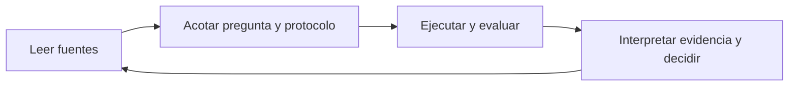

# Thinking Harness

Bienvenido a Thinking Harness, un proyecto de investigación aplicada sobre la construcción
y mejora de harnesses agénticos. Reúne lecturas, propuestas, prototipos y evidencia para
acotar una pregunta de tesis.

El **harness** es el andamiaje de software que permite operar a un modelo: instrucciones,
herramientas, contexto, ejecución, controles y evaluación. La pregunta central es qué aporta
mejorar al propio mejorador frente a mantenerlo fijo, considerando calidad, generalización y costo.

## Por dónde empezar

- [Plan de investigación](docs/doc-0002-research-plan.md): pregunta, alcance y siguientes decisiones.
- [Catálogo de papers](research/literature/catalog.csv) y [mapa de lectura](research/synthesis/research-options.md).
- Reviews de [STOP](research/literature/reviews/pap-0001-stop/README.md) y
  [Self-Harness](research/literature/reviews/pap-0011-self-harness/README.md).
- [Casos](research/cases/README.md): corrección de código y negociación sintética.
- [Notebook de negociación](research/cases/case-0003-debt-negotiation/prompt-search.ipynb):
  reproduce la lectura de un registro existente, sin llamadas a modelos.

La investigación sigue abierta. Hay un piloto de búsqueda de prompts con optimizador fijo:
se detuvo por presupuesto, sin candidato aceptado ni comparación final. No se afirma una
mejora recursiva ni una reproducción de los papers. Cada caso contiene su estado y evidencia.


```mermaid
flowchart LR
    L[Leer fuentes] --> P[Acotar pregunta y protocolo]
    P --> E[Ejecutar y evaluar]
    E --> D[Interpretar evidencia y decidir]
    D --> L
```

## Estructura

| Ruta | Contenido |
|---|---|
| `research/literature/` | Catálogo, búsquedas y una carpeta por paper revisado |
| `research/cases/` | Un caso por carpeta: guía, entradas, notebook, utilidades y resultados |
| `research/synthesis/` | Comparación de métodos y alternativas |
| `docs/` | Plan, estándares, decisiones, diseños, requisitos académicos y plantillas |
| `scripts/` | Comprobaciones y exportación de documentación |
| `tests/` | Pruebas locales sin consumo de modelos |
| `.github/` | CI y plantillas de issues y PRs |

Los [IDs](docs/catalog.csv) se conservan aunque cambie una ruta. Las carpetas crecen
cuando existe una necesidad concreta; véase [evolución del proyecto](docs/project-evolution.md).
Los PDFs de papers y sus anotaciones permanecen en la biblioteca local.

## Trabajo y validación

Las tareas se siguen en el [Project](https://github.com/users/jairzinhosantos/projects/2).
`develop` integra trabajo revisado; `main` conserva baselines formales. Ambas integraciones
requieren aceptación humana según el [estándar de ramas](docs/standards/std-0003-branching-and-releases.md).
El [modelo operativo](docs/operating-model.md) define el flujo. El diseño multiagente es una propuesta futura.

Python 3.11 o posterior; Node.js 22 para Mermaid:

```sh
python3 -m pip install -r research/cases/case-0003-debt-negotiation/requirements.txt
python3 scripts/check_repository.py
python3 -m unittest discover -s tests/unit -v
npm ci
npm run check:diagrams
```

El CI comprueba estructura, enlaces, pruebas locales y diagramas; no valida conclusiones científicas.
Antes de cambiar contenido, leer [AGENTS.md](AGENTS.md). Documentación en español, nombres
y código en inglés, traducciones selectivas y decks en inglés.

## Alcance público

No se incluyen credenciales, datos privados ni implementaciones institucionales. El material
original usa [MIT](LICENSE); fuentes externas conservan sus licencias. Para citar el proyecto,
usar [CITATION.cff](CITATION.cff) e identificar el commit o versión consultados.
