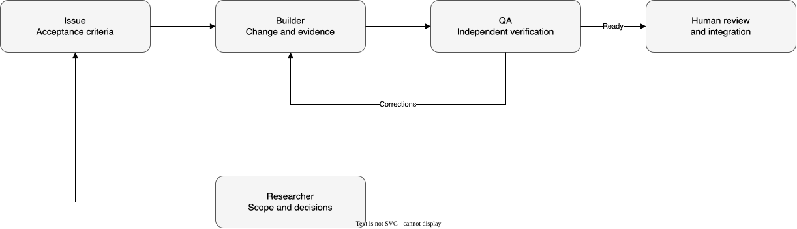

# Agentic development strategy

## Status
Proposal for a later pilot. No persistent agents, scheduler, or project self-modification
loop is enabled.

## Scope
Using agents to build thinking-harness is an engineering workflow. Scientifically evaluating
a harness-improvement method is a separate activity. Development agents must not modify
held-out datasets, acceptance criteria, or results to obtain approval.

| Role | Input | Output | Boundary |
|---|---|---|---|
| coordinator | Objective and issue | Plan, assignment, summary | Does not silently expand scope |
| research-reviewer | Paper and review | Evidence, objections, citations | Does not mark human readings complete |
| builder | Issue and criteria | Small diff and explanation | Does not approve its own change |
| qa | Diff and original criteria | Checks and reproducible failures | Does not weaken criteria to pass |
| experiment-runner | Fixed protocol | Manifest, metrics, logs | Respects budget and stop conditions |
| documentation-reviewer | Accepted evidence | Consistent documentation | Does not turn expectations into results |

## Proposed workflow

[Edit the Draw.io source](../../diagrams/source/agentic-development-workflow.drawio).
The diagram describes a proposed workflow, not currently running agents.

## Incremental pilot
1. Define role contracts and a handoff template.
2. Select one deterministic task without additional external-model calls; builder prepares it.
3. QA checks original criteria and designs a plausible failure test.
4. The coordinator assembles evidence; material disagreements require human review.
5. Measure rework, time, cost, and defects against the reference workflow.
6. Then evaluate parallelism and orchestration tools.

## Minimum handoff
Issue, objective, scope, inputs, allowed files, acceptance criteria, budget, reference commit,
expected output, and escalation conditions. One writer owns each task branch.
Parallel work uses separate branches or checkouts; record contributions and resolve conflicts
before integration. Branches follow the [standard](../standards/std-0003-branching-and-releases.md).

## Pilot acceptance
The change satisfies original criteria; QA provides independent evidence; history allows
reconstruction; cost is recorded. Quality cannot rest only on self-approval.
An unresolved disagreement goes to review rather than an unlimited correction loop.
