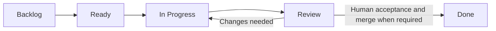

# Operating model

## Work flow

A blocked task records its cause and next action. Initial work in progress is one deep
reading task and one technical task. Done requires evidence, satisfied criteria, and human
acceptance. For repository changes, the maintainer must also merge the task PR into develop.
Passing CI alone does not move a task to Done. A negative result can close a task when its
criteria are met. Small readings and tests do not each need a PRD.

## Cadence
Two-week cycles, weekly reviews, and an end-of-cycle retrospective are proposed.
Dates follow academic requirements and agreed scope. Progress measurement by evidence,
milestones, or flow is still pending; online hours are not a productivity measure.
Reading scope is adjusted at each review point. No scheduled reminders or agents are enabled.
Formal baseline readiness is reviewed approximately every one or two weeks. Promotion
occurs only after a separate human decision and review; the cadence does not trigger a merge.

## Research decisions
Question → bounded reading or test → evidence → adopt, adjust, pivot, or close.
Set cost/time limits and the decision criterion before execution.
A new publication may change direction; record why. Fix confirmatory conditions per
experiment, and create a revision for material changes.

## Responsibilities
Priorities, scope, and conclusions require human decisions, with academic-advisor review
where appropriate. Agent-assisted work prepares evidence, changes, and checks within
authorized tasks. A future QA agent verifies criteria separately from construction. Development assistance is not scientific evidence for the method.

## GitHub and integration
Issues define work; milestones group outcomes; the Project tracks status, type, and priority.
Task branches start from develop. Integration has two human review gates:

1. **Task acceptance:** review the task PR and its evidence; the human maintainer performs
   a squash merge into develop after required checks pass.
2. **Baseline acceptance:** decide when accumulated work is ready, review a separate
   promotion PR, and have the maintainer perform a merge commit into main after checks pass.

Agents prepare changes and PRs. Merging into permanent branches remains a human action;
neither passing CI nor task acceptance schedules or authorizes a later promotion.
Synchronization from main back into develop also requires checks, human review, and a
maintainer-performed merge commit. Follow the
[branch standard](standards/std-0003-branching-and-releases.md).

Close a task after its PR is merged into develop and all criteria are met; it need not wait
for promotion into main. Formal publication is a separate milestone. A task PR uses
`Refs #N`; close its issue explicitly after integration, since develop is not the default
branch. Keep broader issues open when a merged PR satisfies only part of their criteria.
CI validates documentation and local tooling without model calls or cloud credentials.
Human review of scientific claims remains explicit.

## References
- [PRINCE2 adaptation](https://www.peoplecert.org/news-and-announcements/2023/PRINCE2%207%20-%20A%20Process%20of%20Evolution)
- [GitHub Projects](https://docs.github.com/en/issues/planning-and-tracking-with-projects/learning-about-projects/best-practices-for-projects)
