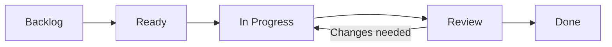

# Operating model

## Work flow

A blocked task records its cause and next action. Initial work in progress is one deep
reading task and one technical task. Done requires evidence and satisfied criteria;
a negative result can close a task. Small readings and tests do not each need a PRD.

## Cadence
Two-week cycles, weekly reviews, and an end-of-cycle retrospective are proposed.
Dates follow academic requirements and agreed scope. Progress measurement by evidence,
milestones, or flow is still pending; online hours are not a productivity measure.
Reading scope is adjusted at each review point. No scheduled reminders or agents are enabled.

## Research decisions
Question → bounded reading or test → evidence → adopt, adjust, pivot, or close.
Set cost/time limits and the decision criterion before execution.
A new publication may change direction; record why. Fix confirmatory conditions per
experiment, and create a revision for material changes.

## Responsibilities
Priorities, scope, and conclusions require human decisions, with academic-advisor review
where appropriate. Agent-assisted work prepares evidence, changes, and checks within
authorized tasks. A future QA agent verifies criteria separately from construction. Development assistance is not scientific evidence for the method.

## GitHub and integration
Issues define work; milestones group outcomes; the Project tracks status, type, and priority.
Task branches start from develop and return through PRs. main receives separately accepted
promotions. Follow the [branch standard](standards/std-0003-branching-and-releases.md).
Close a task after acceptance into develop when its criteria are met; formal publication
is a separate milestone. A task PR uses `Refs #N`; close its issue explicitly on acceptance,
since develop is not the default branch.
CI validates documentation and local tooling without model calls or cloud credentials.
Human review of scientific claims remains explicit.

## References
- [PRINCE2 adaptation](https://www.peoplecert.org/news-and-announcements/2023/PRINCE2%207%20-%20A%20Process%20of%20Evolution)
- [GitHub Projects](https://docs.github.com/en/issues/planning-and-tracking-with-projects/learning-about-projects/best-practices-for-projects)
