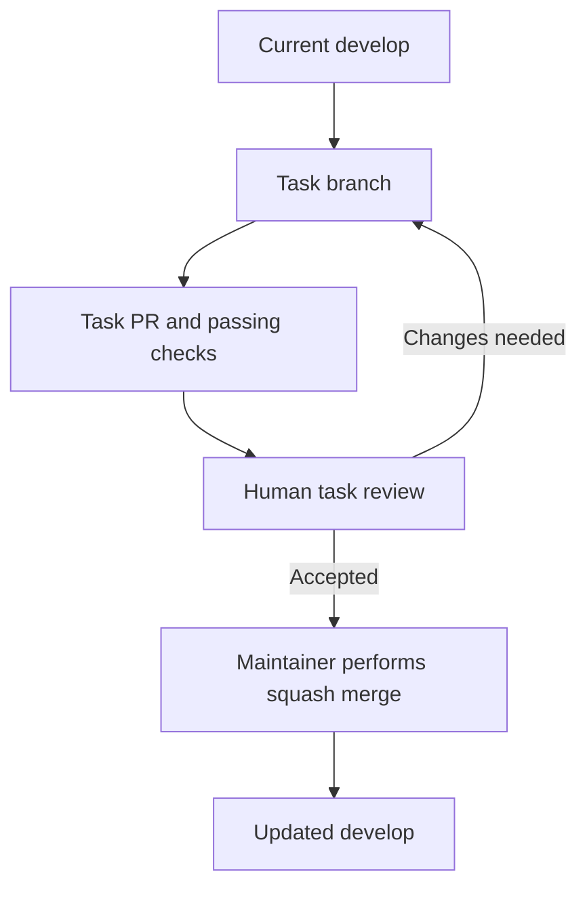
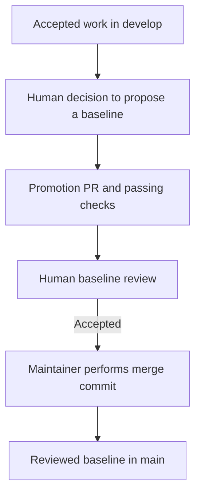

# Branching and formal baselines


## Permanent branches

| Branch | Purpose | Entry condition |
|---|---|---|
| main | Reviewed baselines for presentation, submission, or release | Promotion PR, passing CI, explicit human acceptance, and a maintainer-performed merge commit |
| develop | Integrated research and implementation work | Task PR, passing CI, explicit human acceptance, and a maintainer-performed squash merge |

main remains the repository default. Select develop explicitly when opening a task PR.
The bootstrap commits predate this workflow and are not a formal scientific release.

There are two separate human review gates. The human maintainer reviews and performs
the merge at each gate. Passing CI, opening a PR, or targeting develop does not merge
the change. Agents prepare branches, evidence, checks, and PRs; they do not merge into
either permanent branch or enable auto-merge under this workflow.

### Gate 1: accept a task into develop

Review the task diff, evidence, and closure criteria. If accepted, the maintainer performs
the squash merge. Requests for changes return to the task branch and require another review.



### Gate 2: promote a baseline into main

Accepted tasks accumulate in develop. A separate human decision selects a coherent baseline
for presentation, submission, or release. Review promotion readiness approximately every
one or two weeks; this is a reference cadence, not a deadline or an automatic promotion.
The maintainer may defer promotion until the snapshot is ready.



After promotion, synchronize main back into develop through a separate PR, passing checks,
human review, and a maintainer-performed merge commit. This synchronization preserves
shared history; it does not bypass review or accept unrelated work.

## Task branches
Use `<type>/<issue-number>-<short-description>` in lowercase English.
Types: docs, research, feat, fix, chore, refactor, and test.
Example: docs/12-english-documentation. Agent roles are issue assignments, not branch names.
Create from current develop, keep one bounded objective, and delete after integration.
There is one writer per task branch; concurrent agents use separate branches or checkouts.

```sh
git fetch origin
git switch -c docs/12-english-documentation origin/develop
# Edit, validate, commit, and push the task branch.
gh pr create --base develop --head docs/12-english-documentation --body-file pr-body.md
```

The command is an example; allocate the actual issue and branch before using it.
Commits use `type: concise English description`; an optional scope is allowed.

## Merge and review rules
Squash task PRs into develop. Use merge commits for develop-to-main promotions and
main-to-develop synchronization so shared ancestry is preserved.
Do not squash or rebase a permanent-branch promotion. Do not enforce linear history on
permanent branches because synchronization uses merge commits.
A task PR states its problem, result, issue, evidence, checks, and remaining decisions.
Use `Refs #N`; close the task issue explicitly after the maintainer merges into develop
and all issue criteria are satisfied. A PR that covers only part of an issue does not close it.

Human acceptance applies to the reviewed diff and commit. Material changes require renewed
review, and required checks must pass on the updated branch. Acceptance of an individual
task into develop does not authorize promotion of a larger baseline into main.

main and develop require PRs, passing Repository checks (job: validate), up-to-date
branches, and resolved conversations. Disable force pushes and deletion; apply protection
to administrators too. Initially require zero GitHub approval reviews to avoid a sole
maintainer being unable to approve their own PR. This does not remove either human review
gate. For task PRs, the maintainer's deliberate squash merge after review records acceptance.
For promotion PRs, record explicit acceptance of the baseline in the PR before the maintainer
performs the merge. The technical approval-review count is not permission for agents to merge.
Branch protection enforces checks and PR use; it cannot establish scientific validity
or verify that a conversational acceptance occurred.

## Formal promotion
1. Select a coherent snapshot of develop; its criteria must pass on the exact proposed head.
2. Open a promotion PR to main with scope, validation, known limits, and deliverable references.
3. Obtain explicit human acceptance for that snapshot. Material changes invalidate it.
4. The maintainer performs the merge commit; identify the accepted main commit with a tag.
5. Synchronize main back into develop through a PR, with checks, human review, and a
   maintainer-performed merge commit.

Research tags use `milestone/<name>-rNNN`, such as milestone/research-plan-r001.
Software tags use `vMAJOR.MINOR.PATCH` when a software release exists.
Never move an issued tag; supersede it with a new revision. Branches are mutable working
references; cite a commit or tag in a delivery or experiment manifest.

## Exceptions
If presentation preparation must proceed independently, create a temporary
release/<milestone>-rNNN branch from the chosen develop commit. It receives only baseline
preparation fixes, is promoted by PR, synchronized back, then deleted.
For an urgent formal-baseline correction, branch fix/<issue>-<description> from main,
review through a PR into main, issue a new revision, then sync to develop.
Do not introduce these branches until needed.

## Revision history

Revision 2 makes human review and maintainer-performed merges explicit for both integration
and promotion, and records the indicative one-to-two-week baseline review cadence.
See [dec-0005](../decisions/dec-0005-human-integration-and-promotion.md).

## Reference
[GitHub branch protection](https://docs.github.com/en/repositories/configuring-branches-and-merges-in-your-repository/managing-protected-branches/about-protected-branches)
