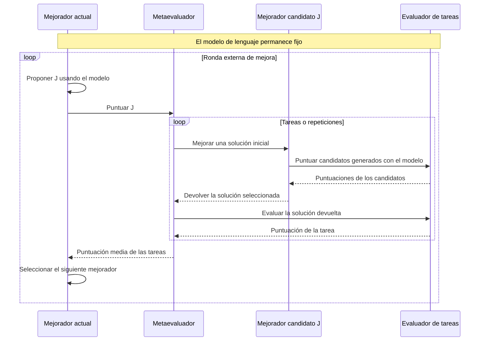
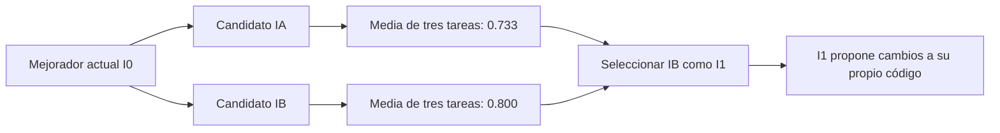

# STOP: mecanismo, correspondencia con el código y evaluación

[English](pap-0001-stop.md) | Español

Traducción de la revisión 2 de la versión principal en inglés. Conserva sus fuentes,
estados y conclusiones; no constituye una revisión independiente del paper.

STOP es una referencia útil para distinguir la solución de una tarea del programa que la
mejora. Para thinking-harness, la pregunta inmediata es qué componente podría modificarse
y cómo medir su mejora de forma independiente de la búsqueda que la produjo.
Esta revisión prepara esa discusión; todavía no selecciona el método de la tesis.

## 1. Fuentes y estado de la revisión

**Paper:** Eric Zelikman, Eliana Lorch, Lester Mackey y Adam Kalai,
*Self-Taught Optimizer (STOP): Recursively Self-Improving Code Generation*.
[Versión 3, 16 de agosto de 2024, COLM 2024](https://arxiv.org/abs/2310.02304v3).
La clave bibliográfica es `zelikman2023stop` y conserva el año del preprint inicial.

**Código:** [microsoft/stop](https://github.com/microsoft/stop/tree/0d6780c54306b2486dd36e9c4ae9b49aceb27ea4),
commit `0d6780c54306b2486dd36e9c4ae9b49aceb27ea4`. Todos los enlaces al código apuntan a esta versión.

| Actividad | Estado y alcance |
|---|---|
| Inspección asistida de fuentes | Resumen, introducción, secciones 3-8, algoritmo 1, figuras 2 y 4, tabla 1 y apéndice K; inspección parcial de A.1-A.2 |
| Lectura completa del paper | Parcial; falta profundizar en los trabajos relacionados, las demostraciones y los demás apéndices |
| Inspección estática del código | Ejecutor, mejoradores iniciales, metautilidad, utilidad de paridad, interfaz del modelo, cargador, configuración y punto de entrada de la evaluación de transferencia |
| Ejecución | No realizada; no se importaron módulos de terceros ni se hicieron llamadas a modelos o experimentos científicos |
| Discusión guiada | Pendiente; preparar el documento no acredita haber completado la lectura personal |
| Reproducción | Sin resultados reproducidos |

`author-claim` identifica un hallazgo reportado por los autores. `interpretation` identifica
un análisis del proyecto o una propuesta ilustrativa. `static-inspection` identifica un
comportamiento observado directamente en el código fuente, todavía no verificado en ejecución.
`reproduced-result` se reserva para evidencia medida.

## 2. Contribución y evidencia publicadas

**Afirmación de los autores.** STOP modifica recursivamente un mejorador
mientras mantiene fijo el modelo de lenguaje (secciones 3-4). En la sección 5.1, GPT-4 mejora
el rendimiento medio en paridad con ruido a lo largo de cinco ejecuciones; cada trayectoria
individual no necesariamente mejora de forma monótona. La evaluación utiliza 20 instancias
de desarrollo, cinco repeticiones y 50 instancias reservadas. Esas repeticiones no equivalen
a cinco familias de tareas. Las comparaciones incluyen el mejorador inicial, una cadena de
razonamiento y un mejorador voraz.

La sección 5.2 reporta la transferencia de un mejorador seleccionado a cinco tareas, no una
distribución de resultados de todos los mejoradores evolucionados. La sección 5.3 reporta
fallos de modelos menos capaces. Los modelos históricos son `gpt-4-0314`,
`gpt-3.5-turbo-0613` y `Mixtral-8x7B-Instruct-v0.1`.
Las secciones 6-7 abordan la explotación del evaluador, la evasión de restricciones, el costo
y la dependencia de una utilidad que pueda calcularse eficientemente. El apéndice A estudia
la generalización bajo supuestos, incluidos programas acotados y tareas muestreadas de forma
independiente; no garantiza que cada actualización recursiva mejore el rendimiento. El
apéndice K reporta aproximadamente 3,000 llamadas a GPT-4 por iteración y por ejecución.
Es necesario conciliar esa unidad con las llamadas a la interfaz del modelo antes de estimar
costos. Fuente: [paper v3](https://arxiv.org/pdf/2310.02304v3).

## 3. Los dos niveles de mejora

**Inspección estática e interpretación.** La función inicial recibe código, un evaluador y
una interfaz del modelo. Genera alternativas y selecciona según su puntuación. En el nivel
de la tarea, ese código es una solución. En el nivel externo, es el propio mejorador.
Véase la [implementación inicial](https://github.com/microsoft/stop/blob/0d6780c54306b2486dd36e9c4ae9b49aceb27ea4/tasks/meta_optimization/secret_seed_algorithm.py#L3-L23).

El siguiente diagrama es una representación didáctica propia de la estructura de llamadas inspeccionada.

Para una comparación controlada se mantienen fijos el modelo, el evaluador, la partición de
tareas y los límites de recursos. Se modifica el código de las soluciones candidatas dentro
de una evaluación y el código del mejorador entre rondas externas.
Cambiar un prompt o una estrategia de búsqueda no implica por sí mismo actualizar los pesos del modelo.

## 4. Lectura matemática y ejemplo propio

La siguiente notación describe las interfaces inspeccionadas y es coherente con la sección 3
y el algoritmo 1. Distingue explícitamente los programas ejecutables de las cadenas que
representan su código fuente.

| Símbolo | Significado |
|---|---|
| `s`, `s'` | Código fuente de la solución inicial y de la solución devuelta |
| `u` | Función que puntúa la tarea, con una descripción disponible para el mejorador |
| `L` | Interfaz del modelo fijo |
| `I_t` | Mejorador ejecutable en la ronda externa `t` |
| `code(I_t)` | Representación del código fuente suministrada como candidato editable |
| `D` | Colección finita de pares formados por una tarea con su evaluador y una solución inicial |
| `n` | Número de entradas de `D`, contando las repeticiones |
| `hat u_D` | Puntuación empírica asignada a un mejorador |

Una llamada en el nivel de la tarea devuelve una solución:

$$
s' = I_t(u,s,L).
$$

El evaluador externo puntúa al mejorador según lo que produce en las tareas seleccionadas:

$$
\widehat{u}_D(I)=\frac{1}{n}\sum_{j=1}^{n}u_j\bigl(I(u_j,s_j,L)\bigr).
$$

La actualización recursiva utiliza el mismo programa en dos funciones: ejecutor y entrada
editable. `load` representa la interpretación del código devuelto como un programa que
puede invocarse; no propone una implementación del aislamiento:

$$
I_{t+1}=\operatorname{load}\left(I_t\left(\widehat{u}_D,\operatorname{code}(I_t),L\right)\right).
$$

En la implementación de Python, el orden de los argumentos es `(initial_solution, utility,
language_model)`. Para relacionar la notación matemática con el código, deben seguirse los
nombres de los parámetros.

**Interpretación: ejemplo inventado, no mediciones de STOP.** Supongamos tres tareas de
programación, cada una con diez verificaciones de desarrollo. La puntuación de una tarea es
la proporción de verificaciones superadas. El modelo y el presupuesto permanecen constantes.
`I_0` muestrea alternativas; el candidato `I_A` incorpora retroalimentación para corregirlas;
el candidato `I_B` explora dos rutas de corrección. Las estrategias y cifras solo ilustran
el cálculo.

| Tarea | Solución inicial | Devuelta por `I_0` | Devuelta por `I_A` | Devuelta por `I_B` |
|---|---:|---:|---:|---:|
| A | 0.4 | 0.6 | 0.8 | 0.9 |
| B | 0.5 | 0.7 | 0.8 | 0.8 |
| C | 0.3 | 0.5 | 0.6 | 0.7 |
| Media | 0.4 | 0.6 | 0.733 | 0.8 |

Para la tarea A, `u_A(I_0(u_A,s_A,L)) = 0.6`. Al considerar todas las tareas,
`hat u_D(I_0) = (0.6 + 0.7 + 0.5) / 3 = 0.6`.
Si `I_0` propone ambos candidatos y selecciona la mayor metapuntuación observada, `I_B` se
convierte en `I_1`. En la siguiente ronda externa, se ejecuta `I_B` para proponer cambios a
su propio código. Utilizar `I_B` únicamente para corregir otra tarea seguiría siendo una
mejora en el nivel de la tarea.

Obtener 0.8 aquí no demuestra rendimiento en tareas futuras. Si `I_0` obtiene 0.7 e `I_B`
obtiene 0.6 en un conjunto de prueba que no se había utilizado, el orden observado durante
el desarrollo se invierte. Seleccionar repetidamente según esas puntuaciones de prueba
convertiría ese conjunto en parte del desarrollo. Por ello, el protocolo de tesis necesita
un conjunto de selección separado de la prueba final, además de ejecuciones independientes repetidas.

## 5. Correspondencia entre el algoritmo y el código

**Inspección estática.** Se presenta un recorrido de dependencias, no una traza de ejecución
verificada. Los archivos descriptivos `utility.py` que se suministran al código generado
difieren de los evaluadores implementados en `secret_utility.py`.

| Responsabilidad | Fuente fijada al commit | Observación |
|---|---|---|
| Propuestas iniciales | [Mejorador inicial, líneas 18-23](https://github.com/microsoft/stop/blob/0d6780c54306b2486dd36e9c4ae9b49aceb27ea4/tasks/meta_optimization/secret_seed_algorithm.py#L18-L23) | Un lote; extracción; selección del candidato con `max` |
| Iteración externa | [Ejecutor, líneas 122-179](https://github.com/microsoft/stop/blob/0d6780c54306b2486dd36e9c4ae9b49aceb27ea4/run_improver.py#L122-L179) | Invoca al mejorador actual; evalúa su resultado; guarda y vuelve a cargar el código devuelto |
| Metaevaluación | [Metautilidad, líneas 65-143](https://github.com/microsoft/stop/blob/0d6780c54306b2486dd36e9c4ae9b49aceb27ea4/tasks/meta_optimization/secret_utility.py#L65-L143) | Repite la mejora de tareas; devuelve la puntuación media de validación; opcionalmente registra las puntuaciones de prueba |
| Evaluación de tareas | [Utilidad de paridad, líneas 9-95](https://github.com/microsoft/stop/blob/0d6780c54306b2486dd36e9c4ae9b49aceb27ea4/tasks/parity_noise/secret_utility.py#L9-L95) | Genera instancias, invoca la solución y puntúa las predicciones |
| Presupuesto del modelo | [Interfaz, líneas 226-250](https://github.com/microsoft/stop/blob/0d6780c54306b2486dd36e9c4ae9b49aceb27ea4/language_model.py#L226-L250) | Cuenta las invocaciones a la interfaz y limita las respuestas por invocación |
| Carga del código generado | [Funciones auxiliares, líneas 52-77 y 154-192](https://github.com/microsoft/stop/blob/0d6780c54306b2486dd36e9c4ae9b49aceb27ea4/helpers.py#L52-L192) | Escribe el código fuente en un módulo temporal y lo importa |
| Entrada de evaluación de transferencia | [Evaluación de transferencia, líneas 207-214](https://github.com/microsoft/stop/blob/0d6780c54306b2486dd36e9c4ae9b49aceb27ea4/tasks/meta_optimization/transfer_eval.py#L207-L214) | Elige un mejorador almacenado e invoca al evaluador de tareas |

## 6. Datos y evaluación en la implementación inspeccionada

**Inspección estática.** La tarea de paridad genera datos sintéticos: 10 bits, 100 ejemplos
etiquetados de entrenamiento y 20 entradas de prueba por instancia. El ruido afecta a las
etiquetas de entrenamiento. La utilidad de desarrollo promedia 20 instancias y la utilidad
de prueba 50, con semillas base distintas. La puntuación es la exactitud media de las
predicciones; se intenta aplicar un límite de dos segundos por instancia. Estos conteos
anidados corresponden a unidades distintas y no deben agruparse como si fueran ejecuciones
experimentales independientes.
Fuente: [evaluador de paridad](https://github.com/microsoft/stop/blob/0d6780c54306b2486dd36e9c4ae9b49aceb27ea4/tasks/parity_noise/secret_utility.py#L21-L85).

**Interpretación para la tesis.** Un método que modifica código y mantiene fijos los pesos
del modelo sigue necesitando datos para buscar y evaluar. No requiere automáticamente un
conjunto de datos para ajuste fino. Las tareas públicas de programación, las instancias
generadas de juegos o los casos de negocio simulados podrían aportar esa evidencia. El
caso seleccionado debe permitir una puntuación repetible y separar la retroalimentación
de la búsqueda de la evaluación final.

## 7. Contabilidad del costo

**Inspección estática.** La configuración predeterminada especifica seis iteraciones
externas, cuatro llamadas a la interfaz del modelo por invocación del mejorador, seis
respuestas por llamada, 25 llamadas a la utilidad, 25 llamadas a la metautilidad y cinco
repeticiones de metaevaluación. Son presupuestos separados, no un único límite global de gasto.
Fuente: [configuración](https://github.com/microsoft/stop/blob/0d6780c54306b2486dd36e9c4ae9b49aceb27ea4/config.py#L1-L20).

**Interpretación: modelo de contabilidad para un protocolo futuro.** Sean `T` las rondas
externas, `K` los mejoradores candidatos puntuados por ronda, `n` las tareas o repeticiones
por candidato y `B` las llamadas internas a la interfaz. `B_o` cuenta las llamadas para
proponer candidatos en cada ronda externa. Si se utiliza toda la asignación, el presupuesto
de llamadas de la búsqueda es:

$$
N_{\mathrm{wrapper}} = T(B_o + KnB).
$$

Con una asignación inventada de `T=2`, `K=2`, `n=3`, `B=2`, `B_o=1`, se obtienen 26 llamadas
a la interfaz, sin contar la evaluación de la referencia, las comprobaciones del mejorador
vigente, las ejecuciones repetidas ni la evaluación final. Con un máximo de cuatro respuestas
por llamada, el presupuesto correspondiente es de 104 respuestas. No es una estimación de
tokens, de precio ni una reconstrucción del experimento publicado.

En la interfaz inspeccionada pueden agruparse prompts idénticos, solicitarse respuestas
conjuntamente y reintentarse solicitudes fallidas. Por ello, las llamadas a la interfaz,
las solicitudes a la API, las respuestas generadas y los tokens facturados no son unidades
intercambiables. Deben registrarse las cuatro por separado, junto con el tiempo de evaluación.
Fuente: [envío de solicitudes y reintentos](https://github.com/microsoft/stop/blob/0d6780c54306b2486dd36e9c4ae9b49aceb27ea4/language_model.py#L294-L356).

Para evaluar la reutilización, se compara el costo total de búsqueda más el costo de
utilización en `m` tareas con esas mismas `m` tareas resueltas mediante un mejorador fijo.
El esfuerzo de revisión humana se registra por separado. Una puntuación mayor en las tareas
no demuestra por sí sola un menor costo de desarrollo.

## 8. Brechas de reproducción y riesgos de validez

Estas observaciones corresponden al commit fijado. No se ejecutaron fallos ni intentos de explotación.

| Hallazgo | Evidencia | Consecuencia para una reproducción futura |
|---|---|---|
| Inconsistencia en la ruta de transferencia | Las [líneas 207-212](https://github.com/microsoft/stop/blob/0d6780c54306b2486dd36e9c4ae9b49aceb27ea4/tasks/meta_optimization/transfer_eval.py#L207-L212) asignan `improve_algorithm_base` en la rama predeterminada `improved` y después abren `improve_algorithm_path` | Si se alcanza esa instrucción con dicha configuración, la expresión de apertura referencia un nombre no definido |
| Selección limitada de tareas de transferencia | La [línea 21](https://github.com/microsoft/stop/blob/0d6780c54306b2486dd36e9c4ae9b49aceb27ea4/tasks/meta_optimization/transfer_eval.py#L21) selecciona solo `three_sat` | El punto de entrada no enumera actualmente el conjunto completo de tareas de transferencia |
| La aceptación externa no compara con el mejorador vigente | El [ejecutor, líneas 140-144](https://github.com/microsoft/stop/blob/0d6780c54306b2486dd36e9c4ae9b49aceb27ea4/run_improver.py#L140-L144), rechaza el valor cero sin compararlo con la puntuación anterior | Devolver un resultado sin fallo no demuestra que el mejorador sea superior |
| La selección inicial omite el código de partida | El [mejorador inicial, líneas 18-23](https://github.com/microsoft/stop/blob/0d6780c54306b2486dd36e9c4ae9b49aceb27ea4/tasks/meta_optimization/secret_seed_algorithm.py#L18-L23), maximiza sobre los candidatos generados | Un candidato puede reemplazar una solución inicial mejor |
| Aislamiento limitado | La [protección de fiabilidad](https://github.com/microsoft/stop/blob/0d6780c54306b2486dd36e9c4ae9b49aceb27ea4/helpers.py#L80-L94) advierte explícitamente que no es un entorno aislado de seguridad | Los nombres de archivos y las restricciones de funciones de Python no garantizan el aislamiento del evaluador ni de las credenciales |
| Entorno histórico incompleto | El [árbol de código](https://github.com/microsoft/stop/tree/0d6780c54306b2486dd36e9c4ae9b49aceb27ea4) no contiene un archivo de bloqueo de dependencias; la [interfaz del modelo](https://github.com/microsoft/stop/blob/0d6780c54306b2486dd36e9c4ae9b49aceb27ea4/language_model.py#L20-L38) utiliza identificadores y configuración de API históricos | La compatibilidad y disponibilidad de los modelos siguen sin verificarse; las sustituciones serían adaptaciones |

**Interpretación.** Una propuesta de reproducción necesita una frontera externa de ejecución,
una evaluación final de solo lectura, una contabilidad fija y una lista explícita de las
diferencias respecto del original. Un archivo llamado `secret_utility.py` no constituye un
mecanismo de control de acceso. La puntuación en modo de prueba está disponible mediante
la misma interfaz del evaluador de Python; sería necesaria una frontera de orquestación
confiable para restringir ese acceso. Es una observación de arquitectura, no una filtración
demostrada ni evidencia de que los experimentos publicados hayan sido comprometidos.

## 9. Qué se ha comprobado de forma independiente

- La inspección del código fijado al commit respalda el mapa de llamadas y la inconsistencia
  identificada en la ruta de transferencia.
- El análisis sintáctico estático de los archivos Python descargados no encontró errores de
  sintaxis. No demuestra que puedan importarse, que sus dependencias sean compatibles, que
  funcionen correctamente en ejecución ni que se hayan reproducido sus resultados numéricos.
- Las medias del ejemplo se obtienen con aritmética elemental sobre puntuaciones inventadas.
- Las afirmaciones de rendimiento del artículo siguen atribuidas a sus autores. No existe
  un resultado medido del proyecto.

La revisión está lista para la discusión. La lectura completa, la inspección en ejecución,
la verificación de demostraciones y la reproducción siguen siendo actividades separadas.

## 10. Implicaciones para la tesis y siguiente discusión

**Interpretación.** Antes de seleccionar un método, se comparan tres alcances posibles:

| Alcance | Objeto modificable | Pregunta principal |
|---|---|---|
| Mejorador fijo, harness que evoluciona | Una configuración o un módulo acotado del harness | ¿Puede un proceso de búsqueda fijo mejorar el rendimiento de las tareas dentro del presupuesto? |
| Mejorador y harness que evolucionan | El procedimiento de búsqueda y su resultado | ¿La recursión aporta valor frente a un mejorador fijo con el mismo presupuesto? |
| Alternativa de aprendizaje o planificación | Una política, un planificador o una regla de búsqueda | ¿Otro método de optimización podría atender la misma necesidad práctica de forma más sencilla? |

En un caso de programación, el objeto editable podría ser un ciclo de corrección. En un caso
de negocio simulado, podría ser la política de enrutamiento o de reintentos de herramientas.
La primera comparación debe limitarse a uno de esos objetos; reescribir todo el harness
introduciría problemas adicionales de atribución y validación. Son direcciones candidatas,
no una contribución de tesis ya seleccionada.

La discusión guiada debe responder:

1. ¿Se puede seguir el ejemplo propio desde la puntuación de una tarea hasta la selección
   de un nuevo mejorador?
2. ¿Qué parte de un harness podría cambiar mientras se mantienen fijos su evaluador y presupuesto?
3. ¿Qué referencia de mejorador fijo permitiría aislar el valor añadido de la recursión?
4. ¿Puede ese caso proporcionar tareas de prueba independientes con un costo de evaluación manejable?

Después se revisará Self-Harness con las mismas dimensiones: objeto modificable, mecanismo
de actualización, frontera de evaluación, costo de búsqueda y evidencia de transferencia.
Su mecanismo y sus resultados todavía deben verificarse. La siguiente lectura se sigue en
la [tarea #4](https://github.com/jairzinhosantos/thinking-harness/issues/4).
La auditoría general de metadatos continúa en la [tarea #3](https://github.com/jairzinhosantos/thinking-harness/issues/3).
