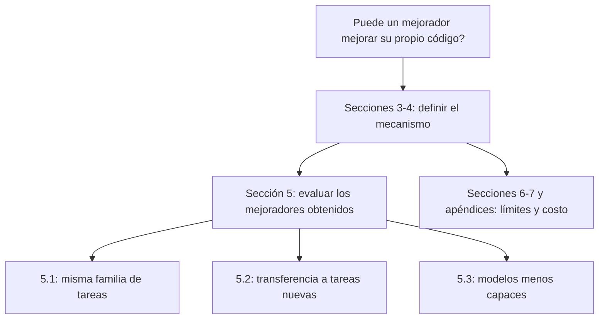
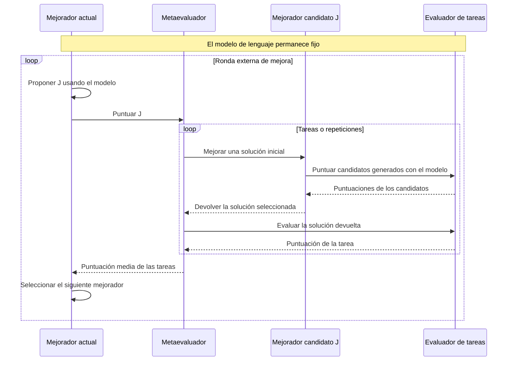
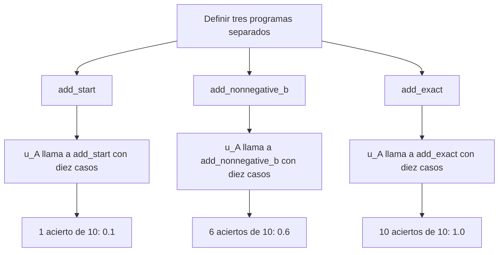
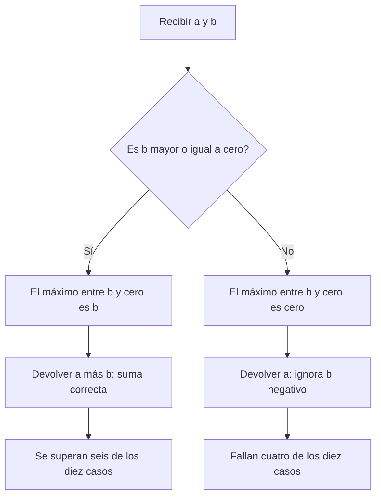
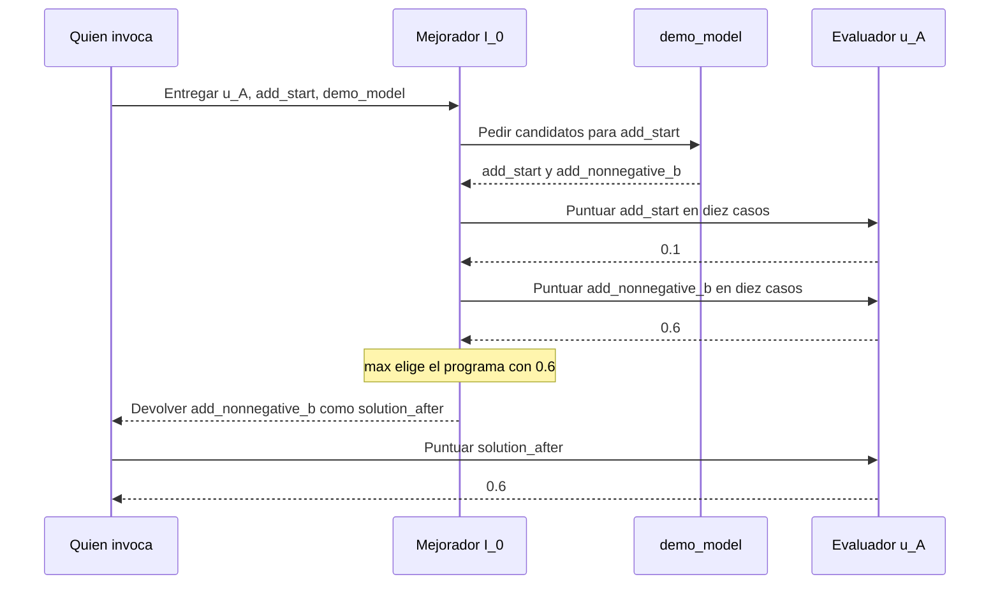
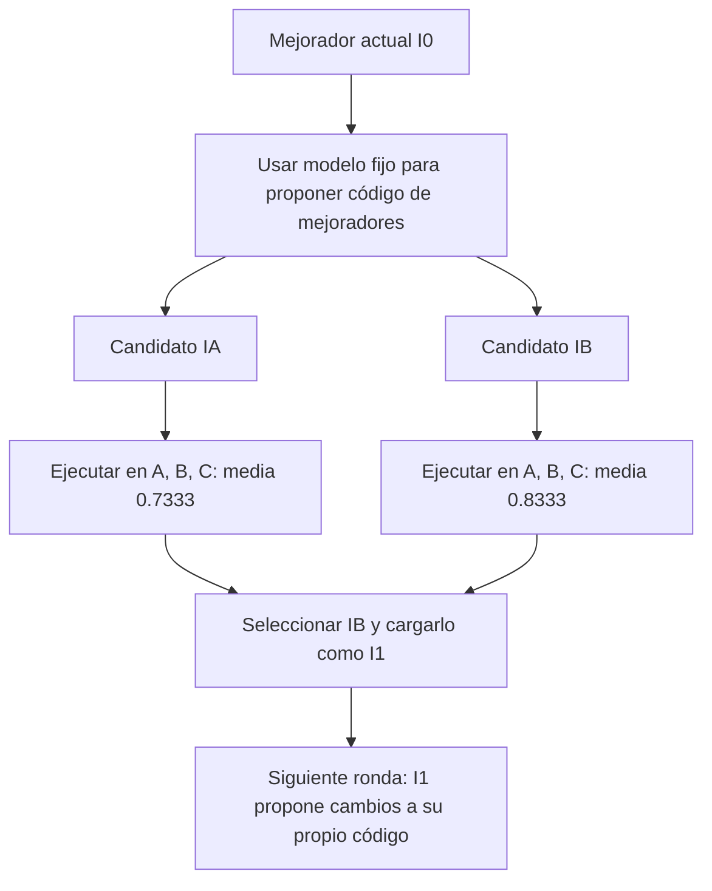
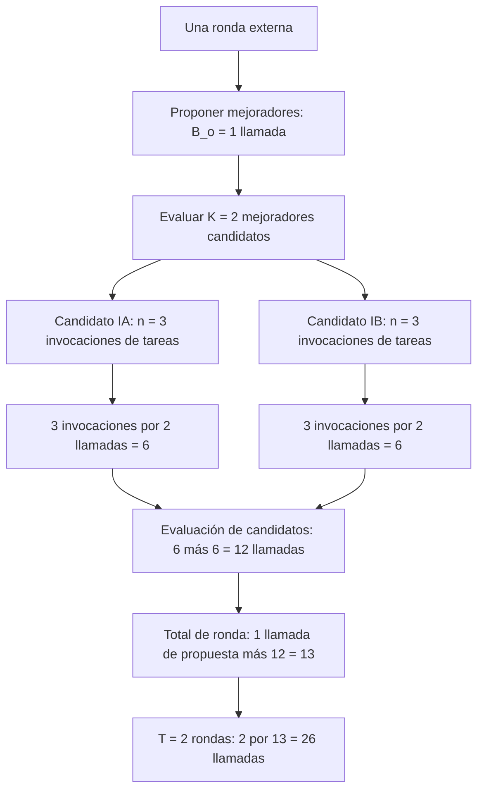

# STOP: mecanismo, correspondencia con el código y evaluación

[English](pap-0001-stop.md) | Español

Traducción de la revisión 3 de la versión principal en inglés. Conserva sus fuentes,
estados y conclusiones; no constituye una revisión independiente del paper.

STOP es una referencia útil para distinguir la solución de una tarea del programa que la
mejora. Para thinking-harness, la pregunta inmediata es qué componente podría modificarse
y cómo medir su mejora de forma independiente de la búsqueda que la produjo.
Esta revisión prepara esa discusión; todavía no selecciona el método de la tesis.

## 1. Fuentes y estado de la revisión

**Paper:** Eric Zelikman, Eliana Lorch, Lester Mackey y Adam Kalai,
*Self-Taught Optimizer (STOP): Recursively Self-Improving Code Generation*.
[Versión 3, 16 de agosto de 2024, COLM 2024](https://arxiv.org/abs/2310.02304v3).
La clave bibliográfica es `zelikman2023stop` y conserva el año del preprint inicial.

**Afiliaciones indicadas en la página 1 de la v3:**

| Autor | Afiliación indicada | Tipo de institución / nota |
|---|---|---|
| Eric Zelikman | Stanford University | Universidad; nota con asterisco: trabajo realizado en Microsoft Research New England |
| Eliana Lorch | No indicada en la cabecera del paper | No se deduce una afiliación del propietario del repositorio |
| Lester Mackey | Microsoft Research | Organización de investigación de la industria |
| Adam Kalai | OpenAI | Empresa de investigación en IA; nota con asterisco: trabajo realizado en Microsoft Research New England |

Son las afiliaciones de esta versión del paper, no una afirmación sobre su empleo actual.
El espacio `microsoft` del repositorio no convierte a todos los autores en empleados de Microsoft.
Fuente: [portada y nota de afiliación de la v3](https://arxiv.org/pdf/2310.02304v3#page=1).

**Código:** [microsoft/stop](https://github.com/microsoft/stop/tree/0d6780c54306b2486dd36e9c4ae9b49aceb27ea4),
commit `0d6780c54306b2486dd36e9c4ae9b49aceb27ea4`. Todos los enlaces al código apuntan a esta versión.

| Actividad | Estado y alcance |
|---|---|
| Inspección asistida de fuentes | Resumen, introducción, secciones 3-8, algoritmo 1, figuras 2 y 4, tabla 1 y apéndice K; inspección parcial de A.1-A.2 |
| Lectura completa del paper | Parcial; falta profundizar en los trabajos relacionados, las demostraciones y los demás apéndices |
| Inspección estática del código | Ejecutor, mejoradores iniciales, metautilidad, utilidad de paridad, interfaz del modelo, cargador, configuración y punto de entrada de la evaluación de transferencia |
| Ejecución | Código original no ejecutado; sin importar módulos de terceros, invocar modelos ni realizar experimentos científicos. Solo se ejecutaron los fragmentos didácticos propios y deterministas de la sección 4 para comprobar sus valores |
| Discusión guiada | Pendiente; preparar el documento no acredita haber completado la lectura personal |
| Reproducción | Sin resultados reproducidos |

`author-claim` identifica un hallazgo reportado por los autores. `interpretation` identifica
un análisis del proyecto o una propuesta ilustrativa. `static-inspection` identifica un
comportamiento observado directamente en el código fuente, todavía no verificado en ejecución.
`reproduced-result` se reserva para evidencia medida.

## 2. Contribución y evidencia publicadas

**Afirmación de los autores.** La contribución central consiste en utilizar un mejorador
para modificar su propio código, manteniendo fijo el modelo de lenguaje. El argumento del
paper se organiza en tres partes:

- **Mecanismo, secciones 3-4:** definir una utilidad de tarea, un mejorador y una metautilidad
  que puntúa las soluciones producidas por ese mejorador. Utilizar la metautilidad para
  buscar un mejorador superior. El objeto editable es software, no los pesos del modelo.
- **Evidencia empírica, sección 5:** examinar la mejora en una familia de tareas, la
  transferencia a otras tareas y la dependencia del modelo utilizado. Son preguntas distintas.
- **Límites, secciones 6-7 y apéndices A/K:** examinar la explotación del evaluador, la evasión
  de restricciones, los supuestos de generalización y el costo computacional. Observar una
  mejora no garantiza que cada actualización recursiva tenga éxito.



La evidencia debe interpretarse dentro del alcance reportado:

| Evidencia | Qué se evalúa | Qué no demuestra |
|---|---|---|
| Sección 5.1: paridad con ruido mediante GPT-4 | Rendimiento medio de cinco ejecuciones independientes de STOP; comparación con el mejorador inicial, cadena de razonamiento y mejorador voraz | Que cada trayectoria individual mejore de forma monótona |
| Sección 5.2: transferencia | Un mejorador evolucionado seleccionado sobre cinco tareas nuevas | La distribución del rendimiento de transferencia de todos los mejoradores evolucionados |
| Sección 5.3: dependencia del modelo | Fallos con modelos menos capaces | Que cualquier modelo pueda mejorar su andamiaje de forma fiable |
| Apéndice A: teoría | Generalización bajo supuestos, incluidos programas acotados y tareas muestreadas de forma independiente | Garantías incondicionales para las actualizaciones recursivas prácticas |
| Apéndice K: costo | Aproximadamente 3,000 llamadas a GPT-4 por iteración y ejecución | Una estimación monetaria actual o equivalencia entre llamadas a la interfaz y solicitudes API |

En la sección 5.1, la utilidad de tarea promedia **20 instancias de desarrollo** de paridad
con ruido. La metautilidad utiliza **cinco copias repetidas del mismo par tarea/solución
inicial**, porque las llamadas al modelo son estocásticas. La generalización se evalúa sobre
**50 instancias reservadas**. Por separado, la gráfica agrega **cinco ejecuciones
independientes de STOP**. Son niveles de repetición distintos, no cinco familias de tareas.
La sección 6 de esta review describe los datos internos de la implementación.

Los modelos históricos son `gpt-4-0314`, `gpt-3.5-turbo-0613` y
`Mixtral-8x7B-Instruct-v0.1`. Fuente: [paper v3](https://arxiv.org/pdf/2310.02304v3).

## 3. Los dos niveles de mejora

**Inspección estática e interpretación.** La función inicial recibe código, un evaluador y
una interfaz del modelo. Genera alternativas y selecciona según su puntuación. En el nivel
de la tarea, ese código es una solución. En el nivel externo, es el propio mejorador.
Véase la [implementación inicial](https://github.com/microsoft/stop/blob/0d6780c54306b2486dd36e9c4ae9b49aceb27ea4/tasks/meta_optimization/secret_seed_algorithm.py#L3-L23).

El siguiente diagrama es una representación didáctica propia de la estructura de llamadas inspeccionada.



Para una comparación controlada se mantienen fijos el modelo, el evaluador, la partición de
tareas y los límites de recursos. Se modifica el código de las soluciones candidatas dentro
de una evaluación y el código del mejorador entre rondas externas.
Cambiar un prompt o una estrategia de búsqueda no implica por sí mismo actualizar los pesos del modelo.

## 4. Ejemplo paso a paso: de una prueba a un nuevo mejorador

**Interpretación: ejemplo didáctico propio, no mediciones de STOP.** Suma, multiplicación
y máximo sustituyen las tareas más difíciles del paper para poder seguir cada puntuación.
Las funciones y respuestas del modelo se escriben de antemano. Este ejemplo no contiene
llamadas a modelos, aprendizaje ni resultados reproducidos de STOP.

### 4.1. Separar los tres objetos

| Objeto | Función | Salida |
|---|---|---|
| Solución `s_A` | Código que intenta resolver la tarea A, como sumar dos números | Un número, por ejemplo `5` |
| Evaluador de tarea `u_A` | Ejecuta esa solución sobre casos fijos y asigna una puntuación | Una puntuación, por ejemplo `0.6` |
| Mejorador `I_0` | Utiliza el modelo `L` para proponer código de soluciones, puntúa candidatos y devuelve uno | Un programa, no su puntuación |

La `A` de `u_A` identifica la **tarea A**. No es una llamada recursiva ni un número de
iteración. El `0` de `I_0` identifica al **mejorador inicial**. Los mejoradores candidatos
`I_A` e `I_B` que aparecen después son programas alternativos, no los evaluadores `u_A`
y `u_B`. El evaluador permanece fijo mientras cambia el código candidato.

### 4.2. ¿Qué produce exactamente una puntuación de 0.6?

La tarea A consiste en sumar dos enteros. Se parte de una solución incorrecta que ignora la
segunda entrada. Una modificación propuesta resuelve las entradas con segundo operando no
negativo, pero sigue fallando cuando es negativo:

**`add_start` sí se utiliza.** Es la solución inicial deliberadamente incorrecta:
`add_start(2, 3)` devuelve `2`, aunque la suma requerida es `5`. Una sentencia `def` solo
define la función; no ejecuta su cuerpo. Más adelante, `u_A(add_start)` entrega esa función
al evaluador. Dentro de `score_cases`, `solution(a, b)` la invoca realmente una vez por
caso, diez veces.

Las tres definiciones son versiones distintas escritas a mano, no cambios automáticos de
una misma función:

| Función | Propósito aquí | Dónde se utiliza |
|---|---|---|
| `add_start` | Programa inicial incorrecto: ignora `b` | Se puntúa abajo y luego se entrega a `I_0` en la sección 4.3 |
| `add_nonnegative_b` | Candidato parcialmente correcto | Se puntúa abajo y se incluye entre las respuestas de `demo_model` |
| `add_exact` | Comparación totalmente correcta para estos casos | Se puntúa abajo; **no** se ofrece en `demo_model` en la sección 4.3 |

El comentario del código identifica un ejemplo didáctico escrito a mano. No desactiva las
funciones ni significa que no se utilicen. Las tres se evalúan en las tres líneas `print`
del final:



```python
# Three handwritten solution versions, evaluated by the print calls below.
def add_start(a, b):
    return a


def add_nonnegative_b(a, b):
    return a + max(b, 0)


def add_exact(a, b):
    return a + b


cases_A = [(2, b, 2 + b) for b in range(-4, 6)]


def score_cases(solution, cases):
    passed = 0
    for a, b, expected in cases:
        actual = solution(a, b)
        if actual == expected:
            passed += 1
    return passed / len(cases)


def u_A(solution):
    return score_cases(solution, cases_A)


print(u_A(add_start))          # 0.1
print(u_A(add_nonnegative_b))  # 0.6
print(u_A(add_exact))          # 1.0
```

El candidato parcial funciona cuando `b` es **no negativo, incluido el cero**. Su decisión
interna puede leerse sin ejecutar todo el evaluador:



Para `(2, 3)`, el candidato parcial devuelve `2 + 3 = 5`. Para `(2, -3)`, devuelve
`2 + 0 = 2`, en lugar de `-1`. Los conteos seis/cuatro corresponden al conjunto de prueba
elegido; no son proporciones universales de todas las entradas posibles.

`range(-4, 6)` produce diez valores: desde -4 hasta 5. El evaluador entrega cada entrada a
`add_nonnegative_b`, compara su resultado con la suma esperada fija y cuenta:

| Caso | Entradas `(a, b)` | Esperado | Obtenido | Crédito |
|---|---|---:|---:|---:|
| 1 | `(2, -4)` | -2 | 2 | 0 |
| 2 | `(2, -3)` | -1 | 2 | 0 |
| 3 | `(2, -2)` | 0 | 2 | 0 |
| 4 | `(2, -1)` | 1 | 2 | 0 |
| 5 | `(2, 0)` | 2 | 2 | 1 |
| 6 | `(2, 1)` | 3 | 3 | 1 |
| 7 | `(2, 2)` | 4 | 4 | 1 |
| 8 | `(2, 3)` | 5 | 5 | 1 |
| 9 | `(2, 4)` | 6 | 6 | 1 |
| 10 | `(2, 5)` | 7 | 7 | 1 |
| Total | Diez casos fijos | | | 6 |

Por tanto, `u_A(add_nonnegative_b) = 6 / 10 = 0.6`. Significa que **se superan seis de estos
diez casos**. No significa que el modelo tenga 60% de confianza, que cada respuesta sea 60%
correcta ni que una entrada futura cualquiera tenga una probabilidad de éxito demostrada del
60%. Aquí cada caso es binario, pero la puntuación agregada tiene valores intermedios. Otro
evaluador podría conceder crédito parcial por caso.

**Conexión con el paper, sección 3.** STOP admite una utilidad de valor real acotado,
posiblemente estocástica; no exige una función binaria de éxito o fallo. Por ejemplo, una
regla de crédito parcial elegida por separado podría ser
`max(0, 1 - abs(actual - expected) / 10)`: con esperado `5` y obtenido `3`, concedería `0.8`.
Esta regla es una ilustración alternativa, no la utilizada en la tabla ni un resultado de
STOP. La paridad con ruido de la sección 5.1 utiliza exactitud de predicción, por lo que su
utilidad agregada también puede estar entre cero y uno. El evaluador debe especificarse
antes de comparar candidatos; cambiarlo durante la comparación alteraría el significado
de la puntuación.

### 4.3. Abrir la expresión anidada, una operación a la vez

Un mejorador pequeño puede elegir entre dos programas propuestos. `demo_model` proporciona
respuestas fijas únicamente para que el ejemplo sea determinista; un `L` real generaría código
a partir de un prompt con la solución inicial y la descripción de la utilidad.

Este diagrama sigue únicamente la llamada de suma. Quien invoca recibe primero un programa
y después solicita su puntuación. El evaluador se utiliza durante la selección y nuevamente
tras devolver el resultado:



`add_exact` no está entre estas propuestas, por lo que no puede ganar la selección aunque
la sección 4.2 muestre su puntuación de `1.0`. El mejorador solo compara los candidatos
que recibe.

```python
def demo_model(initial_solution):
    return [initial_solution, add_nonnegative_b]


def I_0(utility, initial_solution, model):
    candidates = model(initial_solution)
    return max(candidates, key=utility)


solution_after = I_0(u_A, add_start, demo_model)
score_after = u_A(solution_after)
print(solution_after.__name__)  # add_nonnegative_b
print(score_after)              # 0.6
```

La ejecución se lee en este orden:

1. Entregar `u_A`, el programa inicial `add_start` y la interfaz del modelo.
2. Recibir dos candidatos: `add_start` y `add_nonnegative_b`.
3. Evaluar ambos con `u_A`: sus puntuaciones son `0.1` y `0.6`.
4. `max(..., key=utility)` devuelve el **programa** con mayor puntuación, `add_nonnegative_b`.
5. El `u_A(solution_after)` externo evalúa el programa devuelto y obtiene nuevamente `0.6`.
   Esta última llamada puntúa la salida del mejorador; no genera otra modificación.

La expresión compacta contiene, por tanto, dos operaciones, no un evaluador recursivo:

$$
s'_A=I_0(u_A,s_A,L),\qquad u_A(s'_A)=6/10=0.6.
$$

Escribir `u_A(I_0(u_A,s_A,L)) = 0.6` simplemente anida esas dos operaciones. `I_0`
**recibe** `u_A` para comparar candidatos; el `u_A` exterior **puntúa** la solución devuelta.

Para facilitar la lectura, este ejemplo utiliza funciones de Python; STOP pasa cadenas de
código fuente y carga programas mediante su implementación. Además, el ejemplo conserva la
solución inicial entre los candidatos. El mejorador inicial de STOP inspeccionado selecciona
solo entre candidatos generados, por lo que conservar el programa de partida no es una garantía
de ese mejorador. El ejemplo no modela excepciones, tiempos máximos, contabilidad de recursos
ni aislamiento, y no es un ejecutor para código no confiable.

### 4.4. ¿De dónde sale la media `(0.6 + 0.7 + 0.5) / 3`?

Se repite la mejora de soluciones para las tareas B y C. Supongamos que los programas
devueltos son `multiply_magnitude` y `maximum_left`. Sus resultados también pueden calcularse
directamente:

```python
def multiply_magnitude(a, b):
    return abs(a * b)


def maximum_left(a, b):
    return a


cases_B = [(a, 2, a * 2) for a in range(-3, 7)]
cases_C = [(a, 5, max(a, 5)) for a in range(10)]


def u_B(solution):
    return score_cases(solution, cases_B)


def u_C(solution):
    return score_cases(solution, cases_C)


task_scores = [
    u_A(solution_after),
    u_B(multiply_magnitude),
    u_C(maximum_left),
]
meta_score = sum(task_scores) / len(task_scores)
print(task_scores)        # [0.6, 0.7, 0.5]
print(round(meta_score, 3))  # 0.6
```

| Tarea | Qué hace la solución devuelta | Por qué obtiene esa puntuación |
|---|---|---|
| A: suma | Ignora los valores negativos de `b` | Supera los seis casos con `b` no negativo: `6/10 = 0.6` |
| B: multiplicación | Elimina el signo del producto | Supera las entradas `a=0,...,6`; falla en `a=-3,-2,-1`: `7/10 = 0.7` |
| C: máximo | Siempre devuelve la entrada izquierda | Supera las entradas `a=5,...,9`; falla en `a=0,...,4`: `5/10 = 0.5` |

La media resultante es `(0.6 + 0.7 + 0.5) / 3 = 1.8 / 3 = 0.6`. Asigna una puntuación al
**mejorador**, a partir de las tres soluciones que devolvió. El código anterior proporciona
explícitamente las salidas de B/C; no simula sus llamadas al modelo. En un evaluador completo,
esas salidas se obtendrían invocando al mismo mejorador candidato para cada tarea:

```python
def meta_utility(improver, tasks, model):
    scores = []
    for utility, initial_solution in tasks:
        solution_after = improver(utility, initial_solution, model)
        scores.append(utility(solution_after))
    return sum(scores) / len(scores)
```

Esta definición muestra el bucle; necesita pares de tareas reales y una interfaz de modelo
compatible para invocarse. `D` representa esa colección de tareas, `n` su número de entradas
y `hat u_D` esta media empírica:

$$
\widehat{u}_D(I)=\frac{1}{n}\sum_{j=1}^{n}u_j\bigl(I(u_j,s_j,L)\bigr).
$$

Hay dos divisiones distintas: **diez casos** para puntuar cada solución y **tres tareas** para
puntuar al mejorador. La media coincide con `18/30` porque las tareas tienen igual número de
casos; con cantidades distintas, promediar las tareas con igual peso sería diferente de
agrupar todos los casos en una sola proporción. Del mismo modo, las puntuaciones `3/10`,
`5/10` y `8/10` producirían una metapuntuación aproximada de `0.5333`, no `0.6`. Son otro
conjunto de resultados del ejemplo.

### 4.5. ¿Dónde ocurre la automejora recursiva?

Hasta aquí, un mejorador fijo ha producido soluciones de tareas. La **ronda externa** modifica
al propio mejorador. En lugar de entregar código de suma como entrada editable, se entrega
el código de `I_0`. En lugar de utilizar `u_A` para juzgar sumas, se utiliza `hat u_D` para
juzgar mejoradores candidatos ejecutándolos sobre las tareas. El modelo y el presupuesto de
comparación permanecen fijos.

Para ilustrarlo, supongamos que `I_0` utiliza `L` para proponer dos programas mejoradores:

- `I_A`: una estrategia de corrección basada en retroalimentación.
- `I_B`: una estrategia que explora rutas de corrección alternativas.

Estos nombres representan programas, no puntuaciones. Los siguientes son **resultados
hipotéticos de las soluciones devueltas**, no salidas generadas por el modelo de ejemplo ni
efectos garantizados de esas estrategias:

| Mejorador evaluado | Tarea A | Tarea B | Tarea C | Metapuntuación |
|---|---:|---:|---:|---:|
| Actual `I_0` | 0.6 | 0.7 | 0.5 | 0.6000 |
| Candidato `I_A` | 1.0 | 0.7 | 0.5 | 0.7333 |
| Candidato `I_B` | 1.0 | 1.0 | 0.5 | 0.8333 |

Para A, la función de suma exacta mostrada antes ilustra una puntuación de `1.0`. Para B,
sustituir `abs(a * b)` por `a * b` superaría los diez casos. C sigue equivocándose en la mitad.
Evaluar a un mejorador candidato significa ejecutarlo para que produzca esas soluciones de
tareas, no ejecutar al propio mejorador como función de suma. El programa actual aparece como
referencia; el mejorador inicial inspeccionado no lo incluye automáticamente en la selección.



En esta ilustración se selecciona `I_B` y se denomina `I_1`: `B` identifica al candidato;
`1`, a la siguiente ronda. En ese punto cambia el optimizador que se utilizará después.
Ahora puede leerse la actualización recursiva:

$$
I_{t+1}=\mathrm{load}\left(I_t\left(\widehat{u}_D,\mathrm{code}(I_t),L\right)\right).
$$

- `code(I_t)` es el código fuente del mejorador actual, entregado como entrada editable.
- `I_t(...)` utiliza el modelo y la metautilidad para devolver código de un mejorador propuesto.
- `load(...)` convierte el código elegido en el siguiente mejorador ejecutable; no es un
  diseño de aislamiento.
- La ronda siguiente utiliza `I_{t+1}` para buscar. Puede implementarse con un bucle; no exige
  una llamada recursiva dentro de `u_A`. Corregir repetidamente la suma con un `I_0` que no
  cambia seguiría siendo optimización de tareas, no mejora del mejorador.

El orden matemático de argumentos es `(utility, solution, model)`. La implementación
original de Python utiliza `(initial_solution, utility, language_model)`; deben seguirse los
nombres al relacionar ambas representaciones. Estos ejemplos pequeños y deterministas
explican las interfaces. El experimento publicado de paridad con ruido tiene los niveles
adicionales de instancias y repeticiones descritos en la sección 2.

Una metapuntuación de `0.8333` aquí no acredita rendimiento en tareas futuras. Un conjunto de
prueba no utilizado puede invertir el orden. Seleccionar repetidamente con ese conjunto lo
convertiría en datos de búsqueda. El protocolo de tesis necesita, por tanto, evidencia de
selección y de prueba final separadas, ejecuciones independientes repetidas y límites de recursos.

## 5. Correspondencia entre el algoritmo y el código

**Inspección estática.** Se presenta un recorrido de dependencias, no una traza de ejecución
verificada. Los archivos descriptivos `utility.py` que se suministran al código generado
difieren de los evaluadores implementados en `secret_utility.py`.

| Responsabilidad | Fuente fijada al commit | Observación |
|---|---|---|
| Propuestas iniciales | [Mejorador inicial, líneas 18-23](https://github.com/microsoft/stop/blob/0d6780c54306b2486dd36e9c4ae9b49aceb27ea4/tasks/meta_optimization/secret_seed_algorithm.py#L18-L23) | Un lote; extracción; selección del candidato con `max` |
| Iteración externa | [Ejecutor, líneas 122-179](https://github.com/microsoft/stop/blob/0d6780c54306b2486dd36e9c4ae9b49aceb27ea4/run_improver.py#L122-L179) | Invoca al mejorador actual; evalúa su resultado; guarda y vuelve a cargar el código devuelto |
| Metaevaluación | [Metautilidad, líneas 65-143](https://github.com/microsoft/stop/blob/0d6780c54306b2486dd36e9c4ae9b49aceb27ea4/tasks/meta_optimization/secret_utility.py#L65-L143) | Repite la mejora de tareas; devuelve la puntuación media de validación; opcionalmente registra las puntuaciones de prueba |
| Evaluación de tareas | [Utilidad de paridad, líneas 9-95](https://github.com/microsoft/stop/blob/0d6780c54306b2486dd36e9c4ae9b49aceb27ea4/tasks/parity_noise/secret_utility.py#L9-L95) | Genera instancias, invoca la solución y puntúa las predicciones |
| Presupuesto del modelo | [Interfaz, líneas 226-250](https://github.com/microsoft/stop/blob/0d6780c54306b2486dd36e9c4ae9b49aceb27ea4/language_model.py#L226-L250) | Cuenta las invocaciones a la interfaz y limita las respuestas por invocación |
| Carga del código generado | [Funciones auxiliares, líneas 52-77 y 154-192](https://github.com/microsoft/stop/blob/0d6780c54306b2486dd36e9c4ae9b49aceb27ea4/helpers.py#L52-L192) | Escribe el código fuente en un módulo temporal y lo importa |
| Entrada de evaluación de transferencia | [Evaluación de transferencia, líneas 207-214](https://github.com/microsoft/stop/blob/0d6780c54306b2486dd36e9c4ae9b49aceb27ea4/tasks/meta_optimization/transfer_eval.py#L207-L214) | Elige un mejorador almacenado e invoca al evaluador de tareas |

## 6. Datos y evaluación en la implementación inspeccionada

**Inspección estática.** La tarea de paridad genera datos sintéticos: 10 bits, 100 ejemplos
etiquetados de entrenamiento y 20 entradas de prueba por instancia. El ruido afecta a las
etiquetas de entrenamiento. La utilidad de desarrollo promedia 20 instancias y la utilidad
de prueba 50, con semillas base distintas. La puntuación es la exactitud media de las
predicciones; se intenta aplicar un límite de dos segundos por instancia. Estos conteos
anidados corresponden a unidades distintas y no deben agruparse como si fueran ejecuciones
experimentales independientes.
Fuente: [evaluador de paridad](https://github.com/microsoft/stop/blob/0d6780c54306b2486dd36e9c4ae9b49aceb27ea4/tasks/parity_noise/secret_utility.py#L21-L85).

**Interpretación para la tesis.** Un método que modifica código y mantiene fijos los pesos
del modelo sigue necesitando datos para buscar y evaluar. No requiere automáticamente un
conjunto de datos para ajuste fino. Las tareas públicas de programación, las instancias
generadas de juegos o los casos de negocio simulados podrían aportar esa evidencia. El
caso seleccionado debe permitir una puntuación repetible y separar la retroalimentación
de la búsqueda de la evaluación final.

## 7. Contabilidad del costo

**Inspección estática.** La configuración predeterminada especifica seis iteraciones
externas, cuatro llamadas a la interfaz del modelo por invocación del mejorador, seis
respuestas por llamada, 25 llamadas a la utilidad, 25 llamadas a la metautilidad y cinco
repeticiones de metaevaluación. Son presupuestos separados, no un único límite global de gasto.
Fuente: [configuración](https://github.com/microsoft/stop/blob/0d6780c54306b2486dd36e9c4ae9b49aceb27ea4/config.py#L1-L20).

**Interpretación: presupuesto inventado y más pequeño para explicar el cálculo.** Una llamada
al wrapper es una invocación a la interfaz de software que rodea al modelo de lenguaje.
No equivale a una prueba unitaria, un token ni necesariamente una solicitud API. Los valores
siguientes describen un protocolo propuesto, no la configuración anterior ni una reconstrucción
del gasto de STOP.

| Símbolo | Qué cuenta | Asignación del ejemplo |
|---|---|---:|
| `T` | Rondas externas de mejora | 2 rondas |
| `B_o` | Llamadas a la interfaz del modelo para proponer mejoradores en una ronda externa | 1 llamada por ronda |
| `K` | Mejoradores candidatos evaluados en esa ronda | 2 candidatos |
| `n` | Invocaciones de mejora de tareas por candidato, incluidas las repeticiones asignadas | 3 invocaciones por candidato |
| `B` | Llamadas a la interfaz del modelo dentro de cada invocación de mejora de tarea | 2 llamadas por invocación |
| `N_wrapper` | Presupuesto total de llamadas para estas dos actividades en todas las rondas | 26 llamadas |

El subíndice de `B_o` es la letra **o**, por las propuestas de la ronda externa, no el número
cero. La `n` minúscula cuenta invocaciones de mejora, no los diez casos de prueba utilizados
por `u_A`. Esas diez comprobaciones aritméticas ejecutan Python; no necesitan una llamada
al modelo por cada caso.

### 7.1. Seguir el presupuesto de una ronda



Los presupuestos anidados se leen desde dentro hacia fuera:

1. Un candidato mejora una tarea: presupuesto de **2** llamadas a la interfaz del modelo (`B`).
2. Ese candidato se evalúa mediante tres invocaciones de tareas: **3 × 2 = 6** llamadas (`nB`).
3. Se evalúan dos candidatos: **2 × 6 = 12** llamadas (`KnB`).
4. Se añade la llamada externa que los propuso: **1 + 12 = 13** llamadas (`B_o + KnB`).
5. Se repite la asignación en dos rondas externas: **2 × 13 = 26** llamadas.

Por tanto, el presupuesto general es:

$$
N_{\mathrm{wrapper}} = T(B_o + KnB).
$$

En el ejemplo, se sustituyen los valores después de identificar sus unidades:

$$
N_{\mathrm{wrapper}} = 2(1 + 2\cdot3\cdot2)=2(13)=26.
$$

La suma separa **proponer mejoradores** de **evaluarlos mediante la mejora de tareas**.
Las multiplicaciones cuentan trabajo repetido. El consumo real puede ser menor si un
candidato termina antes o no utiliza toda su asignación.

### 7.2. Qué incluye este total y qué deja fuera

Las 26 llamadas cubren únicamente las dos actividades anteriores. Se añaden por separado la
evaluación de la referencia, las comprobaciones del mejorador vigente, las repeticiones
adicionales a las incluidas en `n` y la evaluación final. Si el propio evaluador llama a un
modelo, también deben contabilizarse esas llamadas por separado. El evaluador aritmético
de la sección 4 no hace ninguna llamada a modelos.

Con un máximo de cuatro respuestas por llamada a la interfaz, el presupuesto sería de
**26 × 4 = 104 respuestas**. Las respuestas todavía no equivalen a tokens ni a dinero.
El consumo de tokens depende de la longitud de entradas y salidas; el tiempo transcurrido
incluye también la ejecución del código y la evaluación.

En la interfaz inspeccionada pueden agruparse prompts idénticos, solicitarse respuestas
conjuntamente y reintentarse solicitudes fallidas. Por ello, las llamadas a la interfaz,
las solicitudes a la API, las respuestas generadas y los tokens facturados no son unidades
intercambiables. Deben registrarse las cuatro por separado, junto con el tiempo de evaluación.
Fuente: [envío de solicitudes y reintentos](https://github.com/microsoft/stop/blob/0d6780c54306b2486dd36e9c4ae9b49aceb27ea4/language_model.py#L294-L356).

Para evaluar la reutilización, se compara el costo total de búsqueda más el costo de
utilización en `m` tareas con esas mismas `m` tareas resueltas mediante un mejorador fijo.
El esfuerzo de revisión humana se registra por separado. Una puntuación mayor en las tareas
no demuestra por sí sola un menor costo de desarrollo.

## 8. Brechas de reproducción y riesgos de validez

Estas observaciones corresponden al commit fijado. No se ejecutaron fallos ni intentos de explotación.

| Hallazgo | Evidencia | Consecuencia para una reproducción futura |
|---|---|---|
| Inconsistencia en la ruta de transferencia | Las [líneas 207-212](https://github.com/microsoft/stop/blob/0d6780c54306b2486dd36e9c4ae9b49aceb27ea4/tasks/meta_optimization/transfer_eval.py#L207-L212) asignan `improve_algorithm_base` en la rama predeterminada `improved` y después abren `improve_algorithm_path` | Si se alcanza esa instrucción con dicha configuración, la expresión de apertura referencia un nombre no definido |
| Selección limitada de tareas de transferencia | La [línea 21](https://github.com/microsoft/stop/blob/0d6780c54306b2486dd36e9c4ae9b49aceb27ea4/tasks/meta_optimization/transfer_eval.py#L21) selecciona solo `three_sat` | El punto de entrada no enumera actualmente el conjunto completo de tareas de transferencia |
| La aceptación externa no compara con el mejorador vigente | El [ejecutor, líneas 140-144](https://github.com/microsoft/stop/blob/0d6780c54306b2486dd36e9c4ae9b49aceb27ea4/run_improver.py#L140-L144), rechaza el valor cero sin compararlo con la puntuación anterior | Devolver un resultado sin fallo no demuestra que el mejorador sea superior |
| La selección inicial omite el código de partida | El [mejorador inicial, líneas 18-23](https://github.com/microsoft/stop/blob/0d6780c54306b2486dd36e9c4ae9b49aceb27ea4/tasks/meta_optimization/secret_seed_algorithm.py#L18-L23), maximiza sobre los candidatos generados | Un candidato puede reemplazar una solución inicial mejor |
| Aislamiento limitado | La [protección de fiabilidad](https://github.com/microsoft/stop/blob/0d6780c54306b2486dd36e9c4ae9b49aceb27ea4/helpers.py#L80-L94) advierte explícitamente que no es un entorno aislado de seguridad | Los nombres de archivos y las restricciones de funciones de Python no garantizan el aislamiento del evaluador ni de las credenciales |
| Entorno histórico incompleto | El [árbol de código](https://github.com/microsoft/stop/tree/0d6780c54306b2486dd36e9c4ae9b49aceb27ea4) no contiene un archivo de bloqueo de dependencias; la [interfaz del modelo](https://github.com/microsoft/stop/blob/0d6780c54306b2486dd36e9c4ae9b49aceb27ea4/language_model.py#L20-L38) utiliza identificadores y configuración de API históricos | La compatibilidad y disponibilidad de los modelos siguen sin verificarse; las sustituciones serían adaptaciones |

**Interpretación.** Una propuesta de reproducción necesita una frontera externa de ejecución,
una evaluación final de solo lectura, una contabilidad fija y una lista explícita de las
diferencias respecto del original. Un archivo llamado `secret_utility.py` no constituye un
mecanismo de control de acceso. La puntuación en modo de prueba está disponible mediante
la misma interfaz del evaluador de Python; sería necesaria una frontera de orquestación
confiable para restringir ese acceso. Es una observación de arquitectura, no una filtración
demostrada ni evidencia de que los experimentos publicados hayan sido comprometidos.

## 9. Qué se ha comprobado de forma independiente

- La inspección del código fijado al commit respalda el mapa de llamadas y la inconsistencia
  identificada en la ruta de transferencia.
- El análisis sintáctico estático de los archivos Python descargados no encontró errores de
  sintaxis. No demuestra que puedan importarse, que sus dependencias sean compatibles, que
  funcionen correctamente en ejecución ni que se hayan reproducido sus resultados numéricos.
- Se ejecutaron localmente los fragmentos didácticos propios de Python de la sección 4: puntuaciones de suma 0.1, 0.6 y 1.0; puntuaciones de tareas 0.6, 0.7 y 0.5; media 0.6. La tabla de candidatos externos sigue siendo hipotética y se comprobó su aritmética. Esto valida la explicación, no STOP.
- Las afirmaciones de rendimiento del artículo siguen atribuidas a sus autores. No existe
  un resultado medido del proyecto.

La revisión está lista para la discusión. La lectura completa, la inspección en ejecución,
la verificación de demostraciones y la reproducción siguen siendo actividades separadas.

## 10. Implicaciones para la tesis y siguiente discusión

**Interpretación.** Antes de seleccionar un método, se comparan tres alcances posibles:

| Alcance | Objeto modificable | Pregunta principal |
|---|---|---|
| Mejorador fijo, harness que evoluciona | Una configuración o un módulo acotado del harness | ¿Puede un proceso de búsqueda fijo mejorar el rendimiento de las tareas dentro del presupuesto? |
| Mejorador y harness que evolucionan | El procedimiento de búsqueda y su resultado | ¿La recursión aporta valor frente a un mejorador fijo con el mismo presupuesto? |
| Alternativa de aprendizaje o planificación | Una política, un planificador o una regla de búsqueda | ¿Otro método de optimización podría atender la misma necesidad práctica de forma más sencilla? |

En un caso de programación, el objeto editable podría ser un ciclo de corrección. En un caso
de negocio simulado, podría ser la política de enrutamiento o de reintentos de herramientas.
La primera comparación debe limitarse a uno de esos objetos; reescribir todo el harness
introduciría problemas adicionales de atribución y validación. Son direcciones candidatas,
no una contribución de tesis ya seleccionada.

La discusión guiada debe responder:

1. ¿Se puede seguir el ejemplo propio desde la puntuación de una tarea hasta la selección
   de un nuevo mejorador?
2. ¿Qué parte de un harness podría cambiar mientras se mantienen fijos su evaluador y presupuesto?
3. ¿Qué referencia de mejorador fijo permitiría aislar el valor añadido de la recursión?
4. ¿Puede ese caso proporcionar tareas de prueba independientes con un costo de evaluación manejable?

Después se revisará Self-Harness con las mismas dimensiones: objeto modificable, mecanismo
de actualización, frontera de evaluación, costo de búsqueda y evidencia de transferencia.
Su mecanismo y sus resultados todavía deben verificarse. La siguiente lectura se sigue en
la [tarea #4](https://github.com/jairzinhosantos/thinking-harness/issues/4).
La auditoría general de metadatos continúa en la [tarea #3](https://github.com/jairzinhosantos/thinking-harness/issues/3).
