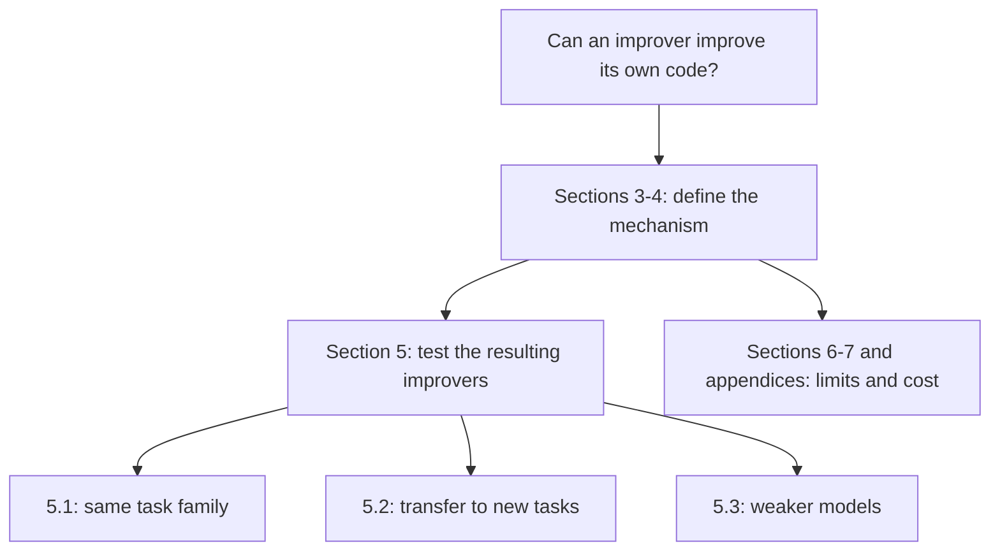
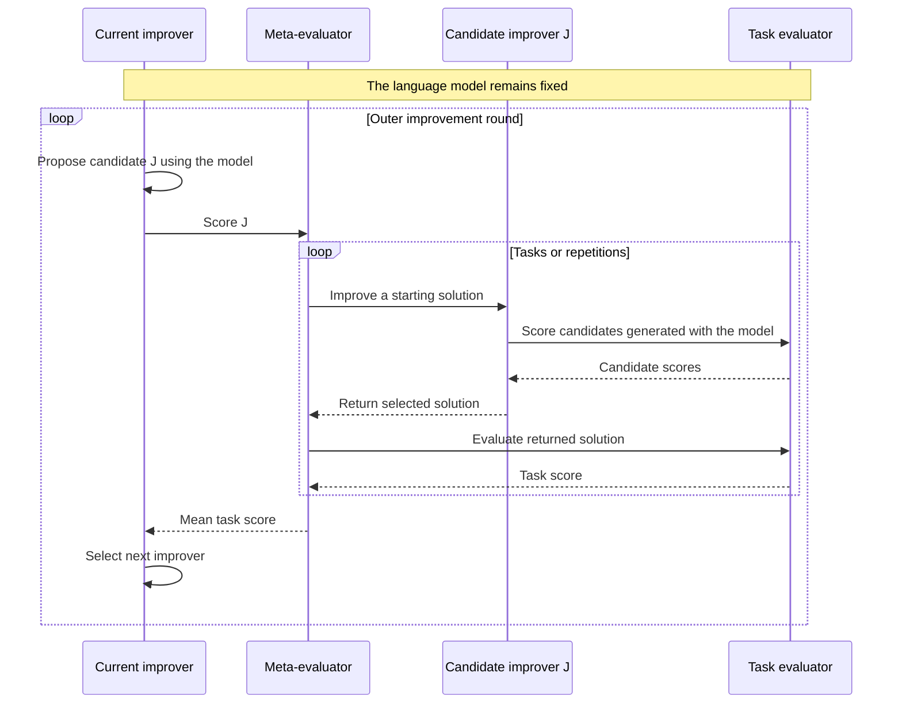
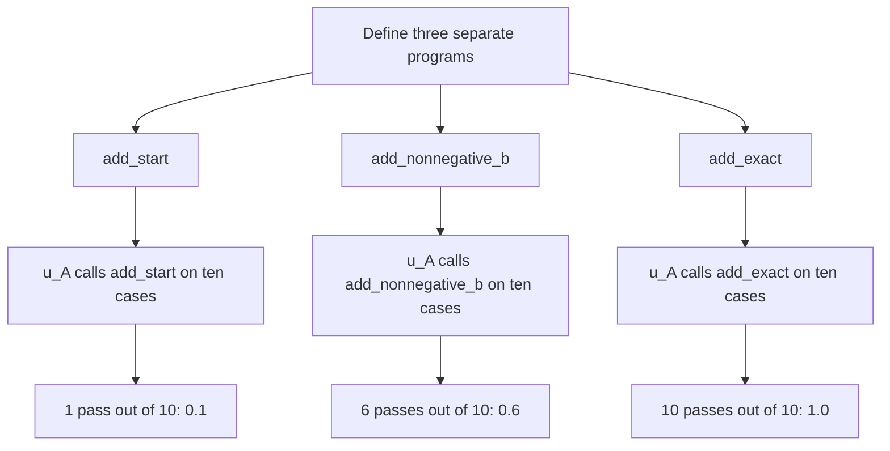
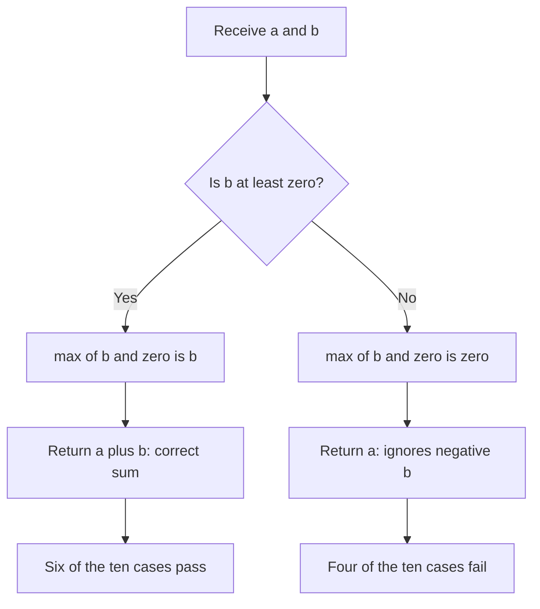
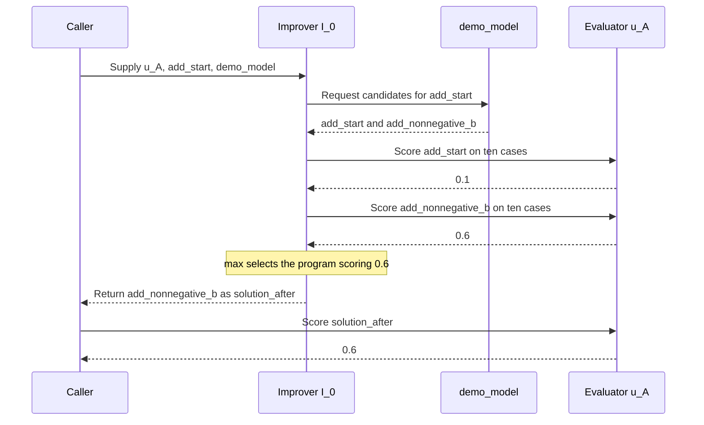
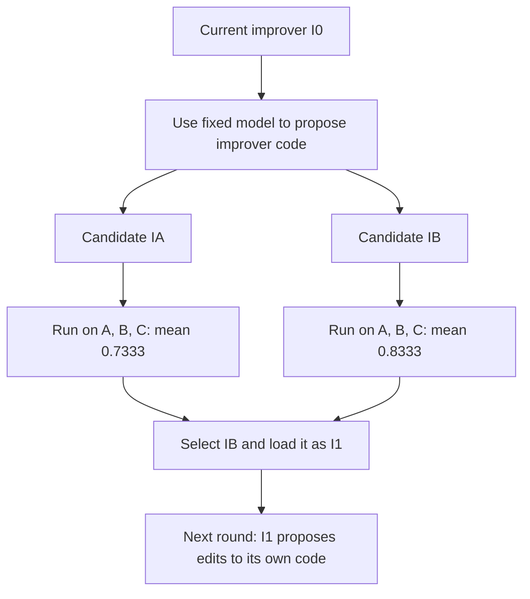
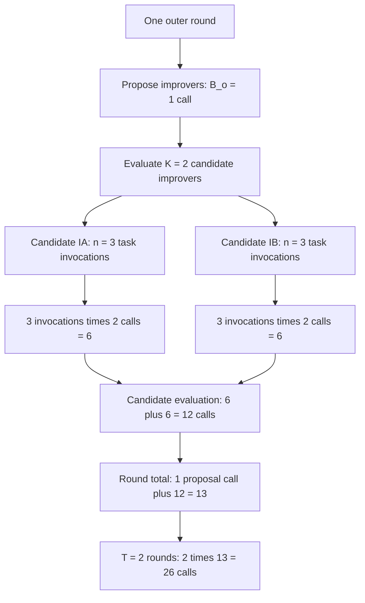

# STOP: mechanism, code trace, and evaluation

English (primary) | [Español](pap-0001-stop.es.md)

STOP is a useful reference for separating a task solution from the program that improves it.
For thinking-harness, the immediate question is which component should be allowed to change
and how its improvement can be measured independently of the search that produced it.
This review prepares that discussion; it does not select the thesis method.

## 1. Sources and review state

**Paper:** Eric Zelikman, Eliana Lorch, Lester Mackey, and Adam Kalai,
*Self-Taught Optimizer (STOP): Recursively Self-Improving Code Generation*.
[Version 3, 16 August 2024, COLM 2024](https://arxiv.org/abs/2310.02304v3).
The bibliographic key is `zelikman2023stop`, retaining the initial preprint year.

**Affiliations printed on page 1 of v3:**

| Author | Listed affiliation | Institution type / note |
|---|---|---|
| Eric Zelikman | Stanford University | University; starred note: work done at Microsoft Research New England |
| Eliana Lorch | Not stated in the paper header | No affiliation inferred from the repository owner |
| Lester Mackey | Microsoft Research | Industrial research organization |
| Adam Kalai | OpenAI | AI research company; starred note: work done at Microsoft Research New England |

These are the affiliations in this paper version, not a claim about current employment.
The repository's `microsoft` namespace does not make every author a Microsoft employee.
Source: [v3 title page and affiliation footnote](https://arxiv.org/pdf/2310.02304v3#page=1).

**Code:** [microsoft/stop](https://github.com/microsoft/stop/tree/0d6780c54306b2486dd36e9c4ae9b49aceb27ea4),
commit `0d6780c54306b2486dd36e9c4ae9b49aceb27ea4`. All code links below use this snapshot.

| Activity | State and scope |
|---|---|
| Assisted source inspection | Abstract, introduction, sections 3-8, Algorithm 1, Figures 2 and 4, Table 1, and Appendix K; partial inspection of A.1-A.2 |
| Complete paper reading | Partial; related work, proofs, and remaining appendices need further study |
| Static code inspection | Runner, seed improvers, meta-utility, parity utility, model wrapper, loader, configuration, and transfer entry point |
| Execution | Upstream code not run; no third-party imports, model calls, or scientific experiments. Only the original deterministic teaching snippets in section 4 were executed to check their values |
| Guided discussion | Pending; document preparation does not establish completed personal reading |
| Reproduction | No reproduced results |

`author-claim` denotes a reported finding. `interpretation` denotes project analysis or
an illustrative proposal. `static-inspection` denotes directly inspected source behavior,
which remains unverified at runtime. `reproduced-result` is reserved for measured evidence.

## 2. Published contribution and evidence

**Author-claim.** The central contribution is to use an improver to revise its own code,
while keeping the language model fixed. The paper builds the argument in three parts:

- **Mechanism, sections 3-4:** define a task utility, an improver, and a meta-utility that
  scores the solutions produced by that improver. Use this meta-utility to search for a
  better improver. The editable object is software, not the model's weights.
- **Empirical evidence, section 5:** examine improvement on one task family, transfer to
  other tasks, and dependence on the underlying model. These answer different questions.
- **Limits, sections 6-7 and appendices A/K:** examine evaluator exploitation, constraint
  circumvention, generalization assumptions, and computational cost. Observed improvement
  is not a guarantee that every recursive update succeeds.



The evidence should be read at its reported scope:

| Evidence | What is evaluated | What it does not establish |
|---|---|---|
| Section 5.1: noisy parity with GPT-4 | Mean performance over five independent STOP runs; comparison with the seed, chain-of-thought, and greedy improvers | Every individual trajectory improves monotonically |
| Section 5.2: transfer | One selected evolved improver on five new tasks | The distribution of transfer performance across all evolved improvers |
| Section 5.3: model dependence | Failures with weaker models | Any model can reliably improve its scaffolding |
| Appendix A: theory | Generalization under assumptions including bounded programs and independently sampled tasks | Unconditional guarantees for practical recursive updates |
| Appendix K: cost | Roughly 3,000 GPT-4 calls per iteration per run | A current monetary estimate or an equivalence between wrapper calls and API requests |

In section 5.1, the task utility averages **20 development instances** of noisy parity.
The meta-utility uses **five repeated copies of the same task/starting-solution pair** because
model calls are stochastic. Generalization is evaluated on **50 held-out instances**.
Separately, the plot aggregates **five independent STOP runs**. These are distinct levels of
repetition, not five task families. Section 6 below describes the implementation's inner data.

Historical models are `gpt-4-0314`, `gpt-3.5-turbo-0613`, and
`Mixtral-8x7B-Instruct-v0.1`. Source: [paper v3](https://arxiv.org/pdf/2310.02304v3).

## 3. The two improvement levels

**Static-inspection and interpretation.** The seed function receives code, an evaluator,
and a model interface. It generates alternatives and selects by score. At the task level,
that code is a solution. At the outer level, that code is the improver itself.
See the [seed implementation](https://github.com/microsoft/stop/blob/0d6780c54306b2486dd36e9c4ae9b49aceb27ea4/tasks/meta_optimization/secret_seed_algorithm.py#L3-L23).

This diagram is an original teaching view of the inspected call structure.



Fixed for a controlled comparison: model, evaluator, task split, and resource limits.
Mutable: candidate solution code inside an evaluation, and improver code across outer rounds.
A changed prompt or search strategy does not by itself imply updated model weights.

## 4. Worked example: from a test result to a new improver

**Interpretation: original teaching example, not STOP measurements.** Addition,
multiplication, and maximum replace the paper's harder tasks so that every score can be
traced. The functions and model responses below are written in advance. There are no model
calls, learning, or reproduced STOP results in this example.

### 4.1. Separate the three objects

| Object | Role | Output |
|---|---|---|
| Solution `s_A` | Code that attempts task A, such as adding two numbers | A number, for example `5` |
| Task evaluator `u_A` | Runs that solution on fixed cases and assigns a score | A score, for example `0.6` |
| Improver `I_0` | Uses model `L` to propose solution code, scores candidates, and returns one | A program, not its score |

`A` in `u_A` identifies **task A**. It is not a recursive call or an iteration number.
`0` in `I_0` identifies the **initial improver**. Candidate improvers `I_A` and `I_B` below
are alternative programs, not the evaluators `u_A` and `u_B`.
The evaluator stays fixed while the candidate code changes.

### 4.2. What exactly produces a score of 0.6?

Task A is to add two integers. Start with a faulty solution that ignores the second input.
A proposed revision handles non-negative second inputs but still fails on negative ones:

**`add_start` is used.** It is the deliberately incorrect starting solution: `add_start(2, 3)`
returns `2`, although the required sum is `5`. A `def` statement only defines a function;
it does not run its body. Later, `u_A(add_start)` passes that function to the evaluator.
Inside `score_cases`, `solution(a, b)` actually calls it once per case, ten times.

The three definitions are separate handwritten versions, not automatic changes to one function:

| Function | Purpose here | Where it is used |
|---|---|---|
| `add_start` | Faulty starting program: ignores `b` | Scored below, then supplied to `I_0` in section 4.3 |
| `add_nonnegative_b` | Partially correct candidate | Scored below and included among `demo_model` responses |
| `add_exact` | Fully correct comparison for these cases | Scored below; **not** offered by `demo_model` in section 4.3 |

The comment in the code identifies a handwritten teaching example. It does not disable the
functions or mean they are unused. All three are evaluated by the final three `print` lines:



```python
# Three handwritten solution versions, evaluated by the print calls below.
def add_start(a, b):
    return a


def add_nonnegative_b(a, b):
    return a + max(b, 0)


def add_exact(a, b):
    return a + b


cases_A = [(2, b, 2 + b) for b in range(-4, 6)]


def score_cases(solution, cases):
    passed = 0
    for a, b, expected in cases:
        actual = solution(a, b)
        if actual == expected:
            passed += 1
    return passed / len(cases)


def u_A(solution):
    return score_cases(solution, cases_A)


print(u_A(add_start))          # 0.1
print(u_A(add_nonnegative_b))  # 0.6
print(u_A(add_exact))          # 1.0
```

The partial candidate succeeds when `b` is **non-negative, including zero**. Its internal
branch can be read without executing the whole evaluator:



For `(2, 3)`, the partial candidate returns `2 + 3 = 5`. For `(2, -3)`, it returns
`2 + 0 = 2`, instead of `-1`. The six/four counts belong to the chosen test set; they are
not universal proportions of possible inputs.

`range(-4, 6)` supplies ten values: -4 through 5. The evaluator passes each input to
`add_nonnegative_b`, compares its return value with the fixed expected sum, and counts:

| Case | Inputs `(a, b)` | Expected | Actual | Credit |
|---|---|---:|---:|---:|
| 1 | `(2, -4)` | -2 | 2 | 0 |
| 2 | `(2, -3)` | -1 | 2 | 0 |
| 3 | `(2, -2)` | 0 | 2 | 0 |
| 4 | `(2, -1)` | 1 | 2 | 0 |
| 5 | `(2, 0)` | 2 | 2 | 1 |
| 6 | `(2, 1)` | 3 | 3 | 1 |
| 7 | `(2, 2)` | 4 | 4 | 1 |
| 8 | `(2, 3)` | 5 | 5 | 1 |
| 9 | `(2, 4)` | 6 | 6 | 1 |
| 10 | `(2, 5)` | 7 | 7 | 1 |
| Total | Ten fixed cases | | | 6 |

Therefore `u_A(add_nonnegative_b) = 6 / 10 = 0.6`. This means **six of these ten cases pass**.
It does not mean the model is 60% confident, each answer is 60% correct, or an arbitrary future
input has a proven 60% success probability. Here, each case is binary but the aggregate score
has intermediate values. A different evaluator could award partial credit per case.

**Connection to the paper, section 3.** STOP allows a bounded real-valued utility, potentially
stochastic; it does not require a binary pass/fail function. For example, an independently
chosen partial-credit rule could be `max(0, 1 - abs(actual - expected) / 10)`: expected `5`
and actual `3` would earn `0.8`. This rule is an alternative illustration, not the rule used
in the table or a STOP result. Noisy parity in section 5.1 uses prediction accuracy, so its
aggregate utility can also lie between zero and one. The evaluator must be specified before
comparing candidates; changing it mid-comparison would change what the score means.

### 4.3. Open the nested expression, one operation at a time

A small improver can choose between two proposed programs. `demo_model` supplies fixed
responses only to make this example deterministic; a real `L` would generate code from a
prompt containing the initial solution and the utility description.

This diagram follows only the addition call. The caller receives a program first, then
asks for its score. The evaluator is used during selection and again after the return:



`add_exact` is absent from these proposals, so it cannot win this selection even though
section 4.2 showed its score of `1.0`. The improver only compares the candidates it receives.

```python
def demo_model(initial_solution):
    return [initial_solution, add_nonnegative_b]


def I_0(utility, initial_solution, model):
    candidates = model(initial_solution)
    return max(candidates, key=utility)


solution_after = I_0(u_A, add_start, demo_model)
score_after = u_A(solution_after)
print(solution_after.__name__)  # add_nonnegative_b
print(score_after)              # 0.6
```

Read this execution in order:

1. Supply `u_A`, the starting program `add_start`, and the model interface.
2. Receive two candidates: `add_start` and `add_nonnegative_b`.
3. Evaluate both with `u_A`: their scores are `0.1` and `0.6`.
4. `max(..., key=utility)` returns the **program** with the larger score, `add_nonnegative_b`.
5. The outer `u_A(solution_after)` evaluates the returned program and obtains `0.6` again.
   This last call scores the improver's output; it does not generate another revision.

Thus the compact expression has two operations, not a recursive evaluator:

$$
s'_A=I_0(u_A,s_A,L),\qquad u_A(s'_A)=6/10=0.6.
$$

Writing `u_A(I_0(u_A,s_A,L)) = 0.6` simply nests those two operations. `I_0` **receives**
`u_A` to compare candidates; the surrounding `u_A` **scores** its returned solution.

This toy uses Python callables for readability; STOP passes solution source strings and loads
programs through its implementation. It also retains the starting solution among the toy
candidates. The inspected STOP seed selects only among generated candidates, so preserving
the starting program is not a guarantee of that seed. The toy does not model exceptions,
timeouts, resource accounting, or isolation and is not a runner for untrusted code.

### 4.4. Where does the mean `(0.6 + 0.7 + 0.5) / 3` come from?

Repeat task-level improvement for tasks B and C. Suppose the returned programs are
`multiply_magnitude` and `maximum_left`. Their results can also be calculated directly:

```python
def multiply_magnitude(a, b):
    return abs(a * b)


def maximum_left(a, b):
    return a


cases_B = [(a, 2, a * 2) for a in range(-3, 7)]
cases_C = [(a, 5, max(a, 5)) for a in range(10)]


def u_B(solution):
    return score_cases(solution, cases_B)


def u_C(solution):
    return score_cases(solution, cases_C)


task_scores = [
    u_A(solution_after),
    u_B(multiply_magnitude),
    u_C(maximum_left),
]
meta_score = sum(task_scores) / len(task_scores)
print(task_scores)        # [0.6, 0.7, 0.5]
print(round(meta_score, 3))  # 0.6
```

| Task | What its returned solution does | Why it gets that score |
|---|---|---|
| A: addition | Ignores negative `b` | Six non-negative `b` cases pass: `6/10 = 0.6` |
| B: multiplication | Removes the product's sign | Inputs `a=0,...,6` pass; `a=-3,-2,-1` fail: `7/10 = 0.7` |
| C: maximum | Always returns the left input | Inputs `a=5,...,9` pass; `a=0,...,4` fail: `5/10 = 0.5` |

The resulting mean is `(0.6 + 0.7 + 0.5) / 3 = 1.8 / 3 = 0.6`. It assigns a score to the
**improver**, based on the three solutions it returned. The code above supplies the B/C
outputs explicitly; it does not simulate their model calls. In a full evaluator, those outputs
would come from calling the same candidate improver on each task:

```python
def meta_utility(improver, tasks, model):
    scores = []
    for utility, initial_solution in tasks:
        solution_after = improver(utility, initial_solution, model)
        scores.append(utility(solution_after))
    return sum(scores) / len(scores)
```

This definition shows the loop; it needs actual task pairs and a matching model interface to
be invoked. `D` denotes that task collection, `n` its number of entries, and
`hat u_D` denotes this empirical mean:

$$
\widehat{u}_D(I)=\frac{1}{n}\sum_{j=1}^{n}u_j\bigl(I(u_j,s_j,L)\bigr).
$$

There are two different divisions: **ten cases** to score each solution, then **three tasks**
to score the improver. The mean happens to equal `18/30` because the tasks have equal case
counts; unequal counts would distinguish an equal-task mean from a pooled-case fraction.
Likewise, scores `3/10`, `5/10`, and `8/10` would give a meta-score of approximately `0.5333`,
not `0.6`. Those are a different set of example outcomes.

### 4.5. Where does recursive self-improvement happen?

So far, a fixed improver has produced task solutions. The **outer round** changes the
improver itself. Instead of supplying addition code as the editable input, supply the code of
`I_0`. Instead of using `u_A` to judge addition, use `hat u_D` to judge candidate improvers by
running them on downstream tasks. Keep the model and comparison budget fixed.

For illustration, suppose `I_0` uses `L` to propose two alternative improver programs:

- `I_A`: a feedback-based repair strategy.
- `I_B`: a strategy that explores alternative repair paths.

These names denote programs, not scores. The following are **hypothetical returned-solution
scores**, not outputs generated by the toy model and not guaranteed effects of those strategies:

| Improver being evaluated | Task A | Task B | Task C | Meta-score |
|---|---:|---:|---:|---:|
| Current `I_0` | 0.6 | 0.7 | 0.5 | 0.6000 |
| Candidate `I_A` | 1.0 | 0.7 | 0.5 | 0.7333 |
| Candidate `I_B` | 1.0 | 1.0 | 0.5 | 0.8333 |

For A, the exact addition function shown above illustrates a score of `1.0`. For B, replacing
`abs(a * b)` with `a * b` would pass all ten cases. C remains incorrect on half the cases.
Evaluating a candidate improver means running it to produce these task solutions, not running
the improver itself as the addition function. The current program is shown as a reference;
the inspected seed does not automatically include it in candidate selection.



Select `I_B` in this illustration and call it `I_1`: `B` identifies the candidate; `1` identifies
the next round. At that point the optimizer used in the next round has changed. The recursive
update can now be read as:

$$
I_{t+1}=\mathrm{load}\left(I_t\left(\widehat{u}_D,\mathrm{code}(I_t),L\right)\right).
$$

- `code(I_t)` is the current improver's source, supplied as editable input.
- `I_t(...)` uses the model and the meta-utility to return proposed improver source.
- `load(...)` makes the selected source the executable next improver; it is not a sandbox design.
- The next round uses `I_{t+1}` to perform the search. A loop can implement this; no recursive
  self-call inside `u_A` is required. Repeatedly repairing addition with unchanged `I_0` would
  remain task-level optimization, not improvement of the improver.

The mathematical argument order is `(utility, solution, model)`. The upstream Python
implementation uses `(initial_solution, utility, language_model)`; follow names when mapping
between them. These small, deterministic examples explain the interfaces. The published
noisy-parity experiment has the additional instance/repetition levels described in section 2.

A meta-score of `0.8333` here does not establish future-task performance. An untouched test set
can reverse the ranking. Selecting repeatedly against that test set would turn it into search
data. A thesis protocol therefore needs separate selection and final-test evidence, repeated
independent runs, and resource limits.

## 5. Algorithm-to-code map

**Static-inspection.** This is a dependency trace, not a verified execution trace.
The descriptive `utility.py` files supplied to generated code differ from the evaluators
implemented in `secret_utility.py`.

| Responsibility | Pinned source | Observation |
|---|---|---|
| Initial proposals | [Seed, lines 18-23](https://github.com/microsoft/stop/blob/0d6780c54306b2486dd36e9c4ae9b49aceb27ea4/tasks/meta_optimization/secret_seed_algorithm.py#L18-L23) | One batch; extraction; candidate selection with `max` |
| Outer iteration | [Runner, lines 122-179](https://github.com/microsoft/stop/blob/0d6780c54306b2486dd36e9c4ae9b49aceb27ea4/run_improver.py#L122-L179) | Invokes the current improver; evaluates its result; saves and reloads returned code |
| Meta-evaluation | [Meta-utility, lines 65-143](https://github.com/microsoft/stop/blob/0d6780c54306b2486dd36e9c4ae9b49aceb27ea4/tasks/meta_optimization/secret_utility.py#L65-L143) | Repeats downstream improvement; returns mean validation score; optionally logs test scores |
| Task evaluation | [Parity utility, lines 9-95](https://github.com/microsoft/stop/blob/0d6780c54306b2486dd36e9c4ae9b49aceb27ea4/tasks/parity_noise/secret_utility.py#L9-L95) | Generates instances, invokes the solution, and scores predictions |
| Model budget | [Wrapper, lines 226-250](https://github.com/microsoft/stop/blob/0d6780c54306b2486dd36e9c4ae9b49aceb27ea4/language_model.py#L226-L250) | Counts wrapper invocations and limits responses per invocation |
| Loading generated code | [Helpers, lines 52-77 and 154-192](https://github.com/microsoft/stop/blob/0d6780c54306b2486dd36e9c4ae9b49aceb27ea4/helpers.py#L52-L192) | Writes source to a temporary module and imports it |
| Transfer entry point | [Transfer evaluation, lines 207-214](https://github.com/microsoft/stop/blob/0d6780c54306b2486dd36e9c4ae9b49aceb27ea4/tasks/meta_optimization/transfer_eval.py#L207-L214) | Chooses a stored improver and invokes the task evaluator |

## 6. Data and evaluation in the inspected implementation

**Static-inspection.** The parity task generates synthetic data: 10 bits, 100 labeled training
examples, and 20 test inputs per instance. Noise affects training labels. Development utility
averages 20 instances and test utility 50, using different base seeds. The score is mean
prediction accuracy; the attempted timeout is two seconds per instance. These nested sample
counts describe different units and must not be pooled as independent experiment runs.
Source: [parity evaluator](https://github.com/microsoft/stop/blob/0d6780c54306b2486dd36e9c4ae9b49aceb27ea4/tasks/parity_noise/secret_utility.py#L21-L85).

**Interpretation for the thesis.** A method that changes code while holding model weights
fixed still needs data for search and evaluation. It does not automatically require a
fine-tuning dataset. Public coding tasks, generated game instances, or simulated business
cases could provide that evidence. The selected case must support repeatable scoring and
separation between search feedback and final evaluation.

## 7. Cost accounting

**Static-inspection.** Defaults specify six outer iterations, four model-wrapper calls per
improver invocation, six responses per call, 25 utility calls, 25 meta-utility calls, and five
meta-evaluation repetitions. These are separate budgets, not one global spending cap.
Source: [configuration](https://github.com/microsoft/stop/blob/0d6780c54306b2486dd36e9c4ae9b49aceb27ea4/config.py#L1-L20).

**Interpretation: a smaller, invented budget to explain the arithmetic.** A wrapper call is
an invocation of the software interface around the language model. It is not one unit test,
one token, or necessarily one API request. The numbers below describe a prospective protocol,
not the defaults above or a reconstruction of STOP's spending.

| Symbol | What it counts | Example allowance |
|---|---|---:|
| `T` | Outer improvement rounds | 2 rounds |
| `B_o` | Model-wrapper calls to propose improvers in one outer round | 1 call per round |
| `K` | Candidate improvers evaluated in that round | 2 candidates |
| `n` | Downstream task-improvement invocations per candidate, including any allocated repetitions | 3 invocations per candidate |
| `B` | Model-wrapper calls within each downstream improvement invocation | 2 calls per invocation |
| `N_wrapper` | Total wrapper-call allowance for these two activities across all rounds | 26 calls |

The subscript in `B_o` is the letter **o**, for outer proposals, not the number zero.
Lowercase `n` counts improvement invocations, not the ten test cases used by `u_A`.
Those ten arithmetic checks execute Python; they do not each require a model call.

### 7.1. Follow the budget for one round



Read the nested budgets from the inside out:

1. One candidate improves one task: allowance of **2** model-wrapper calls (`B`).
2. That candidate is evaluated through three task invocations: **3 × 2 = 6** calls (`nB`).
3. Evaluate two candidates: **2 × 6 = 12** calls (`KnB`).
4. Add the outer call that proposed them: **1 + 12 = 13** calls (`B_o + KnB`).
5. Repeat the allocation for two outer rounds: **2 × 13 = 26** calls.

Thus the general allowance is:

$$
N_{\mathrm{wrapper}} = T(B_o + KnB).
$$

For the example, substitute values only after identifying their units:

$$
N_{\mathrm{wrapper}} = 2(1 + 2\cdot3\cdot2)=2(13)=26.
$$

The sum separates **proposing improvers** from **evaluating them by running downstream
improvements**. The products count repeated work. Actual usage can be smaller if a candidate
stops early or does not use its full allocation.

### 7.2. What this total includes and leaves out

The 26 calls cover only the two activities specified above. Add baseline scoring, incumbent
checks, additional repetitions beyond `n`, and final evaluation separately. If an evaluator
itself calls a model, account for those calls separately too. There is no such model call in
the arithmetic evaluator used in section 4.

At most four responses per wrapper call would yield an allowance of **26 × 4 = 104
responses**. Responses are still not tokens or money. Token usage depends on the length of
inputs and outputs; elapsed time also includes code execution and evaluation.

In the inspected wrapper, identical prompts can be grouped, responses requested together,
and failed requests retried. Therefore wrapper calls, API requests, generated responses, and
billed tokens are not interchangeable. Capture all four separately, plus evaluation time.
Source: [request dispatch and retries](https://github.com/microsoft/stop/blob/0d6780c54306b2486dd36e9c4ae9b49aceb27ea4/language_model.py#L294-L356).

For reuse, compare total search cost plus deployment cost across `m` tasks against the same
`m` tasks with a fixed improver. Include human review effort separately. A higher task score
alone cannot establish lower development cost.

## 8. Reproduction gaps and validity risks

These observations concern the pinned snapshot. No runtime failures or exploits were executed.

| Finding | Evidence | Consequence for a future reproduction |
|---|---|---|
| Transfer path inconsistency | [Lines 207-212](https://github.com/microsoft/stop/blob/0d6780c54306b2486dd36e9c4ae9b49aceb27ea4/tasks/meta_optimization/transfer_eval.py#L207-L212) assign `improve_algorithm_base` in the default `improved` branch, then open `improve_algorithm_path` | If reached under that configuration, the open expression references an undefined name |
| Limited transfer selection | [Line 21](https://github.com/microsoft/stop/blob/0d6780c54306b2486dd36e9c4ae9b49aceb27ea4/tasks/meta_optimization/transfer_eval.py#L21) selects only `three_sat` | The entry point does not currently enumerate the full transfer task set |
| No incumbent comparison in the outer acceptance check | [Runner, lines 140-144](https://github.com/microsoft/stop/blob/0d6780c54306b2486dd36e9c4ae9b49aceb27ea4/run_improver.py#L140-L144) rejects zero, without comparing the previous score | A successful return is not evidence of a better improver |
| Initial source omitted from seed selection | [Seed, lines 18-23](https://github.com/microsoft/stop/blob/0d6780c54306b2486dd36e9c4ae9b49aceb27ea4/tasks/meta_optimization/secret_seed_algorithm.py#L18-L23) maximizes over generated candidates | A candidate can replace a better starting solution |
| Limited isolation | [Reliability guard](https://github.com/microsoft/stop/blob/0d6780c54306b2486dd36e9c4ae9b49aceb27ea4/helpers.py#L80-L94) explicitly disclaims a security sandbox | File naming and Python function restrictions do not enforce evaluator or credential isolation |
| Historical environment incomplete | [Source tree](https://github.com/microsoft/stop/tree/0d6780c54306b2486dd36e9c4ae9b49aceb27ea4) contains no dependency lock; [model wrapper](https://github.com/microsoft/stop/blob/0d6780c54306b2486dd36e9c4ae9b49aceb27ea4/language_model.py#L20-L38) uses historical identifiers and API configuration | Compatibility and model availability remain unverified; substitutions would be adaptations |

**Interpretation.** A reproduction proposal needs an external execution boundary, read-only
final evaluation, fixed accounting, and an explicit list of deviations from the original.
Source files named `secret_utility.py` are not an access-control mechanism. Test-mode scoring
is available through the same Python evaluator interface, so a trusted orchestration boundary
would be needed to restrict access. This is an architectural observation, not a demonstrated
leak or evidence that the published experiments were compromised.

## 9. What is independently established

- Pinned source inspection supports the call map and the identified transfer-path inconsistency.
- Static parsing of the downloaded Python files found no syntax errors. It does not establish
  importability, dependency compatibility, runtime correctness, or numerical reproduction.
- The original Python teaching snippets in section 4 were executed locally: addition scores 0.1, 0.6, and 1.0; task scores 0.6, 0.7, and 0.5; their mean is 0.6. The outer candidate table remains hypothetical, with its arithmetic checked. This validates the explanation, not STOP.
- The article's performance claims remain attributed claims. No measured project result exists.

The review is ready for discussion. Complete reading, runtime inspection, proof checking,
and reproduction remain separate activities.

## 10. Thesis implications and next discussion

**Interpretation.** Compare three possible scopes before selecting a method:

| Scope | Mutable object | Main question |
|---|---|---|
| Fixed improver, evolving harness | A bounded harness configuration or module | Can a fixed search process improve task performance within budget? |
| Evolving improver and harness | Search procedure plus its output | Does recursion add value beyond an equally funded fixed improver? |
| Learning or planning alternative | A policy, planner, or search rule | Would another optimization method answer the same practical need more simply? |

For a coding case, the editable object might be a repair loop. For a simulated business case,
it might be routing or tool-retry policy. Restrict the first comparison to one such object;
whole-harness rewriting would introduce additional attribution and validation problems.
These are candidate directions, not a selected thesis contribution.

The guided discussion should answer:

1. Can the original example be traced from a task score to selection of a new improver?
2. Which part of a harness could change while its evaluator and budget remain fixed?
3. What fixed-improver baseline would isolate the added value of recursion?
4. Can that case provide independent test tasks at a manageable evaluation cost?

Then review Self-Harness using the same dimensions: mutable object, update mechanism,
evaluation boundary, search cost, and transfer evidence. Its mechanism and results still need
verification. Track the next reading in [issue #4](https://github.com/jairzinhosantos/thinking-harness/issues/4).
The broader metadata audit remains in [issue #3](https://github.com/jairzinhosantos/thinking-harness/issues/3).
