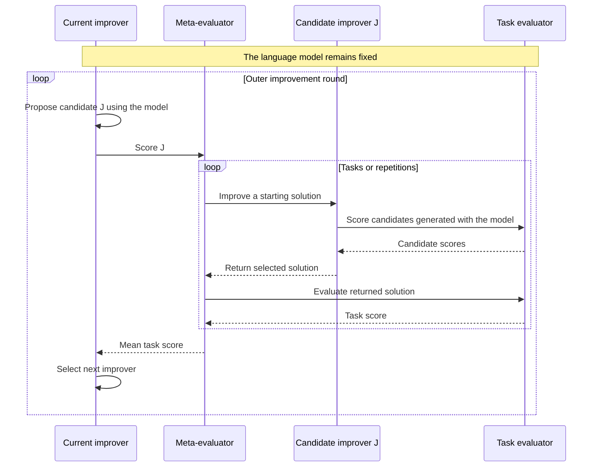
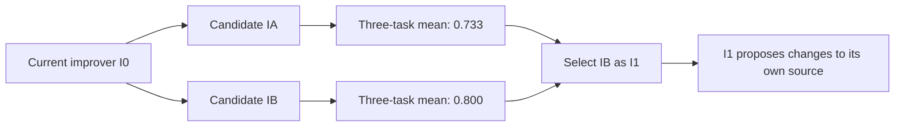

# STOP: mechanism, code trace, and evaluation

STOP is a useful reference for separating a task solution from the program that improves it.
For thinking-harness, the immediate question is which component should be allowed to change
and how its improvement can be measured independently of the search that produced it.
This review prepares that discussion; it does not select the thesis method.

## 1. Sources and review state

**Paper:** Eric Zelikman, Eliana Lorch, Lester Mackey, and Adam Kalai,
*Self-Taught Optimizer (STOP): Recursively Self-Improving Code Generation*.
[Version 3, 16 August 2024, COLM 2024](https://arxiv.org/abs/2310.02304v3).
The bibliographic key is `zelikman2023stop`, retaining the initial preprint year.

**Code:** [microsoft/stop](https://github.com/microsoft/stop/tree/0d6780c54306b2486dd36e9c4ae9b49aceb27ea4),
commit `0d6780c54306b2486dd36e9c4ae9b49aceb27ea4`. All code links below use this snapshot.

| Activity | State and scope |
|---|---|
| Assisted source inspection | Abstract, introduction, sections 3-8, Algorithm 1, Figures 2 and 4, Table 1, and Appendix K; partial inspection of A.1-A.2 |
| Complete paper reading | Partial; related work, proofs, and remaining appendices need further study |
| Static code inspection | Runner, seed improvers, meta-utility, parity utility, model wrapper, loader, configuration, and transfer entry point |
| Execution | Not run; no third-party imports, model calls, or scientific experiments |
| Guided discussion | Pending; document preparation does not establish completed personal reading |
| Reproduction | No reproduced results |

`author-claim` denotes a reported finding. `interpretation` denotes project analysis or
an illustrative proposal. `static-inspection` denotes directly inspected source behavior,
which remains unverified at runtime. `reproduced-result` is reserved for measured evidence.

## 2. Published contribution and evidence

**Author-claim.** STOP recursively revises an improver while keeping the LM fixed
(sections 3-4). In section 5.1, GPT-4 improves mean performance on noisy parity across five
runs; individual trajectories need not improve monotonically. Evaluation uses 20 development
instances, five repetitions, and 50 held-out instances. These repetitions are not five task
families. Comparators include the seed improver, chain-of-thought, and a greedy improver.

Section 5.2 reports transfer of one selected improver to five tasks, not a distribution over
all evolved improvers. Section 5.3 reports weaker-model failures. Historical models are
`gpt-4-0314`, `gpt-3.5-turbo-0613`, and `Mixtral-8x7B-Instruct-v0.1`.
Sections 6-7 discuss evaluator exploitation, constraint circumvention, expense, and dependence
on an efficiently computable utility. Appendix A studies generalization under assumptions,
including bounded programs and independently sampled tasks; it does not guarantee that each
recursive update improves performance. Appendix K reports roughly 3,000 GPT-4 calls per
iteration per run. Their meaning must be reconciled with wrapper calls before estimating costs.
Source: [paper v3](https://arxiv.org/pdf/2310.02304v3).

## 3. The two improvement levels

**Static-inspection and interpretation.** The seed function receives code, an evaluator,
and a model interface. It generates alternatives and selects by score. At the task level,
that code is a solution. At the outer level, that code is the improver itself.
See the [seed implementation](https://github.com/microsoft/stop/blob/0d6780c54306b2486dd36e9c4ae9b49aceb27ea4/tasks/meta_optimization/secret_seed_algorithm.py#L3-L23).

This diagram is an original teaching view of the inspected call structure.

Fixed for a controlled comparison: model, evaluator, task split, and resource limits.
Mutable: candidate solution code inside an evaluation, and improver code across outer rounds.
A changed prompt or search strategy does not by itself imply updated model weights.

## 4. Mathematical reading and original example

The following notation describes the inspected interfaces and is consistent with section 3
and Algorithm 1. It distinguishes executable programs from their source strings explicitly.

| Symbol | Meaning |
|---|---|
| `s`, `s'` | Starting and returned solution source |
| `u` | Task scoring function, with a description available to the improver |
| `L` | Fixed model interface |
| `I_t` | Executable improver at outer round `t` |
| `code(I_t)` | Source representation supplied as an editable candidate |
| `D` | Finite collection of task/evaluator and starting-solution pairs |
| `n` | Number of entries in `D`, counting repetitions |
| `hat u_D` | Empirical score assigned to an improver |

A task-level call returns a solution:

$$
s' = I_t(u,s,L).
$$

The outer evaluator scores an improver by what it produces on the selected tasks:

$$
\widehat{u}_D(I)=\frac{1}{n}\sum_{j=1}^{n}u_j\bigl(I(u_j,s_j,L)\bigr).
$$

The recursive update uses the same program in two roles: executor and editable input.
`load` denotes interpreting the returned source as a callable program, not a proposed
implementation of isolation:

$$
I_{t+1}=\operatorname{load}\left(I_t\left(\widehat{u}_D,\operatorname{code}(I_t),L\right)\right).
$$

In the Python implementation the argument order is `(initial_solution, utility,
language_model)`. Follow parameter names when tracing the mathematical notation into code.

**Interpretation: invented example, not STOP measurements.** Suppose three coding tasks each
have ten development checks. A task score is the fraction passed. The model and budget are
held constant. `I_0` samples alternatives; candidate `I_A` adds repair feedback; candidate
`I_B` explores two repair paths. These strategies and numbers only illustrate the arithmetic.

| Task | Starting solution | Returned by `I_0` | Returned by `I_A` | Returned by `I_B` |
|---|---:|---:|---:|---:|
| A | 0.4 | 0.6 | 0.8 | 0.9 |
| B | 0.5 | 0.7 | 0.8 | 0.8 |
| C | 0.3 | 0.5 | 0.6 | 0.7 |
| Mean | 0.4 | 0.6 | 0.733 | 0.8 |

For task A, `u_A(I_0(u_A,s_A,L)) = 0.6`. Across tasks,
`hat u_D(I_0) = (0.6 + 0.7 + 0.5) / 3 = 0.6`.
If `I_0` proposes both candidates and selects the larger observed meta-score, `I_B` becomes
`I_1`. The next outer round runs `I_B` to propose changes to its own source. Merely using
`I_B` to repair another task would remain task-level improvement.

A score of 0.8 here does not establish future-task performance. If `I_0` scores 0.7 and `I_B`
scores 0.6 on an untouched test set, the development ranking reverses. Repeatedly selecting
against those test scores would make that set part of development. A thesis protocol therefore
needs a separate selection set and a final test set, plus repeated independent runs.

## 5. Algorithm-to-code map

**Static-inspection.** This is a dependency trace, not a verified execution trace.
The descriptive `utility.py` files supplied to generated code differ from the evaluators
implemented in `secret_utility.py`.

| Responsibility | Pinned source | Observation |
|---|---|---|
| Initial proposals | [Seed, lines 18-23](https://github.com/microsoft/stop/blob/0d6780c54306b2486dd36e9c4ae9b49aceb27ea4/tasks/meta_optimization/secret_seed_algorithm.py#L18-L23) | One batch; extraction; candidate selection with `max` |
| Outer iteration | [Runner, lines 122-179](https://github.com/microsoft/stop/blob/0d6780c54306b2486dd36e9c4ae9b49aceb27ea4/run_improver.py#L122-L179) | Invokes the current improver; evaluates its result; saves and reloads returned code |
| Meta-evaluation | [Meta-utility, lines 65-143](https://github.com/microsoft/stop/blob/0d6780c54306b2486dd36e9c4ae9b49aceb27ea4/tasks/meta_optimization/secret_utility.py#L65-L143) | Repeats downstream improvement; returns mean validation score; optionally logs test scores |
| Task evaluation | [Parity utility, lines 9-95](https://github.com/microsoft/stop/blob/0d6780c54306b2486dd36e9c4ae9b49aceb27ea4/tasks/parity_noise/secret_utility.py#L9-L95) | Generates instances, invokes the solution, and scores predictions |
| Model budget | [Wrapper, lines 226-250](https://github.com/microsoft/stop/blob/0d6780c54306b2486dd36e9c4ae9b49aceb27ea4/language_model.py#L226-L250) | Counts wrapper invocations and limits responses per invocation |
| Loading generated code | [Helpers, lines 52-77 and 154-192](https://github.com/microsoft/stop/blob/0d6780c54306b2486dd36e9c4ae9b49aceb27ea4/helpers.py#L52-L192) | Writes source to a temporary module and imports it |
| Transfer entry point | [Transfer evaluation, lines 207-214](https://github.com/microsoft/stop/blob/0d6780c54306b2486dd36e9c4ae9b49aceb27ea4/tasks/meta_optimization/transfer_eval.py#L207-L214) | Chooses a stored improver and invokes the task evaluator |

## 6. Data and evaluation in the inspected implementation

**Static-inspection.** The parity task generates synthetic data: 10 bits, 100 labeled training
examples, and 20 test inputs per instance. Noise affects training labels. Development utility
averages 20 instances and test utility 50, using different base seeds. The score is mean
prediction accuracy; the attempted timeout is two seconds per instance. These nested sample
counts describe different units and must not be pooled as independent experiment runs.
Source: [parity evaluator](https://github.com/microsoft/stop/blob/0d6780c54306b2486dd36e9c4ae9b49aceb27ea4/tasks/parity_noise/secret_utility.py#L21-L85).

**Interpretation for the thesis.** A method that changes code while holding model weights
fixed still needs data for search and evaluation. It does not automatically require a
fine-tuning dataset. Public coding tasks, generated game instances, or simulated business
cases could provide that evidence. The selected case must support repeatable scoring and
separation between search feedback and final evaluation.

## 7. Cost accounting

**Static-inspection.** Defaults specify six outer iterations, four model-wrapper calls per
improver invocation, six responses per call, 25 utility calls, 25 meta-utility calls, and five
meta-evaluation repetitions. These are separate budgets, not one global spending cap.
Source: [configuration](https://github.com/microsoft/stop/blob/0d6780c54306b2486dd36e9c4ae9b49aceb27ea4/config.py#L1-L20).

**Interpretation: accounting model for a future protocol.** Let `T` be outer rounds, `K`
scored candidate improvers per round, `n` tasks or repetitions per candidate, and `B` inner
wrapper calls. Let `B_o` count outer proposal calls per round. If every allocation is used,
the search allowance is:

$$
N_{\mathrm{wrapper}} = T(B_o + KnB).
$$

For an invented allocation `T=2`, `K=2`, `n=3`, `B=2`, `B_o=1`, this gives 26 wrapper calls,
before baseline scoring, incumbent checks, repeated runs, or final evaluation. With at most
four responses per call, the corresponding response allowance is 104. This is not a token
estimate, a price estimate, or a reconstruction of the published experiment.

In the inspected wrapper, identical prompts can be grouped, responses requested together,
and failed requests retried. Therefore wrapper calls, API requests, generated responses, and
billed tokens are not interchangeable. Capture all four separately, plus evaluation time.
Source: [request dispatch and retries](https://github.com/microsoft/stop/blob/0d6780c54306b2486dd36e9c4ae9b49aceb27ea4/language_model.py#L294-L356).

For reuse, compare total search cost plus deployment cost across `m` tasks against the same
`m` tasks with a fixed improver. Include human review effort separately. A higher task score
alone cannot establish lower development cost.

## 8. Reproduction gaps and validity risks

These observations concern the pinned snapshot. No runtime failures or exploits were executed.

| Finding | Evidence | Consequence for a future reproduction |
|---|---|---|
| Transfer path inconsistency | [Lines 207-212](https://github.com/microsoft/stop/blob/0d6780c54306b2486dd36e9c4ae9b49aceb27ea4/tasks/meta_optimization/transfer_eval.py#L207-L212) assign `improve_algorithm_base` in the default `improved` branch, then open `improve_algorithm_path` | If reached under that configuration, the open expression references an undefined name |
| Limited transfer selection | [Line 21](https://github.com/microsoft/stop/blob/0d6780c54306b2486dd36e9c4ae9b49aceb27ea4/tasks/meta_optimization/transfer_eval.py#L21) selects only `three_sat` | The entry point does not currently enumerate the full transfer task set |
| No incumbent comparison in the outer acceptance check | [Runner, lines 140-144](https://github.com/microsoft/stop/blob/0d6780c54306b2486dd36e9c4ae9b49aceb27ea4/run_improver.py#L140-L144) rejects zero, without comparing the previous score | A successful return is not evidence of a better improver |
| Initial source omitted from seed selection | [Seed, lines 18-23](https://github.com/microsoft/stop/blob/0d6780c54306b2486dd36e9c4ae9b49aceb27ea4/tasks/meta_optimization/secret_seed_algorithm.py#L18-L23) maximizes over generated candidates | A candidate can replace a better starting solution |
| Limited isolation | [Reliability guard](https://github.com/microsoft/stop/blob/0d6780c54306b2486dd36e9c4ae9b49aceb27ea4/helpers.py#L80-L94) explicitly disclaims a security sandbox | File naming and Python function restrictions do not enforce evaluator or credential isolation |
| Historical environment incomplete | [Source tree](https://github.com/microsoft/stop/tree/0d6780c54306b2486dd36e9c4ae9b49aceb27ea4) contains no dependency lock; [model wrapper](https://github.com/microsoft/stop/blob/0d6780c54306b2486dd36e9c4ae9b49aceb27ea4/language_model.py#L20-L38) uses historical identifiers and API configuration | Compatibility and model availability remain unverified; substitutions would be adaptations |

**Interpretation.** A reproduction proposal needs an external execution boundary, read-only
final evaluation, fixed accounting, and an explicit list of deviations from the original.
Source files named `secret_utility.py` are not an access-control mechanism. Test-mode scoring
is available through the same Python evaluator interface, so a trusted orchestration boundary
would be needed to restrict access. This is an architectural observation, not a demonstrated
leak or evidence that the published experiments were compromised.

## 9. What is independently established

- Pinned source inspection supports the call map and the identified transfer-path inconsistency.
- Static parsing of the downloaded Python files found no syntax errors. It does not establish
  importability, dependency compatibility, runtime correctness, or numerical reproduction.
- The example's means are elementary arithmetic over invented scores.
- The article's performance claims remain attributed claims. No measured project result exists.

The review is ready for discussion. Complete reading, runtime inspection, proof checking,
and reproduction remain separate activities.

## 10. Thesis implications and next discussion

**Interpretation.** Compare three possible scopes before selecting a method:

| Scope | Mutable object | Main question |
|---|---|---|
| Fixed improver, evolving harness | A bounded harness configuration or module | Can a fixed search process improve task performance within budget? |
| Evolving improver and harness | Search procedure plus its output | Does recursion add value beyond an equally funded fixed improver? |
| Learning or planning alternative | A policy, planner, or search rule | Would another optimization method answer the same practical need more simply? |

For a coding case, the editable object might be a repair loop. For a simulated business case,
it might be routing or tool-retry policy. Restrict the first comparison to one such object;
whole-harness rewriting would introduce additional attribution and validation problems.
These are candidate directions, not a selected thesis contribution.

The guided discussion should answer:

1. Can the original example be traced from a task score to selection of a new improver?
2. Which part of a harness could change while its evaluator and budget remain fixed?
3. What fixed-improver baseline would isolate the added value of recursion?
4. Can that case provide independent test tasks at a manageable evaluation cost?

Then review Self-Harness using the same dimensions: mutable object, update mechanism,
evaluation boundary, search cost, and transfer evidence. Its mechanism and results still need
verification. Track the next reading in [issue #4](https://github.com/jairzinhosantos/thinking-harness/issues/4).
The broader metadata audit remains in [issue #3](https://github.com/jairzinhosantos/thinking-harness/issues/3).
