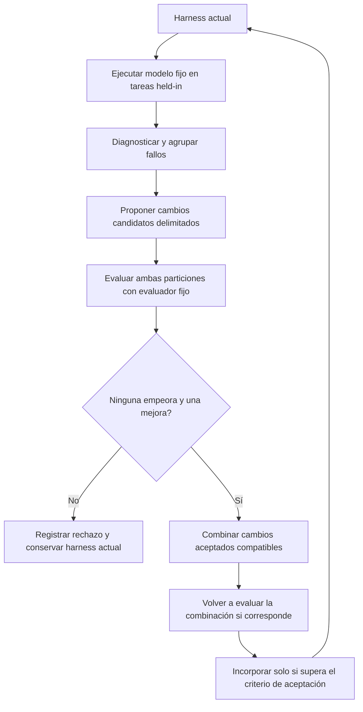
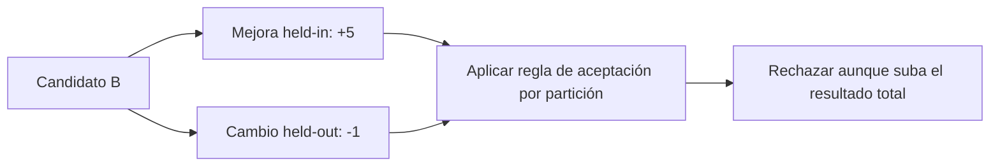
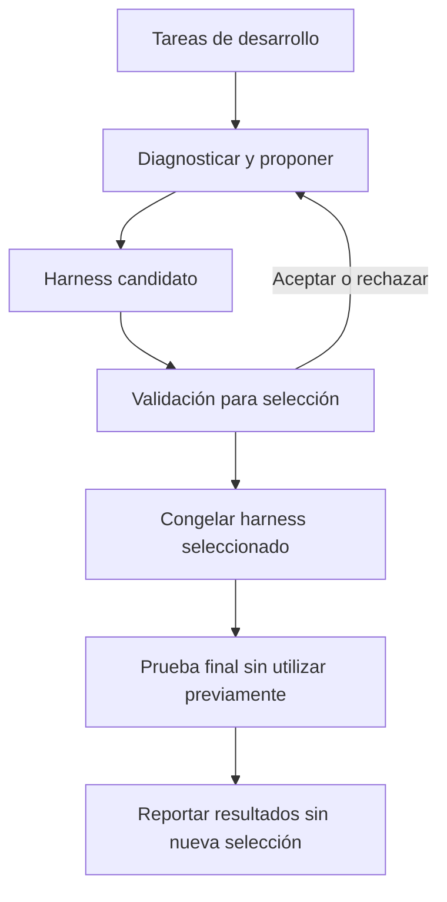

# Self-Harness: mecanismo, recorrido del código y evaluación

[English (primary)](pap-0011-self-harness.md) | Español

Self-Harness es una referencia cercana para mejorar el software que rodea a un modelo de
lenguaje fijo. Propone cambios delimitados en el harness a partir de fallos de ejecución y
los evalúa antes de incorporarlos. Para thinking-harness, constituye un antecedente relevante,
no una elección de método ni una afirmación de novedad. La pregunta útil es qué limitación
medible podría justificar una contribución más acotada.

## 1. Fuentes y estado de la revisión

**Artículo:** Hangfan Zhang, Shao Zhang, Kangcong Li, Chen Zhang, Yang Chen, Yiqun Zhang,
Lei Bai y Shuyue Hu, *Self-Harness: Harnesses That Improve Themselves*.
[arXiv v3, 20 de agosto de 2026](https://arxiv.org/abs/2606.09498v3),
[PDF](https://arxiv.org/pdf/2606.09498v3),
[HTML](https://arxiv.org/html/2606.09498v3). Clave bibliográfica: `zhang2026selfharness`.
La fecha de envío a arXiv identifica la versión; la portada del PDF indica 21 de agosto de
2026. El registro consultado acredita un preprint de arXiv, no una publicación aceptada en
una conferencia.

**Código:** [qzzqzzb/Self-Harness](https://github.com/qzzqzzb/Self-Harness/tree/2720dbb3f52283684f4b85a1065d642df1779dd8),
commit `2720dbb3f52283684f4b85a1065d642df1779dd8`, del 2 de julio de 2026.
Esta versión del código es anterior a la v3 del artículo. Todos los enlaces a la implementación
utilizan ese commit.

| Actividad | Estado y alcance |
|---|---|
| Inspección asistida de fuentes | Introducción, secciones 3-5, Algoritmo 1, Tabla 1 y texto explicativo de los apéndices A y B; verificación visual de las ecuaciones de aceptación y la tabla de resultados en las páginas 8 y 11 |
| Lectura completa del artículo | Parcial; las referencias de trabajos relacionados y todas las figuras de código y trazas de los apéndices no se han contrastado exhaustivamente |
| Inspección estática del código | Agrupación de diagnósticos, interfaz de propuestas, configuración y ejecución de evaluaciones, criterio de aceptación, incorporación y combinación de candidatos |
| Ejecución | No ejecutado; sin importar código externo, invocar modelos ni realizar experimentos científicos |
| Discusión guiada | Pendiente; preparar el análisis no acredita una lectura personal completa |
| Reproducción | Sin resultados reproducidos |

`author-claim` identifica resultados reportados por los autores; `static-inspection`, código
inspeccionado sin validación en ejecución; `interpretation`, análisis o ejemplos originales.
`reproduced-result` queda reservado para evidencia medida de forma independiente.

## 2. Problema y contribución

**Afirmación de los autores, secciones 1 y 3.** Un modelo capaz y fijo puede fallar porque su
harness gestiona mal las herramientas, el estado, la verificación o la recuperación.
Self-Harness utiliza esos fallos como evidencia para modificar superficies declaradas del
harness. El modelo genera varios cambios candidatos, cada uno con una explicación del
fallo, un mecanismo objetivo y un riesgo de regresión. Los candidatos deben superar un
criterio de no regresión antes de incorporarse al harness activo.

El harness inicial es una implementación mínima basada en DeepAgent. El artículo restringe
los cambios a un archivo de definición del harness; no concede acceso irrestricto al evaluador
ni a todo el entorno. El mismo modelo fijo ejecuta las tareas y cumple el rol de proponente.
Se optimizan código y configuración, sin entrenar los pesos del modelo en el método reportado.

| Fijo dentro de una comparación controlada | Modificable dentro de las superficies declaradas |
|---|---|
| Pesos y servicio del modelo | Instrucciones y orientación para utilizar herramientas |
| Evaluador externo y particiones de tareas | Políticas de estado/memoria y comportamiento de recuperación |
| Entorno de evaluación y parámetros de ejecución no editables | Rutinas de verificación, definiciones de subagentes y controles de ejecución admitidos |
| Protocolo de evaluación y límites de recursos | Componentes específicamente permitidos, no reescrituras arbitrarias del sistema |

## 3. Ciclo de mejora

**Afirmación de los autores, Algoritmo 1 y sección 3.** Ejecutar el harness actual,
diagnosticar fallos con evidencia de la partición held-in, proponer cambios distintos y
delimitados, y evaluar cada candidato en ambas particiones. Aceptar únicamente candidatos
que mejoren al menos una sin empeorar la otra. Los rechazados permanecen registrados.
Los cambios aceptados compatibles pueden combinarse.

La nueva evaluación de la combinación en este diagrama explicativo está confirmada en la
implementación pública del flujo, no se deduce del éxito individual de los candidatos. Una
combinación puede introducir una interacción que ninguno de los cambios produce por separado.
Si falla, el flujo inspeccionado no incorpora esa combinación.

**Inspección estática.** El diagnóstico agrupa registros fallidos por la terna exacta
`terminal_cause / criticality / agent_mechanism`. Esos campos los genera un LLM; una vez
disponibles, la agrupación es determinista. No es agrupamiento por embeddings ni una prueba
de relación causal. Se instruye al proponente para utilizar evidencia de entrenamiento.
Esa instrucción, por sí sola, no acredita una barrera de aislamiento de información exigida
por la implementación.

## 4. Lectura matemática y ejemplo original

Esta notación reformula el mecanismo de aceptación de la sección 3.4. Un cambio modifica el
software ejecutable del harness, no actualiza el modelo mediante gradientes.

| Símbolo | Significado |
|---|---|
| `M`, `E` | Modelo de lenguaje fijo y evaluador externo |
| `h_t` | Harness actual en la ronda `t` |
| `x`, `tau`, `y` | Tarea, traza de ejecución y salida final |
| `D_in`, `D_ho` | Particiones held-in y held-out utilizadas durante la búsqueda |
| `Delta_j` | Operación de cambio candidata |
| `P_s(h)` | Número de intentos de tarea exitosos en la partición `s`, acumulado entre repeticiones |
| `delta_s` | Mejora del candidato en ese conteo para la partición `s` |

La ejecución produce una traza y una salida; la evaluación asigna el resultado de la tarea:

$$
(\tau,y)=\operatorname{Run}(M,h_t,x),\qquad z=E(x,\tau,y).
$$

Se aplica un cambio candidato y se compara con el harness actual en cada partición:

$$
h_t^{(j)}=\Delta_j(h_t),\qquad
\delta_s^{(j)}=P_s(h_t^{(j)})-P_s(h_t),\quad s\in\{\mathrm{in},\mathrm{ho}\}.
$$

La regla de aceptación exige ausencia de regresión y al menos una mejora estricta:

$$
\operatorname{accept}(j)\iff
\delta_{\mathrm{in}}^{(j)}\geq0\ \land\
\delta_{\mathrm{ho}}^{(j)}\geq0\ \land\
\max\!\left(\delta_{\mathrm{in}}^{(j)},\delta_{\mathrm{ho}}^{(j)}\right)>0.
$$

**Interpretación: ejemplo inventado, no mediciones del artículo.** Se evalúan 10 tareas
held-in y 5 held-out dos veces, con 20 y 10 intentos respectivamente. Los denominadores
se mantienen fijos.

| Harness | Éxitos held-in | Éxitos held-out | Cambio respecto al actual | Criterio |
|---|---:|---:|---|---|
| Actual | 12/20 | 6/10 | Referencia | No corresponde |
| A | 14/20 | 6/10 | +2, 0 | Aceptar |
| B | 17/20 | 5/10 | +5, -1 | Rechazar |
| C | 12/20 | 6/10 | 0, 0 | Rechazar |
| D | 12/20 | 7/10 | 0, +1 | Aceptar |

B mejora los éxitos totales de 18 a 22, pero pierde un éxito held-out, por lo que se rechaza.
No se puede asumir que A y D sean aditivos: su combinación necesita evaluación.

**Inspección estática.** El criterio público compara la tasa media de éxito entre
repeticiones, mientras que el artículo describe conteos acumulados. Los signos coinciden
cuando cada repetición utiliza el mismo número de tareas por partición y los denominadores
del candidato y la referencia coinciden. El código comprueba identificadores de repetición
y denominadores iguales; no verifica identidades de tareas ni hashes del evaluador. Si las
repeticiones tuvieran cantidades de tareas diferentes, habría que reconciliar ambas formas
de agregación.

**Interpretación.** Que los resultados observados no disminuyan no demuestra convergencia a
un harness óptimo, mejora en tareas futuras ni progreso fiable con evaluación estocástica.
Un protocolo futuro necesita una regla de parada, como un presupuesto fijo de candidatos y
un límite de rondas sin éxito, sin presentar esa parada operativa como convergencia matemática.

## 5. Correspondencia entre algoritmo y código

**Inspección estática.** Estos enlaces documentan un recorrido del código, no una reproducción
exitosa.

| Responsabilidad | Fuente fijada | Observación |
|---|---|---|
| Agrupar fallos diagnosticados | [Diagnóstico, líneas 40-113](https://github.com/qzzqzzb/Self-Harness/blob/2720dbb3f52283684f4b85a1065d642df1779dd8/diagnosis/src/self_harness_diagnosis/integrated.py#L40-L113) | Agrupa firmas exactas a partir de registros de diagnóstico suministrados |
| Especificar propuestas | [Interfaz del proponente](https://github.com/qzzqzzb/Self-Harness/blob/2720dbb3f52283684f4b85a1065d642df1779dd8/proposer/src/self_harness_proposer/multi_proposer.py#L64-L166) | Solicita mecanismos distintos, evidencia de entrenamiento y un hook reconocido por candidato |
| Coordinar el ciclo | [Punto de entrada del flujo](https://github.com/qzzqzzb/Self-Harness/blob/2720dbb3f52283684f4b85a1065d642df1779dd8/workflow/scripts/run_self_harness_loop.py#L22-L145) | Acepta archivos de diagnóstico/propuestas o plantillas de comandos externos; por defecto procesa un candidato pendiente por invocación |
| Ejecutar el adaptador de evaluación | [Ejecutor de evaluaciones](https://github.com/qzzqzzb/Self-Harness/blob/2720dbb3f52283684f4b85a1065d642df1779dd8/eval/scripts/run_harbor_eval.py#L224-L332) | Invoca con uv un proyecto externo de evaluación basado en pytest |
| Aplicar el criterio de no regresión | [Criterio, líneas 77-189](https://github.com/qzzqzzb/Self-Harness/blob/2720dbb3f52283684f4b85a1065d642df1779dd8/acceptance/scripts/run_acceptance_gate.py#L77-L189) | Rechaza caídas en cualquiera de las particiones y candidatos sin cambios; espera dos repeticiones por defecto |
| Combinar cambios aceptados | [Combinación y nueva evaluación](https://github.com/qzzqzzb/Self-Harness/blob/2720dbb3f52283684f4b85a1065d642df1779dd8/workflow/scripts/run_self_harness_loop.py#L500-L594) | Vuelve a evaluar un candidato combinado antes de incorporarlo |
| Actualizar superficies del proponente | [Creación de rama descendiente](https://github.com/qzzqzzb/Self-Harness/blob/2720dbb3f52283684f4b85a1065d642df1779dd8/workflow/scripts/run_self_harness_loop.py#L603-L638) | Los candidatos de tipo prompt conservan las superficies anteriores del proponente; otros mecanismos siguen una ruta de actualización distinta |

Esta última distinción importa: el código público no permite afirmar que todo cambio aceptado
en el harness de tareas se convierta en una configuración idéntica de ejecución del proponente.
El coordinador delega la generación de propuestas en archivos o comandos suministrados.
Reproducir el proponente del artículo, con el mismo modelo y el harness actual, requiere
verificar esa integración externa.

## 6. Tareas, modelos y resultados reportados

**Afirmación de los autores, sección 4 y apéndice A.** Cada candidato recibe normalmente dos
intentos por tarea, con entornos nuevos. Pass (%) es el éxito medio de un intento individual,
no pass@2. Las comparaciones mantienen fijos el modelo y el protocolo dentro de cada
ejecución por modelo y benchmark.

| Benchmark | Subconjunto evaluado | Partición | Configuración relevante |
|---|---|---|---|
| Terminal-Bench-2.0 | 64 de 89 tareas | 43 held-in y 21 held-out, enumeradas en el README público de evaluación | Harbor; límite de salida de 2 MB/s; réplicas de recursos seleccionados; exclusiones por recursos poco fiables o entradas multimodales no admitidas |
| SWE-bench Verified | 100 casos muestreados proporcionalmente por repositorio | 67 held-in y 33 held-out | Instancias Docker aisladas; evaluador oficial; límites de 3,600 segundos por caso y 120 segundos por herramienta |
| AppWorld | 180 ejemplos | 90 ejemplos del conjunto oficial train; 90 muestreados de test_normal/test_challenge | Estado de aplicación nuevo; evaluador oficial; máximo de 50 turnos del agente |

Fuente de la lista de Terminal-Bench:
[README de evaluación](https://github.com/qzzqzzb/Self-Harness/blob/2720dbb3f52283684f4b85a1065d642df1779dd8/eval/README.md).
Son subconjuntos seleccionados, no resultados sobre los benchmarks completos de las
clasificaciones públicas.

La Tabla 1 reporta las siguientes tasas de éxito globales. La última columna contiene
diferencias aritméticas en puntos porcentuales (pp), no incrementos porcentuales relativos.

| Benchmark | Modelo | Inicial (%) | Final (%) | Cambio (pp) |
|---|---|---:|---:|---:|
| Terminal-Bench-2.0 | MiniMax M2.5 | 42.2 | 53.9 | +11.7 |
| Terminal-Bench-2.0 | Qwen3.5-35B-A3B | 18.0 | 36.7 | +18.7 |
| Terminal-Bench-2.0 | GLM-5 | 46.1 | 57.0 | +10.9 |
| SWE-bench Verified | MiniMax M2.5 | 46.0 | 52.5 | +6.5 |
| SWE-bench Verified | Qwen3.5-35B-A3B | 19.5 | 41.5 | +22.0 |
| SWE-bench Verified | GLM-5 | 52.0 | 55.5 | +3.5 |
| AppWorld | MiniMax M2.5 | 48.6 | 58.9 | +10.3 |
| AppWorld | Qwen3.5-35B-A3B | 22.5 | 52.2 | +29.7 |
| AppWorld | GLM-5 | 44.4 | 85.0 | +40.6 |

Por ejemplo, Qwen en Terminal-Bench mejora held-in de 15.1% a 36.0% y held-out de 23.8% a
38.1%. Las tasas globales ponderan intentos de tarea, no los porcentajes de ambas particiones
por igual. La mayor mejora relativa global es aproximadamente 132% para Qwen en AppWorld;
la mayor mejora absoluta es 40.6 pp para GLM-5 en AppWorld. Ninguna es un resultado de
thinking-harness.

El comparador principal es el harness mínimo inicial. Estos resultados no acreditan
superioridad sobre un harness maduro diseñado manualmente ni sobre otro optimizador con
presupuestos de búsqueda equivalentes. Las trazas representativas sugieren creación más
temprana de artefactos, recuperación tras errores de herramientas, mejor verificación de
parches y recuperación exhaustiva del estado de aplicaciones. Son ejemplos seleccionados,
no ablaciones causales que aíslen cada mecanismo.

## 7. Coste y preparación para reproducir

**Afirmación de los autores, apéndice A.** MiniMax utiliza su API alojada; GLM utiliza
OpenRouter. Qwen se sirve sobre **cuatro GPU NVIDIA H200**, con una imagen interna derivada
de SGLang. Esta es la configuración reportada, no un requisito demostrado para cualquier
adaptación menor del método. Los resultados inspeccionados no proporcionan un registro
integral de tokens, dinero y revisión humana que permita reconstruir la economía del proyecto.

**Interpretación: contabilidad propuesta.** Con `K` candidatos, `N` tareas entre ambas
particiones y `R` repeticiones, un lote de candidatos necesita `KNR` intentos de tarea, antes
de diagnosticar, generar propuestas, evaluar la referencia, comprobar combinaciones o ejecutar
la prueba final independiente. Para `K=4`, `N=64` y `R=2`, son **512 intentos de tarea de
candidatos**, no 512 llamadas API. Las herramientas, los reintentos y los subagentes pueden
consumir muchas llamadas dentro de cada intento.

Registrar por separado tokens de propuestas y ejecución, tiempo de sandbox y evaluación,
candidatos aceptados/rechazados y revisión humana. Una mayor tasa de éxito no acredita por sí
sola menor coste de construcción. Un estudio pequeño de viabilidad podría utilizar menos
tareas y un modelo alojado o menor, pero sería una adaptación, no una réplica exacta de la
Tabla 1.

**Inspección estática: brechas en la versión pública fijada.**

- La [configuración de ejemplo](https://github.com/qzzqzzb/Self-Harness/blob/2720dbb3f52283684f4b85a1065d642df1779dd8/eval/configs/harbor_eval.example.toml)
  referencia un proyecto externo de evaluación y un caso pytest de ejemplo. El proyecto
  requerido `eval/evals` no está en esta copia del repositorio.
- El [README](https://github.com/qzzqzzb/Self-Harness/blob/2720dbb3f52283684f4b85a1065d642df1779dd8/README.md)
  reporta resultados de Terminal-Bench y el repositorio incluye un harness final de Qwen para
  TB2. La inspección no acreditó reproducciones completas ejecutables de los nueve resultados
  de la v3.
- No se encontró un archivo de licencia en la raíz de esta versión. Poder leer públicamente
  el código no acredita por sí solo permiso para redistribuir una implementación adaptada.
  La licencia CC BY 4.0 del artículo no establece una licencia de software para el repositorio.

## 8. Límites de validez e implicaciones

**Afirmación de los autores, conclusión.** El método estudia cambios delimitados en benchmarks
fijos, no automejora abierta. Su utilidad depende de la calidad del verificador y de las trazas;
los cambios de mayor impacto necesitan criterios más fuertes que la no regresión de la tasa
de éxito.

**Interpretación.** Estos límites orientan un posible protocolo de tesis:

| Límite | Implicación |
|---|---|
| Los resultados held-out deciden repetidamente qué incorporar | Aunque las trazas se oculten al proponente, esta partición participa en selección adaptativa. Reservar un conjunto final independiente sin utilizar |
| Dos repeticiones de evaluación | Reduce la dependencia de un intento, pero no acredita significancia estadística. Reportar variabilidad entre ejecuciones independientes de optimización |
| No regresión agregada | Una partición puede conservar su resultado y perder tareas antes exitosas. Registrar regresiones por tarea e invariantes críticos |
| Atribución de fallos generada por LLM | Tratar los diagnósticos como hipótesis; evaluar los mecanismos con ablaciones cuando sea viable |
| Evaluador externo fijo | La autoverificación aprendida dentro del harness es distinta de modificar el evaluador de aceptación. Esto último necesita otro protocolo de investigación |
| Harness inicial mínimo y subconjuntos seleccionados | Comparar con una referencia fija creíble y documentar la selección de tareas antes de afirmar ventajas prácticas |

El siguiente diagrama propone una **separación de evaluación para thinking-harness**; no
representa una partición adicional reportada por Self-Harness:

## 9. Relación con STOP y opciones de tesis

**Interpretación.** [STOP](pap-0001-stop.es.md) distingue una solución del programa que mejora
soluciones y luego modifica recursivamente ese programa mejorador. Self-Harness centra el
objeto modificable en superficies declaradas del harness agéntico y utiliza diagnóstico de
trazas junto con un criterio por partición. Ambos mantienen fijos los pesos del modelo.
Ofrecen unidades de mejora distintas; ninguno convierte el entrenamiento del modelo en un
requisito para un primer estudio controlado.

| Posible dirección | Pregunta por investigar | Evidencia necesaria antes de elegir |
|---|---|---|
| Cambios delimitados de verificación/recuperación | ¿Puede un componente mejorar el éxito con un presupuesto de búsqueda pequeño? | Referencia fija, ablaciones, prueba independiente y registro de costes |
| Aceptación que considere el coste | ¿Puede conservarse un éxito comparable con menos tokens, llamadas a herramientas o minutos de revisión? | Presupuestos equivalentes, regla explícita de compromiso y restricciones de calidad |
| Harness de negocio simulado | ¿Se transfieren los mecanismos a flujos con estado, permisos e invariantes? | Tareas públicas/sintéticas, comprobaciones deterministas del estado y fallos documentados |

Son preguntas candidatas, no afirmaciones de novedad demostrada. Cambiar el benchmark por sí
solo no acredita una contribución de investigación. Evaluadores dinámicos, aprendizaje por
refuerzo y búsqueda más amplia de arquitecturas siguen siendo opciones separadas por comparar
después de continuar la lectura.

## 10. Evidencia contrastada y siguiente acción

Se contrastaron de forma independiente la versión del artículo y su identidad bibliográfica;
las ecuaciones de aceptación y la Tabla 1 visualmente; las rutas de código fijadas y el flujo
de control descrito; y la diferencia entre la cobertura del artículo y la del código público,
más limitada. No se reprodujo de forma independiente ningún resultado reportado del benchmark.

A continuación, discutir el ejemplo de aceptación y tres preguntas: qué superficie del
harness podría delimitarse, qué debe permanecer fijo y qué evidencia justificaría un cambio.
Registrar las dudas pendientes antes de aceptar la revisión. Continuar con AFlow y Darwin
Gödel Machine según el [plan inicial de lectura](../../../docs/doc-0002-initial-plan.md).
Cualquier ejecución requiere un protocolo separado, un límite de gasto, una condición de
parada y una ruta para la evidencia.
