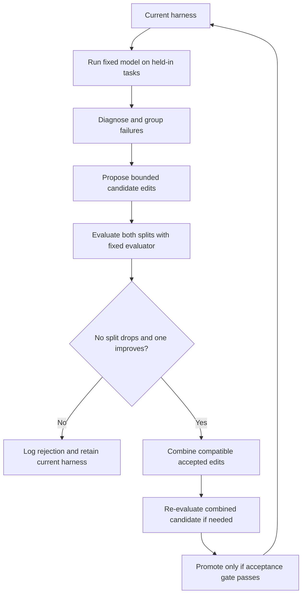
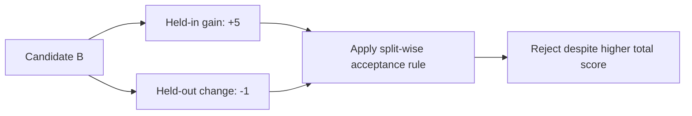
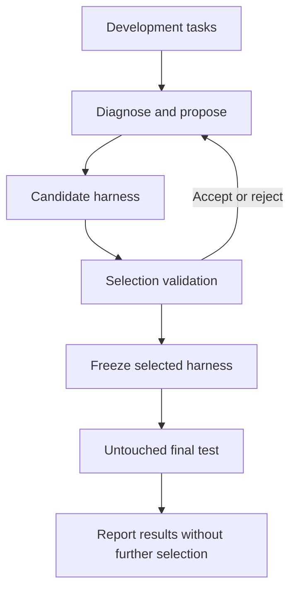

# Self-Harness: mechanism, code trace, and evaluation

English (primary) | [Español](pap-0011-self-harness.es.md)

Self-Harness is a close reference for improving the software around a fixed language model.
It proposes bounded harness edits from execution failures and tests them before promotion.
For thinking-harness, this establishes relevant prior work, not a thesis method or a novelty
claim. The useful question is which measurable limitation could justify a narrower contribution.

## 1. Sources and review state

**Paper:** Hangfan Zhang, Shao Zhang, Kangcong Li, Chen Zhang, Yang Chen, Yiqun Zhang,
Lei Bai, and Shuyue Hu, *Self-Harness: Harnesses That Improve Themselves*.
[arXiv v3, 20 August 2026](https://arxiv.org/abs/2606.09498v3),
[PDF](https://arxiv.org/pdf/2606.09498v3),
[HTML](https://arxiv.org/html/2606.09498v3). Bibliographic key: `zhang2026selfharness`.
The arXiv submission date identifies the version; the PDF cover prints 21 August 2026.
The inspected record establishes an arXiv preprint, not an accepted conference publication.

**Code:** [qzzqzzb/Self-Harness](https://github.com/qzzqzzb/Self-Harness/tree/2720dbb3f52283684f4b85a1065d642df1779dd8),
commit `2720dbb3f52283684f4b85a1065d642df1779dd8`, dated 2 July 2026.
This snapshot predates paper v3. All implementation links below use that commit.

| Activity | State and scope |
|---|---|
| Assisted source inspection | Introduction, sections 3-5, Algorithm 1, Table 1, and Appendix A and B explanatory text; visual verification of the acceptance equations and results table on pages 8 and 11 |
| Complete paper reading | Partial; related-work references and all appendix code/trace figures have not been exhaustively checked |
| Static code inspection | Diagnosis grouping, proposal interface, evaluation configuration and runner, acceptance gate, candidate promotion and merge logic |
| Execution | Not run; no upstream imports, model calls, or scientific experiments |
| Guided discussion | Pending; prepared analysis does not establish completed personal reading |
| Reproduction | No reproduced results |

`author-claim` identifies reported findings; `static-inspection` identifies inspected code
without runtime validation; `interpretation` identifies analysis or original examples.
`reproduced-result` is reserved for independently measured evidence.

## 2. Problem and contribution

**Author-claim, sections 1 and 3.** A capable fixed model can fail because its harness manages
tools, state, verification, or recovery poorly. Self-Harness uses those failures as evidence
for changing declared harness surfaces. The model generates multiple candidate edits, each
with a failure explanation, a target mechanism, and a regression risk. Candidates must pass
a non-regression gate before becoming part of the active harness.

The initial harness is a minimal DeepAgent-based implementation. The paper constrains edits
to a harness definition file; it does not grant unrestricted access to the evaluator or the
whole environment. The same fixed model serves task execution and the proposer role.
This is code/configuration optimization, without model-weight training in the reported method.

| Fixed within a controlled comparison | Mutable within declared surfaces |
|---|---|
| Model weights and backend | Instructions and tool guidance |
| External evaluator and task splits | State/memory policies and recovery behavior |
| Benchmark environment and non-editable runtime settings | Verification routines, subagent definitions, and supported runtime control |
| Evaluation protocol and resource limits | Specific permitted components, not arbitrary system rewrites |

## 3. Improvement loop

**Author-claim, Algorithm 1 and section 3.** Run the current harness, diagnose failures using
held-in evidence, propose distinct bounded edits, and evaluate each candidate on both splits.
Accept only candidates that improve at least one split without degrading the other. Rejected
candidates remain in the record. Compatible accepted edits can be combined.

The combination recheck in this teaching diagram is confirmed in the public workflow
implementation, not inferred from individual candidate success. A merge can introduce an
interaction that neither edit produces alone. If the combined candidate fails, the inspected
workflow does not promote that combination.

**Static-inspection.** Diagnosis groups failed records by the exact triple
`terminal_cause / criticality / agent_mechanism`. Those fields are LLM-generated; grouping is
deterministic once they exist. This is neither embedding-based clustering nor proof of a causal
relationship. The proposer is instructed to use train-side evidence. This instruction alone
does not establish an enforced information-isolation boundary.

## 4. Mathematical reading and original example

This notation restates the acceptance mechanism in section 3.4. Here, an edit is a change
to executable harness software, not a gradient update to the model.

| Symbol | Meaning |
|---|---|
| `M`, `E` | Fixed language model and external evaluator |
| `h_t` | Current harness at round `t` |
| `x`, `tau`, `y` | Task, execution trace, and final output |
| `D_in`, `D_ho` | Held-in and held-out task splits used during search |
| `Delta_j` | Candidate edit operation |
| `P_s(h)` | Number of successful task attempts on split `s`, aggregated over repeats |
| `delta_s` | Candidate improvement in that count on split `s` |

Execution produces a trace and output; evaluation assigns the task outcome:

$$
(\tau,y)=\operatorname{Run}(M,h_t,x),\qquad z=E(x,\tau,y).
$$

Apply a candidate edit and compare it with the current harness on each split:

$$
h_t^{(j)}=\Delta_j(h_t),\qquad
\delta_s^{(j)}=P_s(h_t^{(j)})-P_s(h_t),\quad s\in\{\mathrm{in},\mathrm{ho}\}.
$$

The acceptance rule requires both non-regression and at least one strict improvement:

$$
\operatorname{accept}(j)\iff
\delta_{\mathrm{in}}^{(j)}\geq0\ \land\
\delta_{\mathrm{ho}}^{(j)}\geq0\ \land\
\max\!\left(\delta_{\mathrm{in}}^{(j)},\delta_{\mathrm{ho}}^{(j)}\right)>0.
$$

**Interpretation: invented example, not paper measurements.** Evaluate 10 held-in and
5 held-out tasks twice, giving 20 and 10 attempts. Keep their denominators fixed.

| Harness | Held-in successes | Held-out successes | Change from current | Gate |
|---|---:|---:|---|---|
| Current | 12/20 | 6/10 | Reference | Not applicable |
| A | 14/20 | 6/10 | +2, 0 | Accept |
| B | 17/20 | 5/10 | +5, -1 | Reject |
| C | 12/20 | 6/10 | 0, 0 | Reject |
| D | 12/20 | 7/10 | 0, +1 | Accept |

B improves total successes from 18 to 22 but loses one held-out success, so it is rejected.
A and D cannot simply be assumed additive: their combination needs evaluation.

**Static-inspection.** The public gate compares the mean pass rate across repeats, whereas
the paper describes aggregated counts. Their signs agree when every repeat uses the same
task count for the split and the baseline/candidate denominators match. The code checks
matching repeat IDs and denominators; it does not verify task identities or evaluator hashes.
Unequal per-repeat task counts would require reconciling the two aggregations.

**Interpretation.** Non-decreasing observed scores do not prove convergence to an optimal
harness, future-task improvement, or reliable progress under stochastic evaluation. A future
protocol needs a stopping rule, such as a fixed candidate budget and a limit on unsuccessful
rounds, without presenting that operational stop as mathematical convergence.

## 5. Algorithm-to-code map

**Static-inspection.** These links establish a source trace, not a successful reproduction.

| Responsibility | Pinned source | Observation |
|---|---|---|
| Group diagnosed failures | [Diagnosis, lines 40-113](https://github.com/qzzqzzb/Self-Harness/blob/2720dbb3f52283684f4b85a1065d642df1779dd8/diagnosis/src/self_harness_diagnosis/integrated.py#L40-L113) | Groups exact signatures from supplied diagnosis records |
| Specify proposals | [Proposer interface](https://github.com/qzzqzzb/Self-Harness/blob/2720dbb3f52283684f4b85a1065d642df1779dd8/proposer/src/self_harness_proposer/multi_proposer.py#L64-L166) | Requests distinct mechanisms, train-side evidence, and one recognized hook per candidate |
| Coordinate the loop | [Workflow entry point](https://github.com/qzzqzzb/Self-Harness/blob/2720dbb3f52283684f4b85a1065d642df1779dd8/workflow/scripts/run_self_harness_loop.py#L22-L145) | Accepts diagnosis/proposer files or external command templates; default processes one pending candidate per invocation |
| Execute benchmark adapter | [Evaluation runner](https://github.com/qzzqzzb/Self-Harness/blob/2720dbb3f52283684f4b85a1065d642df1779dd8/eval/scripts/run_harbor_eval.py#L224-L332) | Calls an external pytest evaluation project using uv |
| Apply non-regression gate | [Gate, lines 77-189](https://github.com/qzzqzzb/Self-Harness/blob/2720dbb3f52283684f4b85a1065d642df1779dd8/acceptance/scripts/run_acceptance_gate.py#L77-L189) | Rejects a drop on either split and unchanged candidates; expects two repeats by default |
| Combine accepted edits | [Merge and recheck](https://github.com/qzzqzzb/Self-Harness/blob/2720dbb3f52283684f4b85a1065d642df1779dd8/workflow/scripts/run_self_harness_loop.py#L500-L594) | Evaluates a combined candidate again before promotion |
| Update proposer surfaces | [Child branch creation](https://github.com/qzzqzzb/Self-Harness/blob/2720dbb3f52283684f4b85a1065d642df1779dd8/workflow/scripts/run_self_harness_loop.py#L603-L638) | Prompt candidates preserve prior proposer surfaces; other mechanisms take a separate update path |

The last distinction matters: the public snapshot does not support a blanket claim that every
accepted task-harness edit becomes the proposer's identical runtime configuration. The driver
delegates proposal generation to supplied artifacts or commands. Reproducing the paper's
same-model, current-harness proposer requires verifying that external integration.

## 6. Tasks, models, and reported results

**Author-claim, section 4 and Appendix A.** Each candidate normally receives two attempts per
task, with fresh task environments. Pass (%) is mean single-attempt success, not pass@2.
Comparisons hold the model and evaluation protocol fixed within each model/benchmark run.

| Benchmark | Evaluated subset | Split | Relevant setting |
|---|---|---|---|
| Terminal-Bench-2.0 | 64 of 89 tasks | 43 held-in, 21 held-out, listed in the public evaluation README | Harbor; 2 MB/s outbound limit; selected resource mirrors; exclusions for unreliable resources or unsupported multimodal inputs |
| SWE-bench Verified | 100 cases sampled proportionally by repository | 67 held-in, 33 held-out | Isolated Docker instances; official evaluator; 3,600-second case and 120-second tool timeouts |
| AppWorld | 180 examples | 90 official train examples; 90 sampled from test_normal/test_challenge | Fresh application state; official evaluator; at most 50 agent turns |

Source for Terminal-Bench membership:
[evaluation README](https://github.com/qzzqzzb/Self-Harness/blob/2720dbb3f52283684f4b85a1065d642df1779dd8/eval/README.md).
These are selected subsets, not full benchmark leaderboard results.

Table 1 reports the following overall pass rates. Changes in the last column are arithmetic
differences in percentage points (pp), not relative percentage gains.

| Benchmark | Model | Initial (%) | Final (%) | Change (pp) |
|---|---|---:|---:|---:|
| Terminal-Bench-2.0 | MiniMax M2.5 | 42.2 | 53.9 | +11.7 |
| Terminal-Bench-2.0 | Qwen3.5-35B-A3B | 18.0 | 36.7 | +18.7 |
| Terminal-Bench-2.0 | GLM-5 | 46.1 | 57.0 | +10.9 |
| SWE-bench Verified | MiniMax M2.5 | 46.0 | 52.5 | +6.5 |
| SWE-bench Verified | Qwen3.5-35B-A3B | 19.5 | 41.5 | +22.0 |
| SWE-bench Verified | GLM-5 | 52.0 | 55.5 | +3.5 |
| AppWorld | MiniMax M2.5 | 48.6 | 58.9 | +10.3 |
| AppWorld | Qwen3.5-35B-A3B | 22.5 | 52.2 | +29.7 |
| AppWorld | GLM-5 | 44.4 | 85.0 | +40.6 |

For example, Qwen on Terminal-Bench improves held-in from 15.1% to 36.0% and held-out
from 23.8% to 38.1%. Overall rates weight task attempts, not the two split percentages equally.
The largest relative overall gain is about 132% for Qwen on AppWorld; the largest absolute
gain is 40.6 pp for GLM-5 on AppWorld. Neither is a thinking-harness result.

The main comparator is the initial minimal harness. These results do not establish superiority
over a mature hand-engineered harness or another optimizer under matched search budgets.
Representative traces suggest earlier artifact creation, recovery after tool errors, stronger
patch verification, and exhaustive application-state retrieval. They are selected examples,
not causal ablations that isolate every mechanism.

## 7. Cost and reproduction readiness

**Author-claim, Appendix A.** MiniMax uses its hosted API; GLM uses OpenRouter. Qwen is served
on **four NVIDIA H200 GPUs**, using an internal image derived from SGLang. This is the
reported setup, not a requirement established for every smaller adaptation of the method.
The inspected results do not provide an end-to-end token, monetary, and human-review cost
ledger from which project economics can be reconstructed.

**Interpretation: prospective accounting.** With `K` candidates, `N` tasks across both splits,
and `R` repetitions, one candidate batch requires `KNR` task attempts, before diagnosis,
proposal generation, baseline evaluation, merge checks, or independent final testing.
For `K=4`, `N=64`, and `R=2`, that is **512 candidate task attempts**, not 512 API calls.
Tool interactions, retries, and subagents can consume many calls within each attempt.

Track proposal tokens, execution tokens, sandbox time, evaluation time, accepted/rejected
candidates, and human review separately. Higher success rates alone do not establish lower
construction cost. A small feasibility study could use fewer tasks and a hosted or smaller
model, but it would be an adaptation, not an exact replication of Table 1.

**Static-inspection: gaps in the pinned public snapshot.**

- The [example configuration](https://github.com/qzzqzzb/Self-Harness/blob/2720dbb3f52283684f4b85a1065d642df1779dd8/eval/configs/harbor_eval.example.toml)
  references an external evaluation project and a placeholder pytest case. The required
  `eval/evals` project is absent from this checkout.
- The [README](https://github.com/qzzqzzb/Self-Harness/blob/2720dbb3f52283684f4b85a1065d642df1779dd8/README.md)
  reports Terminal-Bench results and the repository includes a final Qwen TB2 harness.
  Inspection did not establish complete runnable reproductions of all nine v3 results.
- No root license file was found in this snapshot. Publicly readable source is not by itself
  evidence of permission to redistribute an adapted implementation. The paper's CC BY 4.0
  license does not establish a software license for the repository.

## 8. Validity limits and implications

**Author-claim, conclusion.** The method studies bounded edits under fixed benchmarks, not
open-ended self-improvement. Its utility depends on verifier quality and trace evidence;
higher-stakes changes need stronger gates than pass-rate non-regression.

**Interpretation.** The following limits shape a possible thesis protocol:

| Limit | Implication |
|---|---|
| Held-out outcomes repeatedly decide promotion | Although traces are hidden from the proposer, this split participates in adaptive selection. Reserve a separate untouched final test set |
| Two evaluation repeats | Reduces dependence on one attempt but does not establish statistical significance. Report variability across independent optimization runs |
| Aggregate non-regression | A split can retain its score while losing previously passing individual tasks. Record per-task regressions and critical invariants |
| LLM-generated failure attribution | Treat diagnoses as hypotheses; test mechanisms through ablations where feasible |
| Fixed external evaluator | Learned self-verification inside the harness differs from changing the acceptance evaluator. The latter would need a separate research protocol |
| Minimal starting harness and selected subsets | Compare with a credible fixed baseline and report task selection before claiming practical advantage |

The diagram below is a **proposed evaluation separation for thinking-harness**, not an
additional split reported by Self-Harness:

## 9. Relation to STOP and thesis options

**Interpretation.** [STOP](pap-0001-stop.md) separates a solution from the program that
improves solutions, then recursively revises that improver. Self-Harness centers the mutable
object on declared agent-harness surfaces and uses trace diagnosis plus a split-wise gate.
Both keep model weights fixed. They offer different units of improvement; neither makes
model training a prerequisite for the first controlled study.

| Possible direction | Question to investigate | Evidence needed before selection |
|---|---|---|
| Bounded verification/recovery edits | Can one component improve task success within a small search budget? | Fixed baseline, ablations, untouched test, and cost ledger |
| Cost-aware acceptance | Can comparable success be retained with fewer tokens, tool calls, or review minutes? | Matched budgets, explicit trade-off rule, and quality constraints |
| Simulated business harness | Do the mechanisms transfer to stateful workflows with permissions and invariants? | Public/synthetic tasks, deterministic state checks, and documented failure cases |

These are candidate questions, not established novelty claims. Changing the benchmark alone
does not establish a research contribution. Dynamic evaluators, reinforcement learning, and
broader architecture search remain separate options to compare after further reading.

## 10. Checked evidence and next action

Independently checked here: the versioned paper and bibliographic identity; the acceptance
equations and Table 1 visually; the pinned source paths and stated control flow; and the
distinction between paper coverage and the narrower public code snapshot. No reported
benchmark score has been independently reproduced.

Next, discuss the acceptance example and three questions: which harness surface could be
bounded, what must remain fixed, and what evidence would justify a change? Record remaining
questions before accepting the review. Follow with AFlow and Darwin Gödel Machine according
to the [initial reading plan](../../../docs/doc-0002-initial-plan.md). Any execution requires
a separate protocol, spending limit, stop condition, and evidence path.
