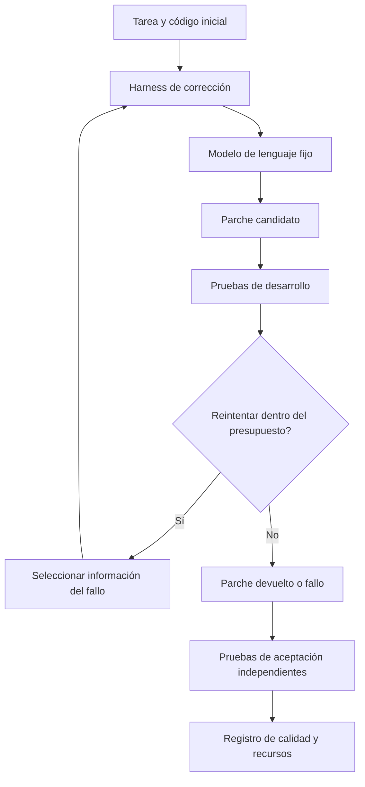

# Harness de corrección de código

[English](case-0001-code-repair-harness.md) | Español

## 1. Propósito y alcance actual

Explorar si un cambio acotado en el ciclo de corrección de un agente de código puede
mejorar su capacidad para corregir programas pequeños de Python con un presupuesto fijo.
El problema práctico es el esfuerzo dedicado a organizar el contexto, interpretar las
pruebas fallidas y decidir qué intentar después.

Este es un caso candidato, no el tema de tesis seleccionado. Todos los escenarios que
siguen son propuestas ficticias. Todavía no existen un benchmark, una implementación,
un conjunto de datos ni resultados experimentales. Se compara con el
[flujo de servicio simulado](case-0002-service-workflow-harness.es.md).

El alcance inicial es un paquete local pequeño con pruebas deterministas. El desarrollo
a escala de todo un repositorio, el despliegue, el entrenamiento de modelos y la modificación
recursiva del optimizador quedan fuera del primer piloto. El método de optimización sigue abierto.

## 2. ¿Qué se mejora?

Hay dos artefactos distintos:

- **Solución de la tarea:** el parche que corrige un programa para una tarea concreta.
- **Harness:** el procedimiento reutilizable que proporciona contexto al modelo, aplica
  un parche, ejecuta las pruebas disponibles, interpreta la retroalimentación y decide
  si realiza otro intento o se detiene.

La comparación de investigación se centra en el harness. Obtener un parche correcto no
demuestra una mejora del harness. Un harness candidato debe evaluarse en varias tareas.

| Límite | Propuesta inicial |
|---|---|
| Componente modificable del harness | Selección de retroalimentación y política de reintentos |
| Cambios permitidos | Seleccionar la salida relevante de los fallos, conservar contexto útil y decidir el siguiente intento de corrección dentro de un límite fijo |
| Resultado de la tarea | Un parche sobre archivos de solución expresamente permitidos |
| Controles fijos | Versión y parámetros del modelo, entradas de las tareas, interfaces de herramientas, ejecutor de pruebas, reglas de evaluación y presupuesto de comparación |
| Artefactos protegidos | Pruebas de aceptación, resultados de referencia, control del presupuesto y tareas de evaluación final |
| Optimizador | Un procedimiento de búsqueda fijo para la primera comparación; el método se seleccionará después de continuar las lecturas |

El agente puede inspeccionar las pruebas de desarrollo. Un evaluador independiente controla
las pruebas de aceptación reservadas. Más adelante, los permisos deberán hacer efectiva
esta separación; el nombre de una carpeta no es suficiente.

## 3. Niveles de complejidad

Cada nivel añade una fuente explícita de dificultad. Son estratos propuestos dentro de
un mismo caso, no tres benchmarks sin relación.

| Nivel | Tarea de ejemplo | Complejidad añadida | Evidencia de aceptación |
|---|---|---|---|
| L1: corrección local | Corregir el cálculo de una línea de factura | Una función, un fallo y un requisito explícito | Resultados correctos para entradas habituales y casos límite |
| L2: reglas relacionadas | Aplicar un descuento antes de calcular el impuesto | Varias reglas y funciones auxiliares; una corrección local puede introducir regresiones | Orden correcto de operaciones y conservación del comportamiento en los casos no afectados |
| L3: cambio acotado en un paquete | Conservar los totales de factura entre los módulos de precios y serialización | Varios archivos y un contrato de interfaz | Comportamiento correcto entre módulos, con pruebas de integración y regresión |

Primero se evalúa la viabilidad de L1 y después se añade L2. L3 es una extensión opcional
si la ejecución y la evaluación siguen siendo asequibles. La complejidad de infraestructura
no constituye por sí misma un objetivo de investigación.

## 4. Escenario explicado: una corrección local

**Ejemplo inventado, no una traza de ejecución.** Una línea de factura debe devolver el
precio unitario multiplicado por la cantidad. Los valores se expresan en céntimos enteros
para no introducir reglas de redondeo. El programa inicial suma las dos entradas.

| Entrada | Resultado inicial | Resultado requerido | Significado |
|---|---|---|---|
| Precio de 250 céntimos, cantidad 3 | 253 | 750 | Tres unidades a 250 céntimos cada una |
| Precio de 250 céntimos, cantidad 0 | 250 | 0 | Si no hay unidades, no hay cargo |
| Precio de 0 céntimos, cantidad 4 | 4 | 0 | Las unidades gratuitas siguen sin generar cargo |

1. El harness recibe el requisito, los archivos modificables y las pruebas de desarrollo.
2. El modelo propone un parche para la función de facturación.
3. El harness aplica el parche y ejecuta las pruebas disponibles.
4. Si una prueba falla, la política de retroalimentación selecciona la información para el siguiente intento.
5. El harness devuelve un parche o se detiene al alcanzar su límite de intentos o recursos.
6. El evaluador independiente comprueba el parche devuelto mediante las pruebas de aceptación reservadas.

Estas tres filas explican la tarea. No constituyen una batería completa de pruebas ni
datos de evaluación final. Un candidato no debe obtener una puntuación favorable cambiando
las pruebas o imprimiendo los resultados esperados de los ejemplos sin implementar el requisito.

L2 añadiría una regla como aplicar un descuento del diez por ciento a un subtotal de
1.000 céntimos antes de un impuesto del veinte por ciento: 900 céntimos antes del impuesto
y 1.080 después. Es una regla aritmética inventada, no una indicación tributaria de alguna
jurisdicción. Las reglas de redondeo y de entradas no válidas tendrían que definirse
explícitamente antes de generar instancias.

## 5. Tareas, evidencia de referencia y EDA

El registro de una tarea identificaría la versión del código inicial, el requisito,
la familia, el nivel de complejidad, los archivos permitidos, las pruebas de desarrollo,
la versión del evaluador y la procedencia de la referencia. Un parche de referencia
revisado por una persona permitiría establecer que la tarea tiene solución. Otros parches
también pueden ser correctos; coincidir con el texto del parche de referencia no es la regla de aceptación.

El EDA inicial abarcaría tanto la colección de tareas como las ejecuciones repetidas del baseline.

| Pregunta | Datos que se inspeccionan | Visualización propuesta | Decisión que fundamenta |
|---|---|---|---|
| ¿Están representadas las familias de tareas? | Cantidades por familia y nivel de complejidad | Matriz de cobertura | Añadir familias ausentes o acotar la afirmación |
| ¿Hay tareas casi duplicadas? | Generadores, requisitos y programas iniciales compartidos | Tabla de familias y procedencia | Agrupar instancias relacionadas antes de crear las particiones |
| ¿Son confiables las referencias? | Resultados de referencia, requisitos ambiguos y pruebas inestables | Resumen de validación | Corregir o excluir tareas no válidas registrando los motivos |
| ¿Dónde falla el baseline? | Etapa y categoría del fallo | Conteos de fallos por nivel | Elegir un componente acotado del harness |
| ¿Cuánto varía la ejecución? | Éxito, intentos, duración y tokens en repeticiones de cada tarea | Distribuciones por tarea | Determinar repeticiones y presupuesto para un protocolo posterior |

Las categorías de fallo propuestas son selección de contexto, parche incorrecto,
regresión, interpretación de la retroalimentación, agotamiento del presupuesto y fallo
del entorno. Son provisionales y deben revisarse con trazas reales. Las asociaciones
observadas en el EDA no demuestran que una política concreta haya causado un fallo.

## 6. Comparación y mediciones

**Hipótesis candidata:** seleccionar la información relevante de las pruebas mejora la
proporción de tareas resueltas con el mismo presupuesto total, frente a una política
fija de retroalimentación.

El baseline utilizaría un ciclo de corrección fijo con un prompt, un formato de
retroalimentación y un límite de reintentos documentados. La primera intervención
cambiaría únicamente la selección de retroalimentación. Los límites de reintentos,
los parámetros del modelo y la selección de tareas se mantendrían iguales para evitar
cambiar varios factores a la vez. Una búsqueda más costosa exige un comparador con
presupuesto equivalente o un análisis explícito del costo.

| Medida | Significado operativo |
|---|---|
| Éxito de la tarea | Se superan todas las comprobaciones de aceptación requeridas y los artefactos protegidos permanecen intactos |
| Puntuación parcial de diagnóstico | Fracción de comprobaciones de aceptación superadas; se informa por separado del éxito de la tarea |
| Recursos de ejecución | Tokens, llamadas al modelo, llamadas a herramientas, intentos y tiempo transcurrido por tarea |
| Esfuerzo de construcción | Costo de búsqueda, cantidad de candidatos, cambios manuales y tiempo de revisión humana necesarios para obtener un harness aceptado |
| Fiabilidad | Variación entre ejecuciones repetidas de la misma tarea y fallos por familia |

Se agrega el éxito dando el mismo peso a cada tarea, salvo que se justifique otra
ponderación de antemano. Las pruebas dentro de una tarea y las ejecuciones repetidas no
son muestras de tareas independientes. El esfuerzo de construcción y la calidad durante
la ejecución responden preguntas distintas; ambos deben informarse antes de afirmar que
construir el harness se volvió más económico.

Las tareas de desarrollo proporcionan retroalimentación a la búsqueda. Las de validación
sirven para seleccionar candidatos. Las tareas finales quedan reservadas tanto del
optimizador como de los ajustes manuales. Cuando corresponda, se divide por familia de
programas o plantilla generadora, en lugar de distribuir instancias casi idénticas entre
particiones. Ajustar repetidamente sobre validación también limita lo que demuestra su puntuación.

## 7. Viabilidad y etapas de trabajo

| Etapa | Resultado revisable | Criterio de salida |
|---|---|---|
| Revisión del caso | Esta especificación y una comparación con case-0002 | Se comprenden el alcance y las decisiones pendientes |
| Diseño de medición | Muestra pequeña de tareas, comprobaciones de referencia y protocolo experimental | Las tareas tienen solución y los evaluadores distinguen soluciones correctas y defectuosas |
| Exploración del baseline | Informe de EDA con trazas y contabilidad de recursos | Se identifica un patrón de fallo relevante y un presupuesto viable |
| Comparación acotada | Baseline frente a una intervención en el harness | La evidencia fundamenta continuar, revisar o rechazar la hipótesis |

Estas etapas pueden convertirse en objetivos de sprint después de acordar el alcance
y la cadencia. No son compromisos de calendario ni de implementación. Un hallazgo
negativo documentado es un resultado válido.

Antes de ejecutar, el protocolo futuro debe fijar cantidades de tareas, repeticiones,
gasto en modelos, presupuesto total de búsqueda, tiempos límite, condiciones de parada
y conservación de evidencia. Se comenzaría con un ejecutor local de pruebas y ejecución
aislada; el caso propuesto no requiere servicios de nube.

Se continúa si las tareas pueden evaluarse objetivamente, existe un patrón de fallo útil
y la comparación cabe en el presupuesto. Se revisa o descarta si la evaluación es poco
fiable, el baseline ya resuelve casi todas las tareas o la mejora depende de acceder a pruebas reservadas.

## 8. Decisiones pendientes y ubicación de artefactos

- ¿Qué familias de tareas ofrecen suficiente dificultad sin un costo excesivo de preparación?
- ¿Qué baseline fijo y qué modelo pueden evaluarse de forma asequible?
- ¿La primera intervención debería seleccionar retroalimentación, conservar contexto o cambiar los reintentos?
- ¿Qué medida del esfuerzo de construcción puede registrarse de manera consistente?

La propuesta permanece aquí. Las futuras tareas ejecutables y los evaluadores estarían
en `benchmarks/case-0001/`; los metadatos de los datos, en `data/`; y los protocolos e
informes, en `experiments/`. Estas rutas describen una implementación posterior, no artefactos existentes.

Material relacionado del proyecto: [opciones de investigación](../synthesis/research-options.md),
[revisión de STOP](../literature/reviews/pap-0001-stop.es.md) y
[plantilla de protocolo experimental](../../templates/experiment-protocol.md).
El artículo es una referencia metodológica, no evidencia de este caso aún no ejecutado.
