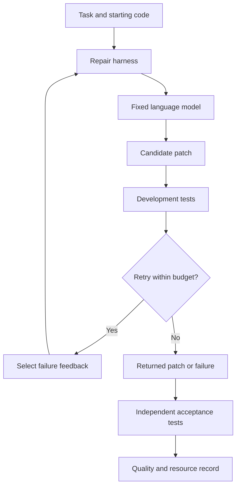

# Code repair harness

English | [Español](case-0001-code-repair-harness.es.md)

## 1. Purpose and current scope

Explore whether a bounded change to a coding agent's repair loop can improve its ability
to correct small Python programs under a fixed budget. The practical problem is the
effort spent organizing context, interpreting failed tests, and deciding what to try next.

This is a candidate case, not the selected thesis topic. All scenarios below are proposed
and fictional. No benchmark, implementation, dataset, or experimental result exists yet.
Compare it with the [simulated service workflow](case-0002-service-workflow-harness.md).

The initial scope is a small local package with deterministic tests. Repository-wide
development, deployment, model training, and recursive modification of the optimizer are
outside the first pilot. The optimization method remains open.

## 2. What is being improved?

There are two distinct artifacts:

- **Task solution:** the patch that corrects a program for one task.
- **Harness:** the reusable procedure that gives context to the model, applies a patch,
  runs available tests, interprets feedback, and selects another attempt or stops.

The research comparison concerns the harness. Producing one successful patch does not
demonstrate harness improvement. A candidate harness must be evaluated across tasks.

| Boundary | Initial proposal |
|---|---|
| Editable harness component | Feedback selection and retry policy |
| Allowed changes | Select relevant failure output, retain useful context, decide the next repair attempt within a fixed cap |
| Task output | A patch to explicitly permitted solution files |
| Fixed controls | Model version and settings, task inputs, tool interfaces, test runner, evaluation rules, and comparison budget |
| Protected artifacts | Acceptance tests, reference results, budget enforcement, and final evaluation tasks |
| Optimizer | One fixed search procedure for the first comparison; method to be selected after further reading |

The agent may inspect development tests. An independent evaluator owns the reserved
acceptance tests. Permissions must eventually enforce this distinction; a folder name
alone is insufficient.

## 3. Complexity levels

Each level adds an explicit source of difficulty. They are proposed strata within one
case, not three unrelated benchmarks.

| Level | Example task | Added complexity | Acceptance evidence |
|---|---|---|---|
| L1: local correction | Repair an invoice line calculation | One function, one fault, explicit requirement | Correct outputs on ordinary and boundary inputs |
| L2: interacting rules | Apply a discount before calculating tax | Several rules and helper functions; a local fix may introduce regressions | Correct order of operations and preserved behavior on unaffected cases |
| L3: bounded package change | Preserve invoice totals across pricing and serialization modules | Several files and an interface contract | Correct behavior across modules, with integration and regression checks |

Begin by assessing L1 feasibility, then add L2. L3 is an optional extension if execution
and evaluation remain affordable. Infrastructure complexity is not itself a research goal.

## 4. Worked scenario: a local correction

**Invented example, not an execution trace.** An invoice line should return unit price
multiplied by quantity. Values use integer cents to avoid introducing rounding behavior.
The starting program adds the two inputs instead.

| Input | Starting output | Required output | Meaning |
|---|---|---|---|
| Price 250 cents, quantity 3 | 253 | 750 | Three units at 250 cents each |
| Price 250 cents, quantity 0 | 250 | 0 | No units produce no charge |
| Price 0 cents, quantity 4 | 4 | 0 | Free units remain free |

1. The harness receives the requirement, editable files, and development tests.
2. The model proposes a patch to the invoice function.
3. The harness applies the patch and runs the available tests.
4. If a test fails, the feedback policy selects the information for the next attempt.
5. The harness returns a patch or stops when its attempt or resource limit is reached.
6. The independent evaluator checks the returned patch against reserved acceptance tests.

These three rows explain the task. They are neither a complete test suite nor final
evaluation data. A candidate must not gain credit by changing tests or printing the
expected example outputs without implementing the requirement.

L2 would add a rule such as applying a ten-percent discount to a 1,000-cent subtotal
before a twenty-percent tax: 900 cents before tax and 1,080 cents after tax. This is an
invented arithmetic rule, not jurisdictional tax guidance. Rounding and invalid-input
rules would need explicit definitions before generating instances.

## 5. Tasks, reference evidence, and EDA

A task record would identify the starting code version, requirement, family, complexity
level, permitted files, development tests, evaluator version, and reference provenance.
A human-checked reference patch would establish that a task is solvable. Other patches
may also be correct; matching the reference patch text is not the acceptance rule.

The initial EDA would cover both the task collection and repeated baseline executions.

| Question | Data to inspect | Proposed visual | Decision supported |
|---|---|---|---|
| Are task families represented? | Counts by family and complexity level | Coverage matrix | Add missing families or narrow the claim |
| Are tasks near duplicates? | Shared generators, requirements, and starting programs | Family and provenance table | Group related instances before splitting |
| Can references be trusted? | Reference outcomes, ambiguous requirements, unstable tests | Validation summary | Repair or exclude invalid tasks with recorded reasons |
| Where does the baseline fail? | Failure stage and category | Failure counts by level | Choose a bounded harness component |
| How variable is execution? | Repeated success, attempts, duration, and tokens per task | Per-task distributions | Determine repetitions and budget for a later protocol |

Suggested failure categories are context selection, incorrect patch, regression,
feedback interpretation, budget exhaustion, and environment failure. Categories are
provisional and require review against actual traces. EDA associations do not establish
that a particular policy caused a failure.

## 6. Comparison and measurements

**Candidate hypothesis:** selecting relevant test feedback improves the proportion of
tasks resolved within the same total budget compared with a fixed feedback policy.

The baseline would use a fixed repair loop with a documented prompt, feedback format,
and retry cap. The first intervention would change feedback selection only. Retry limits,
model settings, and task selection would remain matched to avoid changing several factors
at once. More expensive search requires a budget-matched comparator or explicit cost analysis.

| Measure | Operational meaning |
|---|---|
| Task success | All required acceptance checks pass and protected artifacts remain unchanged |
| Diagnostic partial score | Fraction of acceptance checks passed; reported separately from task success |
| Execution resources | Tokens, model calls, tool calls, attempts, and elapsed time per task |
| Construction effort | Search cost, candidate count, manual edits, and human review time needed to obtain an accepted harness |
| Reliability | Variation across repeated runs of the same task and failures by family |

Aggregate task success with equal task weights unless another weighting is justified in
advance. Tests within a task and repeated runs are not independent task samples.
Construction effort and runtime quality answer different questions; report both before
claiming that harness construction became cheaper.

Development tasks supply feedback to search. Validation tasks support candidate selection.
Final tasks remain reserved from both the optimizer and manual tuning. Split by program
family or generator template where appropriate, rather than scattering almost identical
instances across sets. Repeatedly tuning to validation also limits what its score proves.

## 7. Feasibility and staged work

| Stage | Reviewable output | Exit condition |
|---|---|---|
| Case review | This specification and a comparison with case-0002 | Scope and unresolved choices are understood |
| Measurement design | Small task sample, reference checks, and an experiment protocol | Tasks are solvable and evaluators discriminate correct and faulty solutions |
| Baseline exploration | EDA report with traces and resource accounting | A relevant failure pattern and feasible budget are identified |
| Bounded comparison | Baseline versus one harness intervention | Evidence supports continuing, revising, or rejecting the hypothesis |

These stages can become sprint goals after scope and cadence are agreed. They are not
calendar or implementation commitments. A documented negative finding is a valid outcome.

The future protocol must set task counts, repetitions, model spend, total search budget,
timeouts, stop conditions, and evidence retention before execution. Begin with a local
test runner and isolated execution; cloud services are not required by the proposed case.

Continue if tasks are objectively evaluable, a useful failure pattern exists, and the
comparison fits the budget. Revise or discard if evaluation is unreliable, tasks are
already saturated by the baseline, or improvement depends on exposure to reserved tests.

## 8. Open decisions and artifact locations

- Which task families offer enough difficulty without excessive setup cost?
- Which fixed baseline and model can be evaluated affordably?
- Should the first intervention select feedback, retain context, or change retries?
- Which construction-effort measure can be recorded consistently?

The proposal remains here. Future executable tasks and evaluators would live under
`benchmarks/case-0001/`; dataset metadata under `data/`; protocols and reports under
`experiments/`. These paths describe a later implementation, not existing artifacts.

Related project material: [research options](../synthesis/research-options.md),
[STOP review](../literature/reviews/pap-0001-stop.md), and
[experiment protocol template](../../templates/experiment-protocol.md).
The paper is a method reference, not evidence for this unexecuted case.
