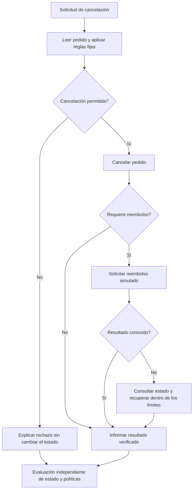

# Harness de un flujo de servicio simulado

[English](case-0002-service-workflow-harness.md) | Español

## 1. Propósito y alcance actual

Explorar si un cambio acotado en la política de recuperación de un agente puede mejorar
la resolución de solicitudes de servicio que requieren varias llamadas a herramientas.
El problema práctico es gestionar avances parciales y resultados inciertos de herramientas
sin repetir operaciones completadas ni necesitar una corrección manual.

Este es un caso candidato, no el tema de tesis seleccionado. El entorno propuesto es
un servicio ficticio de pedidos con registros sintéticos y reembolsos simulados. No
contiene implementaciones del banco, datos de clientes, pagos reales ni acciones sobre
producción externa. Todavía no existen código, datos ni resultados experimentales.
Se compara con el [caso de corrección de código](case-0001-code-repair-harness.es.md).

## 2. ¿Qué se mejora?

- **Resultado de la tarea:** un pedido alcanza el estado requerido, los registros
  relacionados conservan su consistencia y la respuesta describe con precisión lo ocurrido.
- **Harness:** el procedimiento reutilizable que interpreta resultados de herramientas,
  conserva el estado del flujo, decide si reintenta o consulta el estado y se detiene o escala el caso.

La investigación se centra en el harness a través de varias solicitudes. Una cancelación
correcta, por sí sola, no establece que el harness haya mejorado o se haya vuelto más económico de construir.

| Límite | Propuesta inicial |
|---|---|
| Componente modificable del harness | Política de recuperación después de un tiempo de espera agotado o de un resultado ambiguo de una herramienta |
| Cambios permitidos | Elegir una consulta de estado, un reintento o un escalamiento usando el estado de ejecución disponible |
| Acciones de la tarea | Leer el estado del pedido, cancelar un pedido elegible, solicitar un reembolso simulado e informar el resultado |
| Controles fijos | Parámetros del modelo, contratos de herramientas, reglas de negocio, programación de fallos, límites de recursos y evaluador |
| Artefactos protegidos | Resultados de referencia, definiciones de políticas, evaluador y escenarios reservados |
| Optimizador | Un procedimiento fijo por elegir; la optimización recursiva y RL siguen siendo alternativas de investigación |

Las protecciones del backend permanecen iguales entre condiciones. El harness no puede
mejorar su puntuación debilitando las reglas del servicio, cambiando los resultados
esperados o concediéndose nuevas herramientas.

## 3. Niveles de complejidad

| Nivel | Escenario | Complejidad añadida | Evidencia de aceptación |
|---|---|---|---|
| L1: decisión explícita | Cancelar un pedido sin pagar o rechazar una cancelación no permitida | Una decisión de política y, como máximo, una acción que modifica el estado | Estado correcto del pedido y respuesta precisa |
| L2: acciones coordinadas | Cancelar un pedido pagado y no enviado, y solicitar su reembolso | Acciones dependientes entre los registros del pedido y del reembolso | Cancelación y exactamente un reembolso simulado correcto |
| L3: resultado incierto | La herramienta de reembolso agota el tiempo de espera después de registrar un reembolso | Avance parcial, retroalimentación ambigua y recuperación | Estado final correcto, sin reembolso duplicado y con recuperación acotada |

L1 comprueba la evaluación de políticas y la instrumentación. L2 establece un flujo normal
antes de que L3 introduzca un problema de recuperación. Son estratos de escenarios, no
una demostración de que los niveles superiores serán empíricamente más difíciles. No se
añadiría concurrencia ni despliegue distribuido al primer piloto: introducirían más fuentes de variación.

## 4. Escenario explicado: incertidumbre después de un reembolso

**Recorrido inventado, no una traza medida.** El pedido `order-042` está pagado, no ha
sido enviado y tiene un importe reembolsable de 1.200 céntimos. La política ficticia
permite cancelarlo y exige exactamente un reembolso completo. Los reembolsos parciales
quedan fuera de este ejemplo.

| Paso | Observación disponible para el agente | Estado del entorno | Interpretación requerida |
|---|---|---|---|
| 1 | La consulta del pedido indica que está pagado y no enviado | Pedido activo; sin reembolso | Se permite la cancelación |
| 2 | La cancelación se completa | Pedido cancelado; sin reembolso | La cancelación no completa por sí sola el reembolso |
| 3 | La solicitud de reembolso devuelve un timeout | El reembolso puede haberse registrado o no | El timeout no demuestra que la operación haya fallado |
| 4 | La consulta de estado devuelve un reembolso registrado de 1.200 céntimos | Pedido cancelado; un reembolso | Confirmar la finalización sin crear otro reembolso |
| 5 | La respuesta final informa de la cancelación y el reembolso | El estado conserva su consistencia | La respuesta debe coincidir con los hechos registrados |

En esta traza ilustrativa concreta, el timeout del paso 3 ocurre después de registrar
el reembolso. Otros escenarios de desarrollo deben incluir un timeout anterior al
registro, para que asumir siempre que la operación se completó no resuelva toda la colección.

La herramienta de reembolso propuesta utilizaría una clave de idempotencia: repetir una
solicitud con la misma clave devuelve la misma operación en lugar de crear un segundo
reembolso. Este comportamiento sería fijo y estaría documentado; no es una propiedad
descubierta en un sistema existente. Una política de recuperación defectuosa aún podría
desperdiciar llamadas o crear una nueva clave de solicitud. Por ello, las restricciones
del backend y el comportamiento del harness deben evaluarse por separado.

Este diagrama resume el flujo propuesto, no una implementación. La recuperación también
debe gestionar fallos persistentes de la consulta de estado y detenerse indicando
explícitamente un resultado no resuelto cuando se agote el presupuesto. Escalar puede
ser correcto en un escenario que lo contemple, pero se informa por separado de la resolución autónoma.

## 5. Escenarios, evidencia de referencia y EDA

El registro de un escenario identificaría el estado inicial, la solicitud, las reglas
aplicables, los contratos de herramientas, la programación de fallos, los estados finales
aceptables, los efectos secundarios prohibidos y la versión. Se revisaría la consistencia
del conjunto de referencia antes de tratarlo como un golden set. Varias secuencias de
acciones pueden ser válidas; en general, no se exige una coincidencia exacta de secuencias.

El evaluador comprobaría el estado del pedido y del reembolso, los registros no relacionados,
las restricciones de política requeridas y si el mensaje final coincide con el estado.
Comprobar solamente el estado no detectaría una respuesta engañosa. Un modelo juez sin
calibrar no sería la única autoridad para determinar el éxito de la tarea.

| Pregunta | Datos que se inspeccionan | Visualización propuesta | Decisión que fundamenta |
|---|---|---|---|
| ¿Están cubiertos los estados relevantes? | Combinaciones de pago, envío, elegibilidad y reembolso | Matriz de cobertura de escenarios | Añadir casos ausentes o acotar las condiciones admitidas |
| ¿Están representados adecuadamente los fallos? | Herramienta, momento y resultado de los fallos inyectados | Tabla de cobertura de fallos | Separar el fallo anterior a la escritura del posterior |
| ¿Es consistente la evaluación? | Trazas de referencia válidas y resultados deliberadamente incorrectos | Resumen de comprobaciones del evaluador | Corregir reglas ambiguas antes de comparar harnesses |
| ¿Dónde falla el baseline? | Intentos duplicados, estados no resueltos, rechazo incorrecto o mensajes imprecisos | Conteos de fallos por tipo de escenario | Seleccionar el comportamiento de recuperación que se modificará |
| ¿La recuperación añade un costo desproporcionado? | Llamadas, reintentos, tokens, latencia e intervenciones | Gráficos de costo frente a resolución | Fijar un presupuesto viable de búsqueda y ejecución |

La cobertura sintética refleja un espacio de prueba diseñado, no la frecuencia de las
solicitudes de clientes reales. Se informan los resultados por estrato y se explicita
cualquier ponderación agregada. Un conjunto sintético equilibrado no demuestra un impacto
económico sobre toda la operación de producción.

## 6. Comparación y mediciones

**Hipótesis candidata:** una política de recuperación que consulta el estado registrado
del flujo después de un resultado ambiguo reduce acciones redundantes y conserva la
resolución de tareas con un presupuesto total equivalente.

El baseline utilizaría una política de recuperación fija y documentada. Al inicio, un
candidato modificaría únicamente el componente acotado de recuperación. Ambas condiciones
usarían los mismos contratos de herramientas, protecciones del backend, entradas de tareas,
parámetros del modelo y límites de recursos. La inyección de fallos se asociaría a
operaciones identificadas o eventos del escenario, no solamente al tiempo transcurrido,
para que un cambio de velocidad de ejecución no modifique silenciosamente la condición experimental.

| Medida | Significado operativo |
|---|---|
| Éxito de la tarea | Se cumplen el estado requerido, las restricciones de política y la consistencia de la respuesta |
| Resolución autónoma | La tarea se completa sin intervención manual |
| Escalamiento correcto | Se identifica y comunica un resultado no resuelto permitido según los criterios del escenario |
| Efectos secundarios | Reembolsos duplicados, cambios no autorizados o modificaciones de registros no relacionados |
| Recursos de ejecución | Llamadas al modelo y a herramientas, reintentos, tokens y tiempo transcurrido |
| Esfuerzo de construcción | Costo de búsqueda, cantidad de candidatos, cambios manuales y tiempo de revisión necesarios para obtener un harness aceptado |

Cualquier efecto secundario prohibido hace que la tarea se considere fallida, aunque
supere otras comprobaciones. Las puntuaciones por componente siguen siendo diagnósticos
útiles, pero no pueden ocultar una restricción incumplida en la tasa principal de éxito.
Se informa la frecuencia de escalamiento para evitar que una fiabilidad aparente se logre
simplemente evitando el trabajo autónomo.

Se mantienen separados los escenarios de desarrollo, validación y evaluación final.
Al crear las particiones, se agrupan las plantillas de escenarios y familias de fallos
relacionadas. Las ejecuciones repetidas comparten la identidad de un escenario: miden
variabilidad y no añaden cobertura de escenarios independientes. Se restablece el entorno
entre ejecuciones y se registran la versión y el resultado de ese restablecimiento.

## 7. Viabilidad y etapas de trabajo

| Etapa | Resultado revisable | Criterio de salida |
|---|---|---|
| Revisión del caso | Esta especificación y la comparación con case-0001 | Se comprenden el flujo, los límites y los criterios de referencia |
| Diseño de medición | Políticas explícitas, definiciones de escenarios de muestra y un protocolo | Se pueden distinguir de forma fiable los resultados válidos y no válidos |
| Exploración del baseline | EDA de cobertura, fallos y consumo de recursos | Existen fallos de recuperación que pueden estudiarse dentro del presupuesto |
| Comparación acotada | Baseline frente a una intervención en la recuperación | La evidencia fundamenta continuar, ajustar o rechazar la hipótesis |

Estas etapas son candidatas a objetivos de sprint, no un calendario comprometido. Este
documento no autoriza ninguna ejecución. Un protocolo posterior debe especificar
cantidades de escenarios, repeticiones, gasto en modelos, presupuesto total de búsqueda,
condiciones de parada y ubicaciones de la evidencia.

Un simulador local determinista puede ser suficiente al inicio. Solo se introducirían
servicios en Compose si los límites entre servicios fueran necesarios para probar la
hipótesis seleccionada. Azure y Kubernetes no son requisitos previos de este caso.

Se continúa si los resultados pueden comprobarse objetivamente, hay margen de mejora
en la recuperación del baseline y la simulación local representa el comportamiento
estudiado. Se revisa o descarta si domina la ambigüedad del evaluador, la preparación
excede el presupuesto del piloto o la mejora aparente procede únicamente de cambiar las
protecciones del backend o explotar plantillas de escenarios conocidas.

## 8. Decisiones pendientes y ubicación de artefactos

- ¿Qué reglas de política y efectos prohibidos son necesarios para el caso válido más pequeño?
- ¿Qué resultados ambiguos de herramientas pueden simularse de forma determinista?
- ¿Puede comprobarse la consistencia del mensaje con un resultado estructurado y revisión humana focalizada?
- ¿El caso justifica su mayor esfuerzo de diseño del entorno frente a la corrección de código?

La propuesta permanece aquí. Los futuros escenarios y evaluadores estarían en
`benchmarks/case-0002/`; los metadatos de los datos, en `data/`; los protocolos e informes,
en `experiments/`; y las definiciones opcionales de servicios, en `environments/compose/`.
Son ubicaciones previstas, no artefactos implementados.

Material relacionado del proyecto: [opciones de investigación](../synthesis/research-options.md),
[revisión de Self-Harness](../literature/reviews/pap-0011-self-harness.es.md) y
[plantilla de protocolo experimental](../../templates/experiment-protocol.md).
El artículo es una referencia metodológica, no evidencia de este caso aún no ejecutado.
