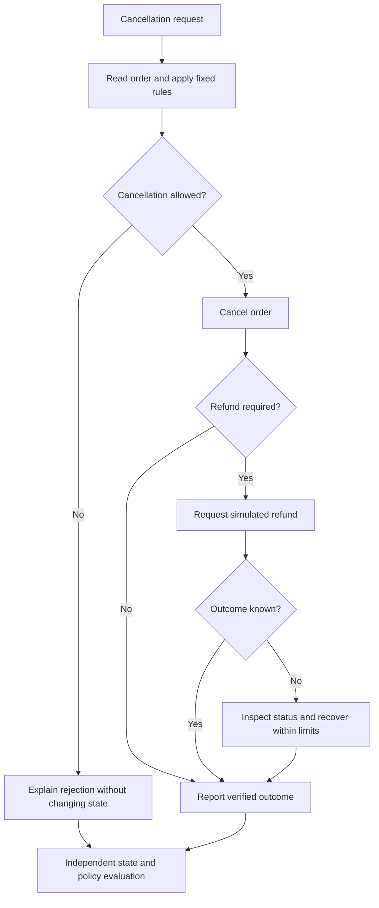

# Simulated service workflow harness

## 1. Purpose and current scope

Explore whether a bounded change to an agent's recovery policy can improve completion
of service requests that require several tool calls. The practical problem is handling
partial progress and uncertain tool outcomes without repeating completed operations or
requiring manual repair.

This is a candidate case, not the selected thesis topic. The proposed environment is a
fictional order service with synthetic records and simulated refunds. It contains no
bank implementation, customer data, real payments, or external production actions.
No code, dataset, or experimental result exists yet. Compare it with the
[code repair case](case-0001-code-repair-harness.md).

## 2. What is being improved?

- **Task outcome:** an order reaches the required state, relevant records remain
  consistent, and the response accurately describes what happened.
- **Harness:** the reusable procedure that interprets tool results, retains workflow
  state, decides whether to retry or inspect status, and stops or escalates.

The research concerns the harness across requests. A successful cancellation by itself
does not establish that the harness improved or became cheaper to construct.

| Boundary | Initial proposal |
|---|---|
| Editable harness component | Recovery policy after a tool timeout or ambiguous result |
| Allowed changes | Choose a status check, retry, or escalation using available execution state |
| Task actions | Read order state, cancel an eligible order, request a simulated refund, and report the result |
| Fixed controls | Model settings, tool contracts, business rules, fault schedules, resource limits, and evaluator |
| Protected artifacts | Reference outcomes, policy definitions, evaluator, and reserved scenarios |
| Optimizer | A fixed procedure chosen later; recursive optimization and RL remain possible research alternatives |

Backend protections remain identical across conditions. The harness cannot improve its
score by weakening service rules, changing expected outcomes, or granting itself new tools.

## 3. Complexity levels

| Level | Scenario | Added complexity | Acceptance evidence |
|---|---|---|---|
| L1: explicit decision | Cancel an unpaid order, or reject an ineligible cancellation | One policy decision and at most one state-changing action | Correct order state and accurate response |
| L2: coordinated actions | Cancel a paid, unshipped order and request its refund | Dependent actions across order and refund records | Cancellation and exactly one correct simulated refund |
| L3: uncertain outcome | The refund tool times out after recording a refund | Partial progress, ambiguous feedback, and recovery | Correct final state with no duplicate refund and bounded recovery |

L1 checks policy evaluation and instrumentation. L2 establishes a normal workflow before
L3 introduces a recovery problem. These are scenario strata, not proof that higher levels
will empirically be harder. Do not add concurrency or distributed deployment to the first
pilot; they would introduce further sources of variation.

## 4. Worked scenario: uncertainty after a refund

**Invented walkthrough, not a measured trace.** Order `order-042` is paid, has not shipped,
and has a refundable amount of 1,200 cents. The fictional policy permits cancellation and
requires exactly one full refund. Partial refunds are outside this example.

| Step | Observation available to the agent | Environment state | Required interpretation |
|---|---|---|---|
| 1 | Order lookup returns paid and unshipped | Order active; no refund | Cancellation is permitted |
| 2 | Cancellation succeeds | Order cancelled; no refund | Cancellation does not itself complete the refund |
| 3 | Refund request returns a timeout | Refund may or may not have been recorded | Timeout is not evidence that the operation failed |
| 4 | Refund status lookup returns a recorded 1,200-cent refund | Order cancelled; one refund | Confirm completion without creating another refund |
| 5 | Final response reports cancellation and refund | State remains consistent | The response must match recorded facts |

For this particular illustrative trace, step 3 times out after the refund is recorded.
Other development scenarios must include a timeout before recording, so that always
assuming success cannot solve the task collection.

The proposed refund tool would use an idempotency key: submitting the same request key
again returns the same operation rather than creating a second refund. This behavior
would be fixed and documented, not a discovered property of an existing system. A faulty
recovery policy could still waste calls or create a new request key. Backend constraints
and harness behavior must therefore be evaluated separately.

This diagram summarizes the proposed workflow, not an implementation. Recovery must also
handle persistent status failures and stop with an explicit unresolved outcome when its
budget is exhausted. Escalation can be correct behavior in a designated scenario, but is
reported separately from autonomous completion.

## 5. Scenarios, reference evidence, and EDA

A scenario record would identify initial state, user request, applicable rules, tool
contracts, fault schedule, acceptable final states, prohibited side effects, and version.
A reference set would be reviewed for consistency before it is treated as a golden set.
Several action sequences may be valid; exact sequence matching is not generally required.

The evaluator would check order and refund state, unrelated records, required policy
constraints, and whether the final message agrees with the state. State checks alone
would miss a misleading response. An uncalibrated model judge would not be the sole
authority for task success.

| Question | Data to inspect | Proposed visual | Decision supported |
|---|---|---|---|
| Are relevant states covered? | Payment, shipment, eligibility, and refund combinations | Scenario coverage matrix | Add missing cases or narrow supported conditions |
| Are faults adequately represented? | Tool, timing, and outcome of injected failures | Fault coverage table | Separate failure-before-write from failure-after-write |
| Is evaluation consistent? | Valid reference traces and intentionally invalid outcomes | Evaluator check summary | Repair ambiguous rules before comparing harnesses |
| Where does the baseline fail? | Duplicate attempts, unresolved states, incorrect rejection, or inaccurate messages | Failure counts by scenario type | Select the recovery behavior to change |
| Does recovery add disproportionate cost? | Calls, retries, tokens, latency, and interventions | Cost versus completion plots | Set a feasible search and runtime budget |

Synthetic coverage reflects a designed test space, not the frequency of real customer
requests. Report results by stratum and state any aggregate weighting explicitly. A
balanced synthetic set cannot establish production-wide economic impact.

## 6. Comparison and measurements

**Candidate hypothesis:** a recovery policy that checks recorded workflow state after
an ambiguous tool result reduces redundant actions while preserving task completion
under a matched total budget.

The baseline would use a fixed, documented recovery policy. A candidate would modify
only the bounded recovery component at first. Both conditions would use the same tool
contracts, backend protections, task inputs, model settings, and resource limits.
Fault injection would be tied to named operations or scenario events, not elapsed wall
time alone, so a change in execution speed does not silently change the treatment.

| Measure | Operational meaning |
|---|---|
| Task success | Required state, policy constraints, and response consistency all hold |
| Autonomous completion | Task succeeds without manual intervention |
| Correct escalation | A permitted unresolved outcome is identified and communicated under its scenario criteria |
| Side effects | Duplicate refunds, unauthorized changes, or modifications to unrelated records |
| Execution resources | Model and tool calls, retries, tokens, and elapsed time |
| Construction effort | Search cost, candidate count, manual edits, and review time needed to obtain an accepted harness |

Any prohibited side effect makes that task unsuccessful, even if other checks pass.
Component scores remain useful diagnostics, but cannot mask a violated constraint in
the headline success rate. Report escalation frequency to prevent apparent reliability
from being achieved merely by avoiding autonomous work.

Keep development, validation, and final scenarios separate. Group related scenario
templates and fault families when splitting. Repeated executions share a scenario
identity; they measure variability and do not create independent scenario coverage.
Reset the environment between runs and record the reset version and outcome.

## 7. Feasibility and staged work

| Stage | Reviewable output | Exit condition |
|---|---|---|
| Case review | This specification and comparison with case-0001 | Workflow, boundaries, and reference criteria are understood |
| Measurement design | Explicit policies, sample scenario definitions, and a protocol | Valid and invalid outcomes can be distinguished reliably |
| Baseline exploration | EDA of coverage, failures, and resource use | Recovery failures exist and can be studied within budget |
| Bounded comparison | Baseline versus one recovery intervention | Evidence supports continuing, adjusting, or rejecting the hypothesis |

These stages are candidates for sprint goals, not a committed schedule. No execution is
authorized by this document. A later protocol must specify scenario counts, repetitions,
model spend, total search budget, stop conditions, and evidence locations.

A deterministic local simulator may be sufficient initially. Compose services would be
introduced only if service boundaries are necessary to test the selected hypothesis.
Azure and Kubernetes are not prerequisites for this case.

Continue if outcomes are objectively checkable, baseline recovery has room to improve,
and local simulation captures the behavior under study. Revise or discard if evaluator
ambiguity dominates, setup cost exceeds the pilot budget, or the apparent improvement
comes only from changing backend protections or exploiting known scenario templates.

## 8. Open decisions and artifact locations

- Which policy rules and prohibited effects are necessary for the smallest valid case?
- Which ambiguous tool outcomes can be simulated deterministically?
- Can message consistency be checked with a structured result and targeted human review?
- Does the case justify its larger environment-design effort compared with code repair?

The proposal remains here. Future scenarios and evaluators would live under
`benchmarks/case-0002/`; data metadata under `data/`; protocols and reports under
`experiments/`; optional service definitions under `environments/compose/`.
These are intended locations, not implemented artifacts.

Related project material: [research options](../synthesis/research-options.md),
[Self-Harness review](../literature/reviews/pap-0011-self-harness.md), and
[experiment protocol template](../../templates/experiment-protocol.md).
The paper is a method reference, not evidence for this unexecuted case.
